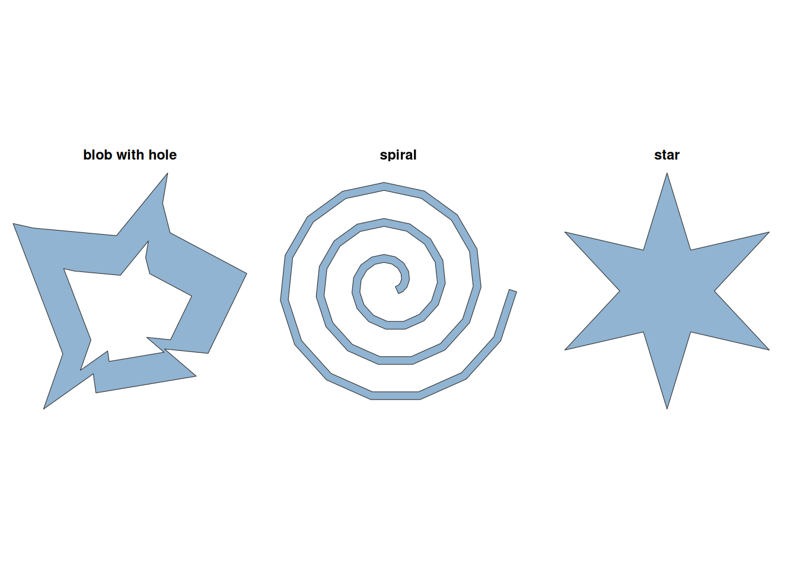
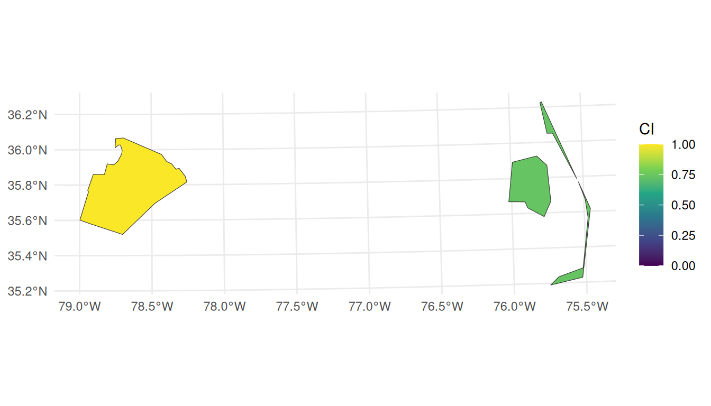
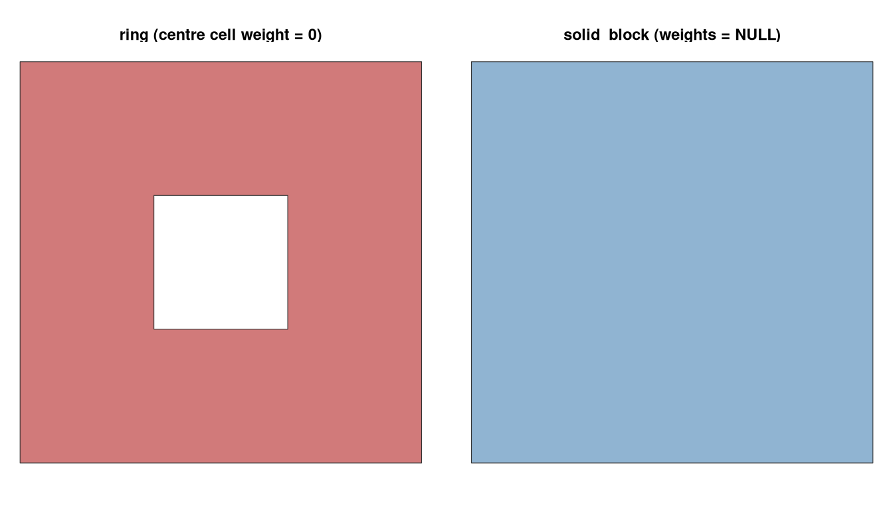
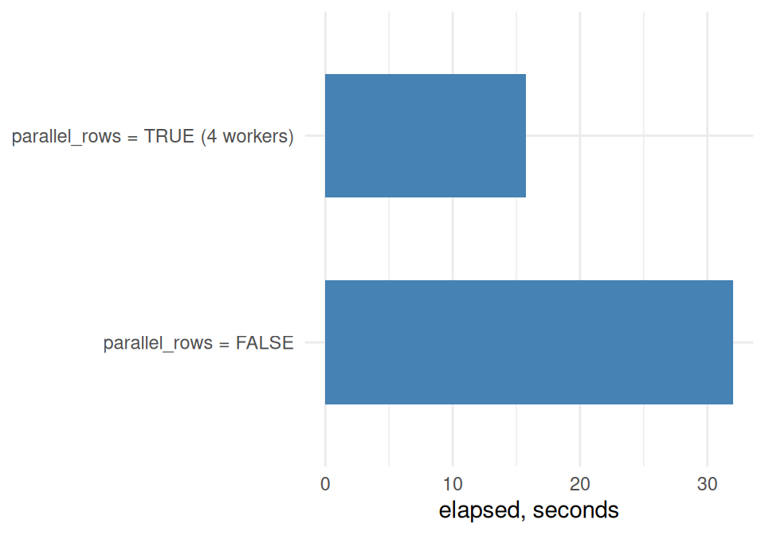

# 1. Basic Usage

Code

``` r

library(shapeindices)
library(sf)
library(ggplot2)
library(dplyr)

theme_set(theme_minimal(base_size = 11))
```

This vignette is a practical, code-first tour of the package: build a
few synthetic shapes, run the indices on them, see what the
`deterministic` argument changes, then move on to a real `sf` data
frame - first row by row, then as a single weighted collection - and
finish with the parallelisation option for larger jobs. For the
mathematical derivation of the indices themselves (what “convexity” even
means here, and where each index breaks down), see
[`vignette("b-understanding-convexity-index", package = "shapeindices")`](https://nkaza.github.io/shapeindices/articles/b-understanding-convexity-index.md).

## 1 Three basic shapes

Three small synthetic polygons, built with base `sf` calls, cover a
useful range of boundary behaviour: a **star** (deep, evenly-spaced
notches), a **spiral** (a single winding corridor, no notches at all),
and a **blob with a hole** (an irregular ring with an interior void).

Code

``` r

make_star <- function(n_points, r_outer = 1, r_inner = 0.5, center = c(0, 0)) {
  n <- n_points * 2
  angles <- seq(pi / 2, pi / 2 + 2 * pi, length.out = n + 1)[1:n]
  radii  <- rep(c(r_outer, r_inner), n_points)
  x <- center[1] + radii * cos(angles)
  y <- center[2] + radii * sin(angles)
  coords <- rbind(cbind(x, y), c(x[1], y[1]))
  st_polygon(list(coords))
}

make_turtle_path <- function(n_steps, angle_deg, step0 = 1, step_growth = 0) {
  angle <- 0
  pos   <- c(0, 0)
  pts   <- matrix(pos, ncol = 2)
  step  <- step0
  for (i in seq_len(n_steps)) {
    angle <- angle + angle_deg * pi / 180
    pos   <- pos + step * c(cos(angle), sin(angle))
    pts   <- rbind(pts, pos)
    step  <- step + step_growth
  }
  st_linestring(pts)
}

make_spiral <- function(n_steps = 48, angle_deg = 24, step0 = 0.35,
                         step_growth = 0.09, width = 0.35) {
  st_buffer(make_turtle_path(n_steps, angle_deg, step0, step_growth),
            dist = width, endCapStyle = "FLAT", joinStyle = "MITRE", mitreLimit = 3)
}

make_blob_hole <- function(n = 14, seed = 1, roughness = 0.55, hole_frac = 0.3) {
  set.seed(seed)
  angles <- sort(runif(n, 0, 2 * pi))
  radii  <- 1 + roughness * (runif(n) - 0.5) * 2
  outer  <- cbind(radii * cos(angles), radii * sin(angles))
  outer  <- rbind(outer, outer[1, ])

  # the hole is the SAME irregular outline scaled down by sqrt(hole_frac)
  # (so hole area / outer area ~= hole_frac) and traced in reverse, so sf
  # treats it as an interior ring rather than a second shell. Scaling every
  # radius by the same constant keeps the hole strictly inside the outer
  # boundary at every angle, so the result is always a valid polygon.
  hole <- outer[nrow(outer):1, ] * sqrt(hole_frac)

  st_polygon(list(outer, hole))
}

star      <- make_star(6, r_outer = 1, r_inner = 0.4)
spiral    <- make_spiral()
blob_hole <- make_blob_hole()

basic_shapes <- list(star = star, spiral = spiral, "blob with hole" = blob_hole)

# geom_sf() + facet_wrap() can't use free scales, so normalise each shape
# onto a common bounding box (center it, scale to unit span) before faceting
normalize_geom <- function(geom, center, scale) (geom - center) * scale
shapes_norm <- lapply(names(basic_shapes), function(nm) {
  g      <- st_sfc(basic_shapes[[nm]])
  bb     <- st_bbox(g)
  center <- unname(c((bb["xmin"] + bb["xmax"]) / 2, (bb["ymin"] + bb["ymax"]) / 2))
  span   <- max(bb["xmax"] - bb["xmin"], bb["ymax"] - bb["ymin"])
  st_sf(shape = nm, geometry = normalize_geom(g, center, 1 / span))
})
shapes_sf <- do.call(rbind, shapes_norm)

ggplot(shapes_sf) +
  geom_sf(fill = "steelblue", alpha = 0.6, color = "grey20") +
  facet_wrap(~ shape) +
  theme_void(base_size = 11) +
  theme(strip.text = element_text(face = "bold"))
```



## 2 The thirteen indices

Each index has its own function -
[`convexity_index()`](https://nkaza.github.io/shapeindices/reference/convexity_index.md),
[`moment_of_inertia_index()`](https://nkaza.github.io/shapeindices/reference/moment_of_inertia_index.md),
[`moment_isotropy_index()`](https://nkaza.github.io/shapeindices/reference/moment_isotropy_index.md),
[`directional_balance_index()`](https://nkaza.github.io/shapeindices/reference/directional_balance_index.md),
[`span_index()`](https://nkaza.github.io/shapeindices/reference/span_index.md),
[`radial_concentration_index()`](https://nkaza.github.io/shapeindices/reference/radial_concentration_index.md),
[`depth_index()`](https://nkaza.github.io/shapeindices/reference/depth_index.md)
(mesh-based: each needs its own CDT triangulation of the polygon), plus
[`hull_ratio_index()`](https://nkaza.github.io/shapeindices/reference/hull_ratio_index.md),
[`polsby_popper_index()`](https://nkaza.github.io/shapeindices/reference/polsby_popper_index.md),
[`width_length_ratio_index()`](https://nkaza.github.io/shapeindices/reference/width_length_ratio_index.md),
[`reock_index()`](https://nkaza.github.io/shapeindices/reference/reock_index.md),
[`detour_index()`](https://nkaza.github.io/shapeindices/reference/detour_index.md),
and
[`exchange_index()`](https://nkaza.github.io/shapeindices/reference/exchange_index.md)
(classic redistricting-literature metrics: each needs only the polygon’s
own boundary, convex hull, or minimum bounding circle, no triangulation
at all) - and each returns a list with `index` plus supporting detail
(the triangle mesh used, the evaluated lines, etc.). Called directly on
a shape, for example,:

``` r

convexity_index(star)$index
```

    [1] 0.9444644

``` r

moment_of_inertia_index(spiral)$index
```

    [1] 0.220872

``` r

hull_ratio_index(blob_hole)$index
```

    [1] 0.5117867

Running the seven mesh-based indices separately re-triangulates the
polygon up to seven times.
[`shape_indices()`](https://nkaza.github.io/shapeindices/reference/shape_indices.md)
triangulates once and returns all thirteen as a named vector, which
might have implications for speed.

``` r

sapply(basic_shapes, shape_indices)
```

                              star     spiral blob with hole
    convexity            0.9444644 0.29966992      0.6953506
    moment_of_inertia    0.7606930 0.22087199      0.4919841
    moment_isotropy      1.0000000 0.82824998      0.7697713
    directional_balance  0.9998800 0.99725177      0.9468156
    span                 0.8823414 0.47014353      0.7050446
    radial_concentration 0.9003461 0.46733463      0.6839780
    depth                0.5118979 0.10206257      0.3181741
    hull_ratio           0.4618802 0.26953133      0.5117867
    polsby_popper        0.2241531 0.01836818      0.1286025
    width_length_ratio   0.8660254 0.91940278      0.9892452
    reock                0.3819719 0.23139241      0.3432286
    detour               0.6472086 0.51092750      0.6574167
    exchange             0.7722293 0.18221681      0.5395352

The spiral scores low on every index (a long, narrow, winding corridor
is far from convex and far from disk-like); the blob’s hole drags its
indices down relative to a solid blob of the same outer boundary; the
star sits in between, close to its `hull_ratio_index` twin but lower on
`convexity_index`, which - unlike `hull_ratio_index` - is sensitive to
the *evenly-spaced* notches cut into it.

`polsby_popper_index` in particular penalises the blob’s hole twice
over, not once: `area` is already net of the hole (every index here
measures net area), but `perimeter` grows too, since
[`st_boundary()`](https://r-spatial.github.io/sf/reference/geos_unary.html)
returns *every* ring - the hole’s own boundary, not just the outer one -
and
[`st_length()`](https://r-spatial.github.io/sf/reference/geos_measures.html)
sums across all of them. A shape with a hole cut out of it genuinely is
less compact than the solid version, so both terms moving the same
direction is the right behaviour here - but it’s not a universal
convention. Some Polsby-Popper implementations in the redistricting
literature measure only the *outer* ring’s length, treating interior
holes (a small enclave, a data-digitisation artifact) as
compactness-irrelevant.
[`polsby_popper_index()`](https://nkaza.github.io/shapeindices/reference/polsby_popper_index.md)
has no `ignore_holes` argument to switch between the two conventions,
deliberately - that would make the same function silently answer two
different questions depending on a flag. If you need to match an
outer-ring-only definition, strip interior rings from the input yourself
first: `st_polygon(your_geometry[1])` keeps only the first (outer) ring
of a single polygon.

## 3 Deterministic vs. random estimation

- [`convexity_index()`](https://nkaza.github.io/shapeindices/reference/convexity_index.md),
  [`span_index()`](https://nkaza.github.io/shapeindices/reference/span_index.md),
  [`radial_concentration_index()`](https://nkaza.github.io/shapeindices/reference/radial_concentration_index.md),
  [`directional_balance_index()`](https://nkaza.github.io/shapeindices/reference/directional_balance_index.md),
  and
  [`depth_index()`](https://nkaza.github.io/shapeindices/reference/depth_index.md)
  all have a `deterministic`
  argument.[`moment_of_inertia_index()`](https://nkaza.github.io/shapeindices/reference/moment_of_inertia_index.md),
- [`moment_isotropy_index()`](https://nkaza.github.io/shapeindices/reference/moment_isotropy_index.md),
  and the six classic metrics don’t have this argument. They are always
  computed directly off the CDT mesh / convex hull / bounding circle,
  unaffected by this choice.

`deterministic = TRUE` (the default for all five) computes the index
over a **fixed grid** on the CDT mesh - `O(n^2)` in piece count for
convexity/span, `O(n)` for
radial_concentration/directional_balance/depth but with each triangle’s
own subdivision depth (up to 256 points) scaled to its area, so only the
mesh’s largest triangles pay the full cost. It’s called `deterministic`,
not `exact`, deliberately: for shapes with small concavities relative to
triangle size, or (for radial_concentration/directional_balance/depth)
an integral with no closed form at all, it’s still only an approximation
of the true value, just a non-random one (see
[`vignette("b-understanding-convexity-index")`](https://nkaza.github.io/shapeindices/articles/b-understanding-convexity-index.md)’s
convexity section for why).

`deterministic = FALSE` instead computes a **Monte Carlo estimate**: all
five functions draw `n_lines` independent random samples and average
some property of them: -
[`convexity_index()`](https://nkaza.github.io/shapeindices/reference/convexity_index.md)
the fraction of a connecting line’s length that falls outside the
polygon, -
[`span_index()`](https://nkaza.github.io/shapeindices/reference/span_index.md)
the line’s length itself -
[`radial_concentration_index()`](https://nkaza.github.io/shapeindices/reference/radial_concentration_index.md)
the distance from each sampled point to the shape’s own geometric
median -
[`directional_balance_index()`](https://nkaza.github.io/shapeindices/reference/directional_balance_index.md)
the bearing of each sampled point from the shape’s own centroid, -
[`depth_index()`](https://nkaza.github.io/shapeindices/reference/depth_index.md)
the distance from each sampled point to the shape’s own boundary.

Only
[`convexity_index()`](https://nkaza.github.io/shapeindices/reference/convexity_index.md)
ever actually builds line geometry. Sharing the argument name means one
`n_lines` the sample count at once for all the five functions.

``` r

det_compare <- do.call(rbind, lapply(names(basic_shapes), function(nm) {
  g <- basic_shapes[[nm]]
  data.frame(
    shape              = nm,
    ci_deterministic   = convexity_index(g, deterministic = TRUE)$index,
    ci_random_line     = convexity_index(g, deterministic = FALSE, n_lines = 3000, seed = 1)$index,
    span_deterministic = span_index(g, deterministic = TRUE)$index,
    span_random_pair   = span_index(g, deterministic = FALSE, n_lines = 3000, seed = 1)$index,
    rci_deterministic  = radial_concentration_index(g, deterministic = TRUE)$index,
    rci_random_point   = radial_concentration_index(g, deterministic = FALSE, n_lines = 3000, seed = 1)$index,
    db_deterministic   = directional_balance_index(g, deterministic = TRUE)$index,
    db_random_point    = directional_balance_index(g, deterministic = FALSE, n_lines = 3000, seed = 1)$index,
    depth_deterministic = depth_index(g, deterministic = TRUE)$index,
    depth_random_point   = depth_index(g, deterministic = FALSE, n_lines = 3000, seed = 1)$index,
    moi                = moment_of_inertia_index(g)$index,
    moment_isotropy    = moment_isotropy_index(g)$index,
    hull_ratio         = hull_ratio_index(g)$index
  )
}))
knitr::kable(format = "html", det_compare, digits = 2, row.names = FALSE)
```

| shape | ci_deterministic | ci_random_line | span_deterministic | span_random_pair | rci_deterministic | rci_random_point | db_deterministic | db_random_point | depth_deterministic | depth_random_point | moi | moment_isotropy | hull_ratio |
|:---|---:|---:|---:|---:|---:|---:|---:|---:|---:|---:|---:|---:|---:|
| star | 0.94 | 0.94 | 0.88 | 0.88 | 0.90 | 0.91 | 1.00 | 0.97 | 0.51 | 0.52 | 0.76 | 1.00 | 0.46 |
| spiral | 0.30 | 0.30 | 0.47 | 0.47 | 0.47 | 0.46 | 1.00 | 0.97 | 0.10 | 0.10 | 0.22 | 0.83 | 0.27 |
| blob with hole | 0.70 | 0.69 | 0.71 | 0.71 | 0.68 | 0.68 | 0.95 | 0.94 | 0.32 | 0.32 | 0.49 | 0.77 | 0.51 |

The Monte Carlo estimate is noisy, but close. relative to the
deterministic one, and that noise shrinks as `n_lines` grows.

## 4 Standalone utilities: coarsening and refining the mesh

[`convexity_index()`](https://nkaza.github.io/shapeindices/reference/convexity_index.md)
always works from the polygon’s own CDT triangle mesh - `n_quad`
controls the quadrature refinement on that mesh (see above), but there’s
no alternative tessellation to choose. Separately, two standalone mesh
utilities are available for downstream geometry work, in opposite
directions - neither is wired into any of the thirteen indices.
[`convex_decompose()`](https://nkaza.github.io/shapeindices/reference/convex_decompose.md)
gives a Hertel-Mehlhorn convex decomposition (fewer, larger convex
pieces than the raw triangle mesh):

``` r

tri    <- cdt_triangles(star)
pieces <- convex_decompose(star)
nrow(tri)     # many small triangles
```

    [1] 10

``` r

nrow(pieces)  # fewer, larger convex pieces
```

    [1] 7

[`subdivide_mesh()`](https://nkaza.github.io/shapeindices/reference/subdivide_mesh.md)
goes the other way - more, smaller triangles, via the same area-adaptive
medial subdivision
[`radial_concentration_index()`](https://nkaza.github.io/shapeindices/reference/radial_concentration_index.md)
uses internally for its own quadrature (see
[`vignette("e-understanding-radial-concentration-index")`](https://nkaza.github.io/shapeindices/articles/e-understanding-radial-concentration-index.md)),
just kept as triangle geometries here rather than collapsed to weighted
centroids:

``` r

fine <- subdivide_mesh(star)
nrow(fine)    # more, smaller triangles than tri
```

    [1] 2560

## 5 Applying it to an `sf` object, row by row

Real polygons usually arrive as rows of an `sf` data frame.
[`shape_indices_sf()`](https://nkaza.github.io/shapeindices/reference/shape_indices_sf.md)
with `byrow = TRUE` (the default) runs
[`shape_indices()`](https://nkaza.github.io/shapeindices/reference/shape_indices.md)
on every row independently and appends four columns. Two North Carolina
counties from the `sf` package - Wake (a simple, nearly-convex Piedmont
county) and Dare (a mainland piece plus a separated barrier-island
strip) - show the range:

``` r

nc <- st_read(system.file("shape/nc.shp", package = "sf"), quiet = TRUE) %>%
  st_transform(32119)   # NC state plane (meters) - nc.shp ships in NAD27 lon/lat

pair     <- nc[nc$NAME %in% c("Wake", "Dare"), ]
pair_res <- shape_indices_sf(pair)

pair_res %>%
  st_drop_geometry() %>%
  select(NAME, convexity_index, moment_of_inertia_index, span_index, hull_ratio_index) %>%
  knitr::kable(format = "html", digits = 3, row.names = FALSE)
```

| NAME | convexity_index | moment_of_inertia_index | span_index | hull_ratio_index |
|:-----|----------------:|------------------------:|-----------:|-----------------:|
| Wake |           0.995 |                   0.856 |      0.939 |            0.905 |
| Dare |           0.738 |                   0.228 |      0.545 |            0.265 |

``` r

ggplot(pair_res) +
  geom_sf(aes(fill = convexity_index), color = "grey20") +
  scale_fill_viridis_c(limits = c(0, 1)) +
  labs(fill = "CI")
```



## 6 Weighting a collection of polygons

`byrow = FALSE` treats every row instead as a weighted sub-polygon of
**one** overall shape (`st_union(x)`), returning a single-row result.
`weights = NULL` (the default) weights each row by its own physical
area, which reproduces the plain unweighted indices on the union; a
column name or numeric vector weights rows by something else instead -
here, births (`BIR74`) as a population proxy for four contiguous
Research Triangle counties:

``` r

triangle_counties <- nc[nc$NAME %in% c("Wake", "Durham", "Orange", "Chatham"), ]

by_area   <- shape_indices_sf(triangle_counties, byrow = FALSE, id = "weighted_by_area")
by_births <- shape_indices_sf(triangle_counties, byrow = FALSE,
                               weights = "BIR74", id = "weighted_by_births")

rbind(by_area, by_births) %>%
  st_drop_geometry() %>%
  knitr::kable(format = "html", digits = 3, row.names = FALSE)
```

| id | convexity_index | moment_of_inertia_index | moment_isotropy_index | directional_balance_index | span_index | radial_concentration_index | depth_index | hull_ratio_index | polsby_popper_index | width_length_ratio_index | reock_index | detour_index | exchange_index | total_weight |
|:---|---:|---:|---:|---:|---:|---:|---:|---:|---:|---:|---:|---:|---:|---:|
| weighted_by_area | 0.983 | 0.815 | 0.507 | 0.984 | 0.917 | 0.924 | 0.685 | 0.831 | 0.514 | 0.683 | 0.483 | 0.83 | 0.807 | 5811314465 |
| weighted_by_births | 0.990 | 0.697 | 0.643 | 0.960 | 0.849 | 0.852 | 0.507 | 0.831 | 0.514 | 0.683 | 0.483 | 0.83 | 0.807 | 27264 |

Same union geometry, same `hull_ratio_index` (it has no weighted form -
it’s a property of the convex hull’s boundary, not a sum over pieces) -
but `convexity_index`, `moment_of_inertia_index`, and `span_index` all
shift once births, rather than raw land area, decide how much each
county’s shape “counts”.

Whenever rows genuinely differ in weight, each row’s own boundary is
supplied as a hard constraint on the combined triangulation, so no
triangle can ever straddle two rows - density is allocated onto the mesh
exactly, not approximated by averaging. This matters most for a handful
of large, high-density rows sitting next to many small, low-density
ones, where a single coarse triangle could otherwise span rows with very
different weights. It falls back to the coarser, union-only mesh
automatically (with a warning) if the kept rows genuinely overlap rather
than just touch.

## 7 0/NA weights change the shape being measured

A row with weight 0 or NA isn’t just zero-weighted - it’s treated as a
**hole**, excluded from the union entirely. This is a *design decision*
of the package. That means switching `weights` can change `poly_u`
itself, not just how it’s weighted - two calls that differ *only* in
`weights` can disagree on `hull_ratio_index` too, even though
`hull_ratio_index` has no weighted form of its own. It was simply
computed on two different shapes.

A 3x3 grid of unit squares makes this concrete. With every cell kept
(`weights = NULL`), the union is a solid, convex block. Exclude just the
*centre* cell (weight 0) and the union becomes a square ring - same 8
outer cells, but now with an actual hole punched through the middle, not
just a smaller boundary:

``` r

cell <- function(cx, cy) st_polygon(list(rbind(
  c(cx - 0.5, cy - 0.5), c(cx + 0.5, cy - 0.5),
  c(cx + 0.5, cy + 0.5), c(cx - 0.5, cy + 0.5), c(cx - 0.5, cy - 0.5))))
ctr <- expand.grid(x = -1:1, y = -1:1)
grid9 <- st_sf(pop = ifelse(ctr$x == 0 & ctr$y == 0, 0, 10),
               geometry = st_sfc(mapply(cell, ctr$x, ctr$y, SIMPLIFY = FALSE), crs = 3857))

solid_block <- shape_indices_sf(grid9, byrow = FALSE, id = "solid_block")            # keeps all 9
ring        <- shape_indices_sf(grid9, byrow = FALSE, weights = "pop", id = "ring")  # centre excluded

rbind(solid_block, ring) %>%
  st_drop_geometry() %>%
  knitr::kable(format = "html", digits = 3, row.names = FALSE)
```

| id | convexity_index | moment_of_inertia_index | moment_isotropy_index | directional_balance_index | span_index | radial_concentration_index | depth_index | hull_ratio_index | polsby_popper_index | width_length_ratio_index | reock_index | detour_index | exchange_index | total_weight |
|:---|---:|---:|---:|---:|---:|---:|---:|---:|---:|---:|---:|---:|---:|---:|
| solid_block | 1.000 | 0.955 | 1 | 1 | 0.980 | 0.983 | 0.887 | 1.000 | 0.785 | 1 | 0.637 | 0.886 | 0.909 | 9 |
| ring | 0.862 | 0.764 | 1 | 1 | 0.875 | 0.856 | 0.480 | 0.889 | 0.393 | 1 | 0.566 | 0.836 | 0.840 | 80 |

``` r

grid_compare <- rbind(
  solid_block %>% mutate(label = "solid_block (weights = NULL)"),
  ring        %>% mutate(label = "ring (centre cell weight = 0)")
)

ggplot(grid_compare) +
  geom_sf(aes(fill = label), alpha = 0.6, color = "grey20", show.legend = FALSE) +
  facet_wrap(~ label) +
  scale_fill_manual(values = c("solid_block (weights = NULL)" = "steelblue",
                                "ring (centre cell weight = 0)" = "firebrick")) +
  theme_void(base_size = 11) +
  theme(strip.text = element_text(face = "bold"))
```



`hull_ratio_index` drops from 1 to 0.889 (`= 8/9` - the ring’s true area
over the *same* convex hull area the solid block had), and
`convexity_index` drops even further (1 to 0.862), since a line between
two points on opposite sides of the ring is forced to cross the hole.
This is exactly what happened with real population data earlier in this
vignette: rows with 0 population get excluded as holes, which can
disconnect a collection into several pieces and punch new interior holes
through it - a materially different (and usually more meaningful) shape
than “count every row, weighted or not.”

## 8 Parallelisation and efficiency

This package has one parallelism knob, at the row level:
[`shape_indices_sf()`](https://nkaza.github.io/shapeindices/reference/shape_indices_sf.md)’s
`parallel_rows` argument. There is no parallelism *within* a single
index call - a single very complex polygon can’t be split across cores,
only a collection of rows can.

With `byrow = TRUE`, `parallel_rows = TRUE` distributes whole rows
across the active
[`future::plan()`](https://future.futureverse.org/reference/plan.html)
via `furrr` - this dispatch is unconditional (no fast-path
short-circuit), so it delivers real multi-core speedups. Row-level
parallelism is only worth turning on once each row’s own cost is
bounded - pass `deterministic_max_tri` (see
[`shape_indices()`](https://nkaza.github.io/shapeindices/reference/shape_indices.md))
so no single county can blow up into an expensive deterministic-mode
computation (`O(n^2)` for convexity/span, `O(n)` with a large constant
for radial_concentration) inside a worker. Raising
`deterministic_max_tri` and `n_lines` below (relative to the row-by-row
example earlier) gives every county enough work to make the per-worker
overhead worth paying:

``` r

library(furrr)

future::plan(future::sequential)
t_seq_rows <- system.time(
  res_seq <- shape_indices_sf(nc, deterministic_max_tri = 60, n_lines = 6000, seed = 1,
                               parallel_rows = FALSE)
)

future::plan(future::multisession, workers = 4)
t_par_rows <- system.time(
  res_par_rows <- shape_indices_sf(nc, deterministic_max_tri = 60, n_lines = 6000, seed = 1,
                                    parallel_rows = TRUE)
)
future::plan(future::sequential)

timing <- data.frame(
  mode    = c("parallel_rows = FALSE", "parallel_rows = TRUE (4 workers)"),
  elapsed = c(t_seq_rows[["elapsed"]], t_par_rows[["elapsed"]])
)
timing$speedup <- timing$elapsed[1] / timing$elapsed
knitr::kable(format = "html", timing, digits = 2, row.names = FALSE)
```

| mode                             | elapsed | speedup |
|:---------------------------------|--------:|--------:|
| parallel_rows = FALSE            |   32.01 |    1.00 |
| parallel_rows = TRUE (4 workers) |   15.73 |    2.04 |

``` r

ggplot(timing, aes(x = mode, y = elapsed)) +
  geom_col(fill = "steelblue", width = 0.6) +
  labs(x = NULL, y = "elapsed, seconds") +
  coord_flip()
```



Both modes agree on every county’s indices (not shown - parallelising
changes *how* the 100 rows get computed, not the values themselves); the
gain is in `elapsed`. Overhead from spinning up workers is fixed per
call, so it matters less as the batch gets bigger or each row gets more
expensive - not worth turning on for a handful of small, cheap polygons,
but pays off exactly on the kind of workload this package targets: many
real-world rows, each potentially complex enough to need
`deterministic_max_tri`’s random-line fallback. For a real workload,
size `workers` to
[`future::availableCores()`](https://parallelly.futureverse.org/reference/availableCores.html)
(or fewer, to leave headroom) and prefer
[`future::multicore`](https://future.futureverse.org/reference/multicore.html)
over
[`future::multisession`](https://future.futureverse.org/reference/multisession.html)
on Mac/Linux, which forks rather than starting fresh R sessions per
worker.

### 8.1 `simplify_tolerance`: reducing boundary detail, not just mesh size

[`prepare_polygon()`](https://nkaza.github.io/shapeindices/reference/prepare_polygon.md),
[`shape_indices()`](https://nkaza.github.io/shapeindices/reference/shape_indices.md),
and
[`shape_indices_sf()`](https://nkaza.github.io/shapeindices/reference/shape_indices_sf.md)
all accept a `simplify_tolerance` argument: an
[`st_simplify()`](https://r-spatial.github.io/sf/reference/geos_unary.html)
pass, applied once the polygon is already cleaned and (for
`byrow = FALSE`) already unioned, before triangulating. Its units are
whatever the geometry’s own CRS uses at that point - metres for
geographic (lon/lat) input, since these functions auto-project that to a
metric CRS themselves, but whatever unit an *already*-projected input’s
CRS uses otherwise (many US State Plane CRSs are US survey feet, not
metres) - a warning fires if that unit isn’t metres, since the same
numeric tolerance means a very different amount of simplification
depending on which.

It’s worth reaching for on genuinely detailed real-world boundaries
(block/parcel data with hundreds of thousands of vertices), for a reason
that isn’t obvious from mesh size alone:
[`convexity_index()`](https://nkaza.github.io/shapeindices/reference/convexity_index.md)’s
`deterministic = FALSE` mode tests candidate lines against *every*
boundary edge of the polygon, and that edge count doesn’t shrink just
because the triangulated mesh does - simplifying the boundary itself is
what actually bounds it.

**With `byrow = FALSE`, simplify the union, never the rows beforehand.**
`shape_indices_sf(byrow = FALSE)` applies `simplify_tolerance` to
`st_union(x)` itself, after every row’s own boundary has already merged
with its neighbours - internal edges shared between adjacent rows are
already gone by that point, so there’s nothing there for simplification
to misalign. Simplifying each row independently *first* - a
natural-looking alternative, and the wrong one - simplifies the same
shared edge differently on either side of it, turning what used to be a
clean tessellation into thousands of sliver gaps between rows that no
longer quite touch. As a concrete example, on one real 50,424-row
Census-block dataset: unioning the raw rows gives one clean,
~50,000-vertex polygon, while independently simplifying every row first
and *then* unioning gives 1,851 disjoint sliver fragments instead -
*more* total boundary than not simplifying at all, which at that scale
is the difference between a computation that fits in memory and one that
doesn’t. Passing `simplify_tolerance` here instead keeps the union at
one part and cuts its boundary edge count by an order of magnitude.
Weight accuracy is unaffected by design: the row-level weight overlay
always uses the *unsimplified* original rows - only the mesh comes from
the simplified union - so a tolerance modest relative to the shape’s own
scale still captures upward of 99% of the true row-level weight total.
