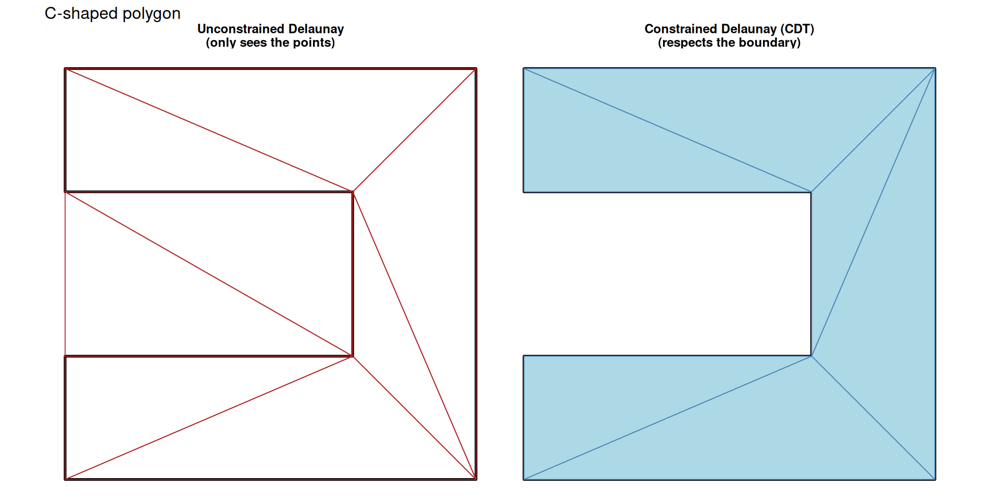
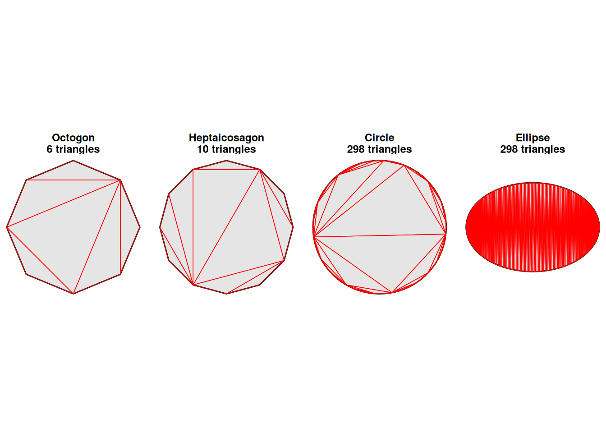

# 2. Discretising Shapes

Code

``` r

library(shapeindices)
library(sf)
library(ggplot2)
library(dplyr)
library(purrr)
library(knitr)

theme_set(theme_minimal(base_size = 11))
theme_gallery <- theme_void(base_size = 10) +
  theme(strip.text = element_text(size = 9, face = "bold"),
        legend.position = "bottom")
```

## 1 Introduction

Most of this package’s indices - everything except the six classical
boundary/hull metrics covered in
[`vignette("j-understanding-classical-indices")`](https://nkaza.github.io/shapeindices/articles/j-understanding-classical-indices.md) -
work from the same underlying structure: a **constrained Delaunay
triangulation (CDT)** of the polygon’s interior. This vignette looks at
that mesh directly: how it’s built and how it differs from an
unconstrained triangulation, two standalone utilities for coarsening or
refining it, and - when a collection of polygons is aggregated into one
weighted shape via `shape_indices_sf(byrow = FALSE)` - how the *choice
of weights* changes the mesh itself, not just the resulting index
values.

See
[`vignette("a-basic-usage")`](https://nkaza.github.io/shapeindices/articles/a-basic-usage.md)
for the package’s own entry points, and each index’s own vignette
(starting with
[`vignette("c-understanding-convexity-index")`](https://nkaza.github.io/shapeindices/articles/c-understanding-convexity-index.md))
for how it actually uses this mesh.

## 2 Constrained Delaunay triangulation

“Delaunay triangulation” converts a set of *points* into well-shaped
triangles, using the empty-circumcircle property to avoid long,
sliver-shaped ones. Applied naively to a polygon’s vertices, it will
happily fill in triangles across holes and gaps, since it only sees
points, not edges.

A **constrained** Delaunay triangulation (CDT) instead treats the
polygon’s edges and hole boundaries as constraints every triangle must
respect. The triangulation covers exactly the polygon’s true interior,
as shown below.

Code

``` r

c_shape <- st_polygon(list(rbind(
  c(0,0), c(10,0), c(10,10), c(0,10), c(0,7), c(7,7),
  c(7,3), c(0,3), c(0,0))))

cdt_compare_plot <- function(poly, subtitle = "") {
  title_a <- "Unconstrained Delaunay\n(only sees the points)"
  title_b <- "Constrained Delaunay (CDT)\n(respects the boundary)"

  verts         <- st_cast(st_geometry(poly), "MULTIPOINT")
  unconstrained <- st_collection_extract(st_triangulate(verts), "POLYGON", warn = FALSE)
  constrained   <- st_geometry(cdt_triangles(poly))

  poly_df <- rbind(
    st_sf(method = title_a, color = "black", fill = NA,        geometry = st_sfc(poly)),
    st_sf(method = title_b, color = "black", fill = "grey92",  geometry = st_sfc(poly))
  )
  tri_df <- rbind(
    st_sf(method = title_a, color = "firebrick", fill = NA,        geometry = unconstrained),
    st_sf(method = title_b, color = "steelblue", fill = "lightblue", geometry = constrained)
  )
  poly_df$method <- factor(poly_df$method, levels = c(title_a, title_b))
  tri_df$method  <- factor(tri_df$method,  levels = c(title_a, title_b))

  ggplot() +
    geom_sf(data = poly_df, aes(color = color, fill = fill), linewidth = 0.9) +
    geom_sf(data = tri_df,  aes(color = color, fill = fill), linewidth = 0.3) +
    scale_color_identity() +
    scale_fill_identity() +
    facet_wrap(~ method) +
    labs(title = subtitle) +
    theme_gallery
}
```

``` r

cdt_compare_plot(c_shape, "C-shaped polygon")
```



## 3 A caveat on smoothness

Smooth geometric figures are analytically useful but computationally
challenging. A mesh overlaid on 27-sided regular polygon have many fewer
triangles than a circle, even though it appraoches the circle on many of
its properties. When spatial computing tools generate a (near) ‘perfect
circle’ (or any other smooth shape), hundreds of boundary points sit on
the exact same circular path. This perfect symmetry triggers a critical
weakness in Delaunay triangulation algorithms, which rely on the
relative positions of points to decide how to split shapes into meshes.
Because the points are perfectly co-circular, the algorithm encounters
endless mathematical “ties” when deciding where to draw diagonal lines.
It is forced to break these ties using microscopic floating-point
rounding errors. This means that a minuscule shift to the coordinates—as
tiny as 1e-12—is enough to flip the diagonal lines and completely alter
the resulting mesh structure.

Code

``` r

library(sf)
library(dplyr)
library(purrr)
library(ggplot2)

base_circle <- st_buffer(st_point(c(0, 0)), dist = 1, nQuadSegs = 75)

shapes_df <- st_sf(
  shape_name = c("Octogon", "Heptaicosagon", "Circle", "Ellipse"),
  geometry = st_sfc(
     st_buffer(st_point(c(0, 0)), dist = 3, nQuadSegs = 2),
    st_buffer(st_point(c(0, 0)), dist = 3, nQuadSegs = 3),
    base_circle * 3,
    base_circle * c(3, 2),
    crs = 3857
  )
)

processed_data <- map(shapes_df$shape_name, function(name) {
  tri_mesh <- cdt_triangles(shapes_df |> filter(shape_name == name))
  
  list(
    name  = name,
    count = nrow(tri_mesh),
    geom  = tri_mesh
  )
})

panel_levels <- map_chr(processed_data, \(x) {
  sprintf("%s\n%d triangles", x$name, x$count)
})

plot_data <- map(processed_data, \(x) {
  
  panel <- sprintf("%s\n%d triangles", x$name, x$count)
  
  list(
    shape = shapes_df |>
      filter(shape_name == x$name) |>
      mutate(panel = panel),
    
    mesh = x$geom |>
      mutate(panel = panel)
  )
})

shape_sf <- map_dfr(plot_data, "shape") |>
  mutate(panel = factor(panel, levels = panel_levels))

mesh_sf <- map_dfr(plot_data, "mesh") |>
  mutate(panel = factor(panel, levels = panel_levels))

ggplot() +
  geom_sf(
    data = shape_sf,
    fill = "grey90",
    colour = "black",
    linewidth = 0.5
  ) +
  geom_sf(
    data = mesh_sf,
    fill = NA,
    colour = "red",
    linewidth = 0.25
  ) +
  facet_wrap(~panel, nrow = 1) +
  coord_sf(datum = NA) +
  theme_void() +
  theme(
    strip.text = element_text(face = "bold")
  )
```



While this mesh shifting barely impacts uniform, unweighted calculations
(changing them by a negligible 0.004%), it drastically alters weighted
spatial indices by more than a full percentage point. This happens
because flipping a diagonal line shifts the geographic center (centroid)
of the resulting sub-triangles, causing them to sample entirely
different values from the underlying data field (like a population or
elevation grid). Fortunately, this instability does not pose a general
cross-platform reproducibility threat for real-world projects. Real
geographical features are naturally irregular and lack the perfect
symmetry required to cause these algorithm ties, and standard reference
calculations rely on stable, closed-form math formulas rather than
triangulation.

## 4 Polygonization is different in a weighting scheme

`shape_indices_sf(byrow = FALSE)` treats a whole collection of rows as
sub-polygons of one weighted shape rather than scoring each row
independently. Wake, Durham, Orange, and Chatham counties (the Research
Triangle) are geographically contiguous. Only the six mesh-based indices
have a genuine weighted form worth comparing this way; see
[`vignette("k-nc-counties-comparison")`](https://nkaza.github.io/shapeindices/articles/k-nc-counties-comparison.md)’s
“Weighting a collection of polygons” for how the weighting choice moves
the resulting index values.

The CDT triangulation itself is different in the weighted and unweighted
case. In the weighted case, the internal borders are respected so that
the weight transfers from the sub-polygon to the mesh more cleanly,
which increases the mesh count. Also note the assumption of constant
density within the sub-polygon, so a larger triangle gets more weight
within the same polygon.

Code

``` r

nc <- st_read(system.file("shape/nc.shp", package = "sf"), quiet = TRUE) %>%
  st_transform(32119)   # NC state plane (meters) - nc.shp ships in NAD27 lon/lat

triangle <- nc %>%
            filter(NAME %in% c("Wake", "Durham", "Orange", "Chatham"))


### This is for demonstration of the triangulation only!
wmA <- shapeindices:::.weighted_mesh(triangle, weights = NULL)
triA <- wmA$pieces
triA$straddles <- lengths(st_overlaps(triA, st_geometry(triangle))) > 1

cwm <- shapeindices:::.constrained_weighted_mesh(triangle, weights = "BIR74")
tri_to_sf <- function(P, T, crs) {
  polys <- lapply(seq_len(nrow(T)), function(i) {
    v <- P[T[i, ], , drop = FALSE]
    st_polygon(list(rbind(v, v[1, ])))
  })
  st_sf(tri_id = seq_len(nrow(T)), geometry = st_sfc(polys, crs = crs))
}
triB <- tri_to_sf(cwm$P, cwm$T, cwm$crs)
triB$weight <- cwm$tri_weight
triB$straddles <- lengths(st_overlaps(triB, st_geometry(triangle))) > 1

pal <- hcl.colors(100, "YlOrRd", rev = TRUE)
w_scaled <- (triB$weight - min(triB$weight)) / (max(triB$weight) - min(triB$weight))
triB$col <- pal[pmax(1, ceiling(w_scaled * 100))]

par(mfrow = c(1, 2), mar = c(2, 1, 3, 1))
plot(st_geometry(triA), border = ifelse(triA$straddles, "firebrick", "steelblue"),
     col = NA, lwd = 0.6)
plot(st_geometry(triangle), col = NA, border = "black", lwd = 2.5, add = TRUE)
title(main = sprintf("weights = NULL\n%d/%d triangles straddle a county line",
                      sum(triA$straddles), nrow(triA)), cex.main = 0.95)

plot(st_geometry(triB), col = triB$col, border = "grey40", lwd = 0.6)
plot(st_geometry(triangle), col = NA, border = "black", lwd = 2.5, add = TRUE)
title(main = sprintf('weights = "BIR74"\n%d/%d triangles straddle a county line',
                      sum(triB$straddles), nrow(triB)), cex.main = 0.95)
```


## 5 0/NA weights change the shape being measured

A row with weight 0 or NA isn’t just zero-weighted - it’s treated as a
**hole**, excluded from the union entirely. This is a *design decision*
of the package. That means switching `weights` can change `poly_u`
itself, not just how it’s weighted - two calls that differ *only* in
`weights` can disagree on `hull_ratio_index` too, even though
`hull_ratio_index` has no weighted form of its own. It was simply
computed on two different shapes.

A 3x3 grid of unit squares makes this concrete. With every cell kept ,
the union is a solid, convex block, even when the centre cell’s weight
is 0. Exclude just the and the union becomes a square ring - same 8
outer cells, but now with an actual hole punched through the middle.

The comparison below is restricted to the six classical metrics, which
have no weighted form at all: any difference between the two columns can
only be because the shape itself having changed, never a differential
weighting effect, since these six never look at `weights` beyond the
0/NA exclusion.\[^ The seven mesh-based indices (`convexity_index` and
its siblings) also move here, but putting them in the same table would
conflate that same shape change with their own weighted computation
kicking in - see “Polygonization is different in a weighting scheme”
above and
[`vignette("k-nc-counties-comparison")`](https://nkaza.github.io/shapeindices/articles/k-nc-counties-comparison.md)‘s
“Weighting a collection of polygons” for how weighting actually moves
those indices’ values\]

Code

``` r

# a small base64-embedded PNG of a shape's own outline, embedded directly
# in the table below and reused as a column header
shape_thumb <- function(geom, size_px = 60, col = "grey75") {
  f <- tempfile(fileext = ".png")
  grDevices::png(f, width = size_px, height = size_px, bg = "white", res = 96)
  par(mar = c(0.5, 0.5, 0.5, 0.5))
  plot(st_geometry(st_sfc(geom)), col = col, border = "grey30")
  grDevices::dev.off()
  uri <- knitr::image_uri(f)
  unlink(f)
  sprintf('<br>', uri, size_px, size_px)
}

# 1. Define grid geometry
cell <- function(cx, cy) st_polygon(list(rbind(
  c(cx - 0.5, cy - 0.5), c(cx + 0.5, cy - 0.5),
  c(cx + 0.5, cy + 0.5), c(cx - 0.5, cy + 0.5), c(cx - 0.5, cy - 0.5)
)))

ctr <- expand.grid(x = -1:1, y = -1:1)
grid9 <- st_sf(
  pop = ifelse(ctr$x == 0 & ctr$y == 0, 0, 10),
  geometry = st_sfc(mapply(cell, ctr$x, ctr$y, SIMPLIFY = FALSE), crs = 3857)
)

# 2. Extract shape objects for thumbnails
grid_shapes <- list(
  solid_block = grid9,
  ring        = dplyr::filter(grid9, pop > 0)
)

classical_indices <- c("hull_ratio", "polsby_popper",
                        "width_length_ratio", "reock",
                        "detour", "exchange")

combined <- map_dfr(names(grid_shapes), function(id) {
  shape_indices_sf(grid9, byrow = FALSE, weights = if (id == "ring") "pop" else NULL, id = id, which = classical_indices)
}) %>%
  st_drop_geometry() %>%
 select(!all_of('total_weight'))

# 4. Prepare numeric matrix for transposing
combined_mat <- as.matrix(combined[, -1])
rownames(combined_mat) <- combined$id

# 5. Create thumbnail headers with shape previews - the centre cell (the
# one that becomes a hole once weighted) is a lighter grey on solid_block,
# and genuinely absent - white, not just transparent - on ring
headers <- map_chr(names(grid_shapes), function(nm) {
  geom <- st_geometry(grid_shapes[[nm]])
  col  <- if (nm == "solid_block") ifelse(grid9$pop == 0, "grey90", "grey75") else "grey75"
  paste0(shape_thumb(geom, col = col), nm)
})

# 6. Render table
kable(
  t(combined_mat),
  format = "html",
  digits = 2,
  row.names = TRUE,
  col.names = headers,
  escape = FALSE
)
```

[TABLE]

`hull_ratio_index` drops from 1 to 0.889 (`= 8/9` - the ring’s true area
over the *same* convex hull area the solid block had), and
`polsby_popper_index` drops further still, penalised twice over: once by
the smaller area, once by the added perimeter of the hole’s own
boundary. Neither index has any notion of `weights` in its own formula,
so neither drop can be a weighting effect - it is the shape itself that
has changed. In real world datasets, many polygons have rows with 0
weights and they get excluded as holes, which can disconnect a
collection into several pieces and punch new interior holes through it -
a materially different (and usually more meaningful) shape than “count
every row, weighted or not.”

## 6 Standalone utilities: coarsening and refining the mesh

Separately from any index, two standalone mesh utilities are available
for downstream geometry work, in opposite directions - neither is wired
into any of the thirteen indices.
[`convex_decompose()`](https://nkaza.github.io/shapeindices/reference/convex_decompose.md)
gives a Hertel-Mehlhorn convex decomposition (fewer, larger convex
pieces than the raw triangle mesh):

Code

``` r

make_star <- function(n_points, r_outer = 1, r_inner = 0.5, center = c(0, 0)) {
  n <- n_points * 2
  angles <- seq(pi / 2, pi / 2 + 2 * pi, length.out = n + 1)[1:n]
  radii  <- rep(c(r_outer, r_inner), n_points)
  x <- center[1] + radii * cos(angles)
  y <- center[2] + radii * sin(angles)
  coords <- rbind(cbind(x, y), c(x[1], y[1]))
  st_polygon(list(coords))
}
star <- make_star(6, r_outer = 1, r_inner = 0.4)
```

``` r

tri    <- cdt_triangles(star)
pieces <- convex_decompose(star)
nrow(tri)     # many small triangles
```

    [1] 10

``` r

nrow(pieces)  # fewer, larger convex pieces
```

    [1] 7

[`subdivide_mesh()`](https://nkaza.github.io/shapeindices/reference/subdivide_mesh.md)
goes the other way - more, smaller triangles, via the same area-adaptive
medial subdivision
[`radial_concentration_index()`](https://nkaza.github.io/shapeindices/reference/radial_concentration_index.md)
uses internally for its own quadrature (see
[`vignette("f-understanding-radial-concentration-index")`](https://nkaza.github.io/shapeindices/articles/f-understanding-radial-concentration-index.md)),
just kept as triangle geometries here rather than collapsed to weighted
centroids:

``` r

fine <- subdivide_mesh(star)
nrow(fine)    # more, smaller triangles than tri
```

    [1] 2560
