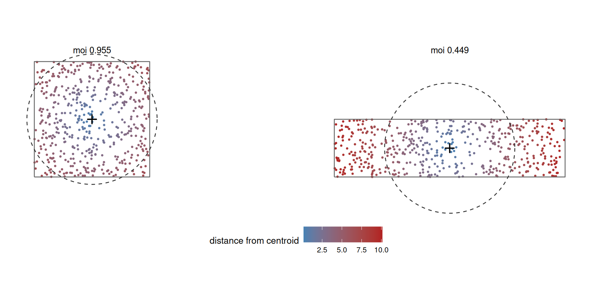
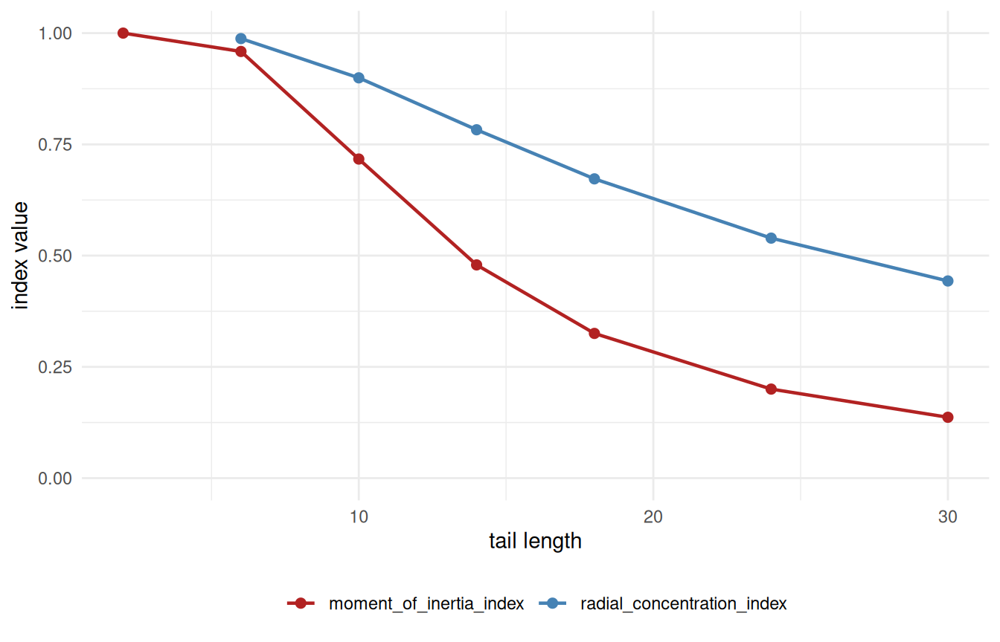

# 3. Understanding Moment of Inertia Index

Code

``` r

library(shapeindices)
library(sf)
library(ggplot2)

theme_set(theme_minimal(base_size = 11))
theme_gallery <- theme_void(base_size = 10) +
  theme(strip.text = element_text(size = 9, face = "bold"),
        legend.position = "bottom")
```

Code

``` r

square <- st_polygon(list(rbind(c(0,0), c(10,0), c(10,10), c(0,10), c(0,0))))
make_rect <- function(w, h) st_polygon(list(rbind(c(0,0), c(w,0), c(w,h), c(0,h), c(0,0))))
aspect_seq <- c(1, 2, 4, 10, 20)
rectangles <- lapply(aspect_seq, function(a) make_rect(sqrt(100 * a), sqrt(100 / a)))
names(rectangles) <- sprintf("aspect %gx", aspect_seq)

make_star <- function(n_points, r_outer = 1, r_inner = 0.5, center = c(0, 0)) {
  n <- n_points * 2
  angles <- seq(pi/2, pi/2 + 2*pi, length.out = n + 1)[1:n]
  radii  <- rep(c(r_outer, r_inner), n_points)
  x <- center[1] + radii * cos(angles); y <- center[2] + radii * sin(angles)
  st_polygon(list(rbind(cbind(x, y), c(x[1], y[1]))))
}
ratio_seq <- c(0.9, 0.7, 0.5, 0.3, 0.15)
stars_r <- lapply(ratio_seq, function(r) make_star(6, 5, 5 * r))
names(stars_r) <- sprintf("notch ratio %.2f", ratio_seq)

disk <- st_buffer(st_sfc(st_point(c(0, 0))), dist = 5.64, nQuadSegs = 60)[[1]]

# a ring of n_arms radial wedges spanning [r_in, r_out], with a FIXED total
# angular width (total_angle_frac * pi radians) split evenly among them - so
# n_arms only changes how finely that fixed total width is cut up, not how
# much of it there is; area and the radius-vs-mass profile stay identical
# across n_arms by construction
make_spokes <- function(r_in, r_out, n_arms, total_angle_frac = 0.5) {
  angles <- seq(0, 2 * pi, length.out = n_arms + 1)[1:n_arms]
  half_w <- total_angle_frac * pi / n_arms
  polys <- lapply(angles, function(a0) {
    th <- seq(a0 - half_w, a0 + half_w, length.out = max(6, 40 %/% n_arms))
    outer_pts <- cbind(r_out * cos(th), r_out * sin(th))
    inner_pts <- cbind(r_in * cos(rev(th)), r_in * sin(rev(th)))
    st_polygon(list(rbind(outer_pts, inner_pts, outer_pts[1, ])))
  })
  Reduce(function(p, q) st_union(st_sfc(p), st_sfc(q))[[1]], polys)
}
arm_counts <- c(2, 4, 8, 16)
spokes <- lapply(arm_counts, function(n) make_spokes(3, 5, n))
names(spokes) <- sprintf("%d arms", arm_counts)
```

## 1 Introduction

[`moment_of_inertia_index()`](https://nkaza.github.io/shapeindices/reference/moment_of_inertia_index.md)
measures how tightly a polygon’s own mass is packed around its centre,
using *squared* distance from the mass centroid. For a mass distribution
with density $`\rho`$ over the polygon $`P`$ and total mass $`W`$, the
polar second moment about the mass centroid $`G`$ is

``` math
J = \int_P \rho(s)\,|s - G|^2\,ds,
```

where $`s \in P`$ is a point of the polygon (not a scalar coordinate).
The index compares this to $`J_{\text{ref}}`$, the same quantity for the
*most compact possible* arrangement of that area/mass - a disk when
unweighted, concentric rings (densest at the centre) when weighted. The
index is $`J_{\text{ref}}/J \in (0, 1]`$, equal to 1 exactly when $`P`$
is that reference shape.

It is a sibling to
[`span_index()`](https://nkaza.github.io/shapeindices/reference/span_index.md)
(mean *plain* distance between two random points) and
[`radial_concentration_index()`](https://nkaza.github.io/shapeindices/reference/radial_concentration_index.md)
(mean plain distance to the geometric median). This one is *squared*
distance to the centroid - the remaining member of that family, and the
smoothest to compute: because squared distance has an exact polygon
closed form,
[`moment_of_inertia_index()`](https://nkaza.github.io/shapeindices/reference/moment_of_inertia_index.md)
needs no Monte Carlo mode at all, unlike the other two.

This exact construction - the polar second moment of a polygon’s own
mass, compared to the minimum achieved by an equal-area disk - is Kaza’s
Index of Moment of Inertia (IMI).[^1] It also happens to be the same
quantity as **Cohesion**, one of Angel, Parent & Civco’s (2010)
classical circle-compactness properties
([`vignette("d-understanding-span-index")`](https://nkaza.github.io/shapeindices/articles/d-understanding-span-index.md)’s
Introduction): Cohesion is defined there as the ratio of mean *squared*
pairwise distance in an equal-area circle to the same quantity in the
actual shape, and mean squared pairwise distance is exactly twice the
mean squared distance to the centroid for any point set - a factor that
cancels identically in the ratio, leaving IMI. Their own plain-distance
analogue of Cohesion is a different quantity entirely, and one they
explicitly left as an open conjecture rather than a proven proposition;
[`span_index()`](https://nkaza.github.io/shapeindices/reference/span_index.md)’s
Introduction picks that up.[^2] It’s a different lineage from the
classical circle-compactness properties
[`span_index()`](https://nkaza.github.io/shapeindices/reference/span_index.md)
draws on otherwise, though related: Boyce & Clark (1964) proposed an
earlier compactness measure that also samples radial spread, but from
the *boundary* (radius as a function of angle, not mass as a function of
squared distance), a distinct construction with no direct correspondence
to IMI.[^3]

## 2 Deriving the index

### 2.1 The polar moment and its disk reference

Writing $`s = (x, y)`$, the polar moment splits into the two coordinate
second moments,

``` math
J = \int_P \rho(s)\,\big[(x - G_x)^2 + (y - G_y)^2\big]\,ds = I_{yy} + I_{xx},
```

the same $`I_{xx}`$, $`I_{yy}`$ that
[`moment_isotropy_index()`](https://nkaza.github.io/shapeindices/reference/moment_isotropy_index.md)
uses (see
[`vignette("f-understanding-moment-isotropy-index")`](https://nkaza.github.io/shapeindices/articles/f-understanding-moment-isotropy-index.md));
this index just needs their sum. Each is an exact polygon integral,
summed triangle by triangle via the shoelace formula - no quadrature, no
sampling.

The reference $`J_{\text{ref}}`$ is the polar moment of a disk of the
same area $`A`$. A disk of radius $`R = \sqrt{A/\pi}`$ has

``` math
J_{\text{disk}} = \int_0^R r^2 \cdot 2\pi r\,dr = \frac{\pi R^4}{2} = \frac{A^2}{2\pi},
```

so the index is $`J_{\text{ref}}/J = \dfrac{A^2}{2\pi J}`$.

### 2.2 Why the disk is optimal - and why that makes the index bounded

For fixed area, $`J`$ weights each patch of area by its *squared*
distance from $`G`$. To make that sum as small as possible you must pile
the area as close to the centre as it will go - and the shape that does
this, for a given area, is a disk centred at $`G`$. This is the
**bathtub principle**: with the “cost” $`|s - G|^2`$ increasing
radially, the minimising set of fixed measure is a ball around the
minimum. So the disk uniquely minimises $`J`$ among *all* measurable
shapes of that area - convexity, holes, and multiple parts do not enter
the argument - which gives $`J_{\text{ref}} \le J`$ always, hence the
index in $`(0, 1]`$, equal to 1 if and only if $`P`$ is (almost
everywhere) a disk.

Because both $`J`$ and $`J_{\text{ref}}`$ are exact closed forms, there
is no approximation to control:
[`moment_of_inertia_index()`](https://nkaza.github.io/shapeindices/reference/moment_of_inertia_index.md)
has no `deterministic` argument and no Monte Carlo mode, unlike
[`convexity_index()`](https://nkaza.github.io/shapeindices/reference/convexity_index.md),
[`span_index()`](https://nkaza.github.io/shapeindices/reference/span_index.md),
and
[`radial_concentration_index()`](https://nkaza.github.io/shapeindices/reference/radial_concentration_index.md).
The same is true of
[`moment_isotropy_index()`](https://nkaza.github.io/shapeindices/reference/moment_isotropy_index.md),
which reuses these very moments.

### 2.3 Weighted version: concentric rings

A per-triangle weight makes the density $`\rho`$ piecewise-constant
instead of uniform, so the disk-minimises-$`J`$ theorem no longer
applies directly - the minimiser for a given density profile is
concentric rings, densest at the centre (the same
rearrangement-inequality family
[`span_index()`](https://nkaza.github.io/shapeindices/reference/span_index.md)
and
[`radial_concentration_index()`](https://nkaza.github.io/shapeindices/reference/radial_concentration_index.md)
use). Sorting parcels by descending density, with $`S_k`$ the cumulative
area of the $`k`$ densest,

``` math
J_{\text{ref}} = \frac{1}{2\pi}\sum_k \rho_{(k)}\big(S_k^2 - S_{k-1}^2\big),
```

and the index is again $`J_{\text{ref}}/J \in (0, 1]`$. Weighting by
each triangle’s own area (uniform density) collapses this back to
$`A^2/2\pi`$ exactly.

## 3 Illustrations

### 3.1 What the index sees: squared distance from the centroid

The index asks how far the shape’s mass sits from its own centroid, in
squared terms, against the disk that would pack the same area as tightly
as possible. Shading interior points by their squared distance from the
centroid, and overlaying that equal-area reference disk, shows the
difference directly: a compact shape’s mass stays close (blue) and
nearly fills its reference disk, while an elongated one flings mass out
to the ends (red), inflating $`J`$ and dropping the index - even though
both shapes are perfectly convex.



The dashed circle is the equal-area disk each shape is scored against.
The square (moi 0.955) nearly fills it; the rectangle (moi 0.449) spills
far past it at both ends, where the reddest points contribute most to
$`J`$.

### 3.2 Basic shapes: dispersal, not concavity

| shape | name | moment_of_inertia | span | convexity |
|:---|:---|---:|---:|---:|
|  | square | 0.955 | 0.981 | 1.000 |
|  | disk | 1.000 | 1.002 | 1.000 |
|  | aspect 1x | 0.955 | 0.981 | 1.000 |
|  | aspect 2x | 0.764 | 0.898 | 1.000 |
|  | aspect 4x | 0.449 | 0.714 | 1.000 |
|  | aspect 10x | 0.189 | 0.474 | 1.000 |
|  | aspect 20x | 0.095 | 0.338 | 1.000 |
|  | notch ratio 0.90 | 0.996 | 1.001 | 1.000 |
|  | notch ratio 0.70 | 0.957 | 0.981 | 0.998 |
|  | notch ratio 0.50 | 0.851 | 0.929 | 0.975 |
|  | notch ratio 0.30 | 0.637 | 0.813 | 0.892 |
|  | notch ratio 0.15 | 0.373 | 0.632 | 0.724 |

Two things stand out. First, moment of inertia falls steeply as a
rectangle elongates while `convexity` stays pinned at 1 - a long thin
rectangle is perfectly convex but far from a disk, so this index (like
[`moment_isotropy_index()`](https://nkaza.github.io/shapeindices/reference/moment_isotropy_index.md))
sees a kind of non-compactness convexity is blind to. Second, moment of
inertia drops *faster* than `span` on the same shapes: squaring the
distance amplifies the contribution of the far-flung mass, so this index
penalises dispersal more sharply than its plain-distance sibling. It is
the most aggressive of the three “distance from a centre” indices for
that reason.

### 3.3 Weighting: concentrating mass toward the centre

Weighting by each triangle’s own area reproduces the unweighted index
exactly; concentrating weight toward the centroid raises it (mass packed
tighter than the shape’s geometry alone), and toward the edge lowers
it - but always compared against the concentric-ring reference matching
that same weight profile, not against a fixed disk.

``` r

star <- st_sfc(make_star(6, 5, 2))
prep <- prepare_polygon(star)
tri  <- prep$tri
d    <- as.numeric(st_distance(st_centroid(st_geometry(tri)), st_centroid(star)))
w_centre <- exp(-d / mean(d))
w_edge   <- exp( d / mean(d))

data.frame(
  weighting = c(weight_thumb(tri, rep(1, nrow(tri))), weight_thumb(tri, w_centre), weight_thumb(tri, w_edge)),
  name = c("uniform (area)", "toward centre", "toward edge"),
  moment_of_inertia = c(
    moment_of_inertia_index(star, prep = prep, weight = tri$area)$index,
    moment_of_inertia_index(star, prep = prep, weight = w_centre)$index,
    moment_of_inertia_index(star, prep = prep, weight = w_edge)$index)
) |> knitr::kable(format = "html", digits = 3, row.names = FALSE, escape = FALSE)
```

| weighting | name | moment_of_inertia |
|:---|:---|---:|
|  | uniform (area) | 0.761 |
|  | toward centre | 0.768 |
|  | toward edge | 0.566 |

### 3.4 Things to watch out for: same radial spread, same index

$`J = \int_P \rho(s)\,|s-G|^2\,ds`$ depends on each point only through
its distance $`|s-G|`$ from the centroid, never its bearing. Splitting
the integral into a distance step and a bearing step,
$`J = \int_0^\infty r^2\,m(r)\,dr`$, where $`m(r)`$ is the total mass
sitting at distance $`r`$ from $`G`$, integrated over every bearing at
that radius. Two shapes with the same $`m(r)`$ get the same $`J`$,
however differently that mass is arranged bearing to bearing at each
radius - *provided* $`G`$ itself lands in the same place for both, which
is exactly what happens for any shape with two-fold or higher rotational
symmetry (the symmetry forces the centroid to the shape’s own centre of
symmetry).

``` r

tbl_spokes <- do.call(rbind, lapply(names(spokes), function(nm) {
  poly <- st_sfc(spokes[[nm]])
  data.frame(shape = shape_thumb(spokes[[nm]]), name = nm,
             moment_of_inertia = moment_of_inertia_index(poly)$index,
             convexity = suppressWarnings(convexity_index(poly, deterministic = FALSE,
                                                            n_lines = 5000, seed = 1)$index))
}))
knitr::kable(format = "html", tbl_spokes, digits = 4, row.names = FALSE, escape = FALSE)
```

| shape | name | moment_of_inertia | convexity |
|:---|:---|---:|---:|
|  | 2 arms | 0.2353 | 0.6269 |
|  | 4 arms | 0.2353 | 0.5168 |
|  | 8 arms | 0.2353 | 0.4278 |
|  | 16 arms | 0.2353 | 0.3797 |

Each row is a ring of radial wedges spanning the same inner/outer radius
and covering the same *total* angular width - only how finely that width
is cut into separate arms changes, from 2 broad wedges down to 16 thin
ones with wide gaps between them. `moment_of_inertia` doesn’t move at
all: every row has the same $`m(r)`$, so every row has the same $`J`$.
[`convexity_index()`](https://nkaza.github.io/shapeindices/reference/convexity_index.md)
sees exactly what
[`moment_of_inertia_index()`](https://nkaza.github.io/shapeindices/reference/moment_of_inertia_index.md)
misses, falling steadily as the gaps multiply.

``` r

make_spokes_at <- function(r_in, r_out, angles, half_w) {
  polys <- lapply(angles, function(a0) {
    th <- seq(a0 - half_w, a0 + half_w, length.out = 12)
    outer_pts <- cbind(r_out * cos(th), r_out * sin(th))
    inner_pts <- cbind(r_in * cos(rev(th)), r_in * sin(rev(th)))
    st_polygon(list(rbind(outer_pts, inner_pts, outer_pts[1, ])))
  })
  Reduce(function(p, q) st_union(st_sfc(p), st_sfc(q))[[1]], polys)
}
half_w <- 0.5 * pi / 4
evenly  <- st_sfc(make_spokes_at(3, 5, seq(0, 2 * pi, length.out = 5)[1:4], half_w))
bunched <- st_sfc(make_spokes_at(3, 5, c(0, 1.3, 2.7, 4.6), half_w))  # same 4 wedges, uneven bearings

moi_evenly  <- moment_of_inertia_index(evenly)$index
moi_bunched <- moment_of_inertia_index(bunched)$index
```

This isn’t a symmetry-independent fact about $`m(r)`$ alone - it relies
on the centroid staying put. The same 4 wedges, same widths and same
radial extent, rearranged onto unevenly-spaced bearings instead of
evenly-spaced ones, moves the index from 0.2353 to 0.2384: breaking the
rotational symmetry lets the centroid drift off-centre, which breaks the
“distance from $`G`$ equals radius from the ring’s own centre” identity
the argument above depends on. Two-fold symmetry or higher is doing real
work here, not just convenient shape-picking.

## 4 Where this fits

[`moment_of_inertia_index()`](https://nkaza.github.io/shapeindices/reference/moment_of_inertia_index.md)
is the squared-distance, centroid-anchored member of a family of three.
Its siblings measure the same “how spread out is the mass” question
through different lenses:
[`span_index()`](https://nkaza.github.io/shapeindices/reference/span_index.md)
uses plain distance between two random points
([`vignette("d-understanding-span-index")`](https://nkaza.github.io/shapeindices/articles/d-understanding-span-index.md)),
and
[`radial_concentration_index()`](https://nkaza.github.io/shapeindices/reference/radial_concentration_index.md)
uses plain distance to the geometric median
([`vignette("e-understanding-radial-concentration-index")`](https://nkaza.github.io/shapeindices/articles/e-understanding-radial-concentration-index.md)).
It also shares its exact second moments with
[`moment_isotropy_index()`](https://nkaza.github.io/shapeindices/reference/moment_isotropy_index.md)
([`vignette("f-understanding-moment-isotropy-index")`](https://nkaza.github.io/shapeindices/articles/f-understanding-moment-isotropy-index.md)),
which asks not how far the mass spreads but whether it prefers a
direction.

The most interesting sibling comparison is with
[`radial_concentration_index()`](https://nkaza.github.io/shapeindices/reference/radial_concentration_index.md),
since the two anchor on genuinely different centres - the area centroid
here, the geometric median there
([`vignette("e-understanding-radial-concentration-index")`](https://nkaza.github.io/shapeindices/articles/e-understanding-radial-concentration-index.md)’s
“Why the geometric median, not the centroid”). Reusing that vignette’s
own “tadpole” construction (a round head with a thin tail, lengthened
here in steps) isolates the difference cleanly: the centroid gets
dragged toward the tail as it grows, while the median stays anchored in
the head where the mass actually is.



Both fall as the tail lengthens, but
[`moment_of_inertia_index()`](https://nkaza.github.io/shapeindices/reference/moment_of_inertia_index.md)
falls faster and further. Squaring the distance amplifies the penalty
for the tail’s far tip, and the centroid it’s measured from is itself
being dragged outward toward that tip - two effects compounding in the
same direction.
[`radial_concentration_index()`](https://nkaza.github.io/shapeindices/reference/radial_concentration_index.md)’s
median, by contrast, resists the pull (it minimises *plain* distance,
which weights far points less aggressively than squared distance does),
so the same growing tail costs it less. At `tail_len =` 30,
[`moment_of_inertia_index()`](https://nkaza.github.io/shapeindices/reference/moment_of_inertia_index.md)
reads 0.137 against
[`radial_concentration_index()`](https://nkaza.github.io/shapeindices/reference/radial_concentration_index.md)’s
0.443 - the same shape, read as more than three times as far from ideal
by one index as the other.

## 5 Key takeaways

- [`moment_of_inertia_index()`](https://nkaza.github.io/shapeindices/reference/moment_of_inertia_index.md)
  compares a shape’s polar second moment $`J`$ (mass weighted by
  *squared* distance from the centroid) to the same quantity for an
  equal-area disk, the provably optimal (bathtub-principle)
  arrangement - 1 exactly when the shape is a disk almost everywhere.
- It is exact and closed-form throughout: no `deterministic` argument,
  no quadrature, no Monte Carlo mode, unlike
  [`convexity_index()`](https://nkaza.github.io/shapeindices/reference/convexity_index.md),
  [`span_index()`](https://nkaza.github.io/shapeindices/reference/span_index.md),
  and
  [`radial_concentration_index()`](https://nkaza.github.io/shapeindices/reference/radial_concentration_index.md).
- It measures dispersal from the centroid, not concavity - a long thin
  (but perfectly convex) rectangle scores low, while a deeply notched
  (but compact) star barely moves it.
- It depends only on the distance each point sits from the centroid,
  never the bearing: shapes with two-fold or higher rotational symmetry
  and the same radius-vs-mass profile score *identically*, however that
  mass is carved up angularly - from a couple of broad wedges to many
  thin ones with wide gaps between them (see “Things to watch out for”
  above).
  [`convexity_index()`](https://nkaza.github.io/shapeindices/reference/convexity_index.md)
  is the one that actually sees those gaps.
- Weighting is free: since the disk-is-optimal argument extends to
  concentric rings for any piecewise-constant density, a weighted index
  is just the same ratio computed against the reweighted reference, with
  no new derivation needed.
- Among the three “distance from a centre” siblings, it is the most
  aggressive: squaring the distance amplifies the penalty for far-flung
  mass, so it falls faster than
  [`span_index()`](https://nkaza.github.io/shapeindices/reference/span_index.md)
  on the same elongating or notching shape.

[^1]: Kaza, N. (2020). Urban form and transportation energy consumption.
    *Energy Policy*, 136, 111049. Kaza, N. (2024). Multiclass
    compactness index for urban areas. *The Professional Geographer*,
    76(4), 532-542.

[^2]: Angel, S., Parent, J., & Civco, D. L. (2010). Ten compactness
    properties of circles: measuring shape in geography. *Canadian
    Geographer*, 54(4), 441-461.

[^3]: Boyce, R. R., & Clark, W. A. V. (1964). The concept of shape in
    geography. *Geographical Review*, 54(4), 561-572.
