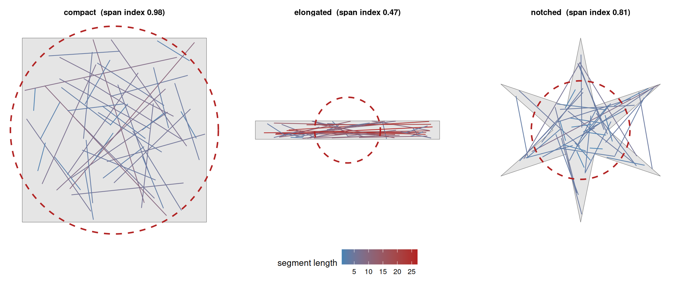
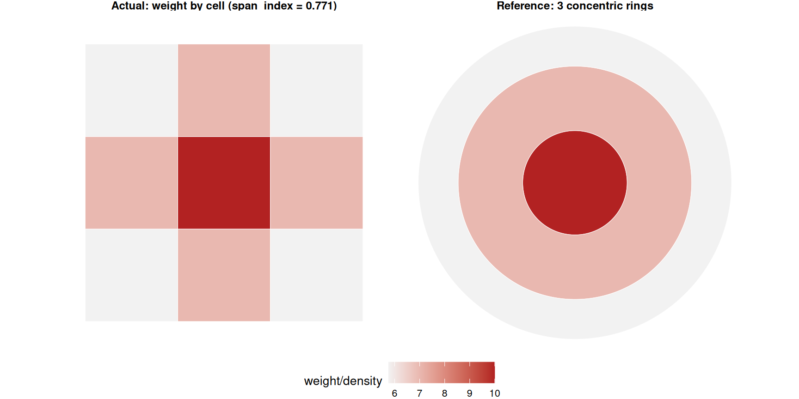
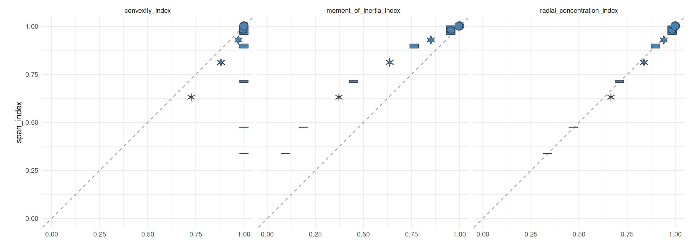

# 4. Understanding Span Index

Code

``` r

library(shapeindices)
library(sf)
library(ggplot2)
library(dplyr)

theme_set(theme_minimal(base_size = 11))
theme_gallery <- theme_void(base_size = 10) +
  theme(strip.text = element_text(size = 9, face = "bold"),
        legend.position = "bottom")
```

Code

``` r

square <- st_polygon(list(rbind(c(0,0), c(10,0), c(10,10), c(0,10), c(0,0))))

make_rect <- function(w, h) st_polygon(list(rbind(c(0,0), c(w,0), c(w,h), c(0,h), c(0,0))))
aspect_seq  <- c(1, 2, 4, 10, 20)
rectangles  <- lapply(aspect_seq, function(a) make_rect(sqrt(100 * a), sqrt(100 / a)))
names(rectangles) <- sprintf("aspect %gx", aspect_seq)

make_star <- function(n_points, r_outer = 1, r_inner = 0.5, center = c(0, 0)) {
  n <- n_points * 2
  angles <- seq(pi/2, pi/2 + 2*pi, length.out = n + 1)[1:n]
  radii  <- rep(c(r_outer, r_inner), n_points)
  x <- center[1] + radii * cos(angles)
  y <- center[2] + radii * sin(angles)
  coords <- rbind(cbind(x, y), c(x[1], y[1]))
  st_polygon(list(coords))
}
ratio_seq <- c(0.9, 0.7, 0.5, 0.3, 0.15)
stars_r   <- lapply(ratio_seq, function(r) make_star(6, 5, 5 * r))
names(stars_r) <- sprintf("notch ratio %.2f", ratio_seq)

disk <- st_buffer(st_sfc(st_point(c(0, 0))), dist = 5.64, nQuadSegs = 60)[[1]]  # area matches square

# a ring of n_arms radial wedges spanning [r_in, r_out], with a FIXED total
# angular width split evenly among them, so n_arms only changes how finely
# that fixed width is cut up - same construction used in
# vignette("c-understanding-moment-of-inertia-index") and
# vignette("e-understanding-radial-concentration-index") to demonstrate
# those two indices' shared exact invariance to this kind of rearrangement
make_spokes <- function(r_in, r_out, n_arms, total_angle_frac = 0.5) {
  angles <- seq(0, 2 * pi, length.out = n_arms + 1)[1:n_arms]
  half_w <- total_angle_frac * pi / n_arms
  polys <- lapply(angles, function(a0) {
    th <- seq(a0 - half_w, a0 + half_w, length.out = max(6, 40 %/% n_arms))
    outer_pts <- cbind(r_out * cos(th), r_out * sin(th))
    inner_pts <- cbind(r_in * cos(rev(th)), r_in * sin(rev(th)))
    st_polygon(list(rbind(outer_pts, inner_pts, outer_pts[1, ])))
  })
  Reduce(function(p, q) st_union(st_sfc(p), st_sfc(q))[[1]], polys)
}
arm_counts <- c(2, 4, 8, 16)
spoke_shapes <- lapply(arm_counts, function(n) make_spokes(3, 5, n))
names(spoke_shapes) <- sprintf("%d arms", arm_counts)
```

## 1 Introduction

[`span_index()`](https://nkaza.github.io/shapeindices/reference/span_index.md)
measures how far apart a polygon’s own interior points typically are,
relative to a reference shape. Two independent points $`s, t \in P`$
drawn uniformly from a polygon $`P`$ have some mean distance apart,
$`D(P) = \mathbb{E}|s - t|`$;
[`span_index()`](https://nkaza.github.io/shapeindices/reference/span_index.md)
compares this to $`D_{\text{ref}}`$, the same quantity for the *most
compact possible* arrangement of that area/mass - a circle when
unweighted, a concentric annulus (densest at the centre) when weighted.
The index is $`D_{\text{ref}}/D(P) \in (0, 1]`$, equal to 1 exactly when
$`P`$ already matches its reference.

This sits alongside
[`convexity_index()`](https://nkaza.github.io/shapeindices/reference/convexity_index.md)
(which measures whether interior lines stay inside the boundary) and
[`moment_of_inertia_index()`](https://nkaza.github.io/shapeindices/reference/moment_of_inertia_index.md)
(which measures dispersal via *squared* distance from the shape’s own
centroid). Span index measures dispersal too, but via plain
(non-squared) pairwise distance - a genuinely different quantity, not
just a rescaling of moment of inertia, for reasons this vignette
derives.

Span index’s plain-distance construction is close to, but not quite, a
named index in the shape-compactness literature (reviewed generally in
Frolov 1975[^1] and MacEachren 1985[^2]). Angel, Parent & Civco
(2010)[^3] define **Cohesion** - one of several classical “compactness
properties of circles,” alongside Polsby-Popper and Reock (both already
in this package, as
[`polsby_popper_index()`](https://nkaza.github.io/shapeindices/reference/polsby_popper_index.md)
and
[`reock_index()`](https://nkaza.github.io/shapeindices/reference/reock_index.md)) -
as the ratio of mean *squared* distance between two random points in an
equal-area circle to the same quantity in the actual shape. That’s
[`moment_of_inertia_index()`](https://nkaza.github.io/shapeindices/reference/moment_of_inertia_index.md)’s
own construction, not span index’s: mean squared pairwise distance is
exactly twice the mean squared distance to the centroid for any point
set, and that factor of 2 cancels identically in the ratio, so Cohesion
reduces to Kaza’s IMI exactly (see
[`vignette("c-understanding-moment-of-inertia-index")`](https://nkaza.github.io/shapeindices/articles/c-understanding-moment-of-inertia-index.md)’s
Introduction). Angel et al. explicitly flag the *plain*-distance
version - span index’s own construction - as an open question in their
own footnote: “It stands to reason that among all shapes of a given area
the circle also has the shortest average distance…but a rigorous proof
of this proposition has so far eluded us.” The rearrangement-inequality
argument below (see “The reference shapes really are optimal”) settles
exactly that question.

## 2 Deriving span index

### 2.1 Definition

Here $`\rho`$ is a density over the polygon $`P`$: for a point
$`s \in P`$, $`\rho(s)`$ is the mass density there. Let $`s, t \in P`$
be two independent points drawn from $`\rho/W`$, where
$`W = \int_P \rho`$ is the total mass. Define

``` math
D(\rho) = \frac{1}{W^2}\iint_{P \times P} \rho(s)\,\rho(t)\,\lvert s - t\rvert\; ds\, dt = \mathbb{E}\,\lvert s - t\rvert
```

The density appears *twice* - once for each of the two independent
points $`s`$ and $`t`$ - because span index is about a pair of random
locations (this is what distinguishes it from
[`radial_concentration_index()`](https://nkaza.github.io/shapeindices/reference/radial_concentration_index.md),
where only one end of the distance is random and $`\rho`$ appears once).
The letters $`s, t`$ stand for whole points of $`P`$, not scalar
coordinates.

Span index is $`D_{\text{ref}}/D(\rho)`$, where $`D_{\text{ref}}`$ is
this same quantity computed for a reference mass arrangement that
provably minimises it (below). Unweighted, $`\rho`$ is just the
polygon’s indicator function and $`W = A`$ (area); weighted, $`\rho`$ is
piecewise-constant across the CDT triangles, one `weight` value per
triangle, and $`W = \sum \text{weight}`$.

### 2.2 What the index sees

Span index is the *average length of the segment between two random
interior points* - a chord, strictly, has both endpoints on the boundary
itself, so “segment” is the accurate word here even though the two are
easy to conflate. Draw a few dozen such segments and colour them by
length: a compact shape produces mostly short ones, an elongated one of
the same area produces many long ones, so its mean pairwise distance
$`D`$ is larger and its index (reference over $`D`$) is lower. The
dashed circle in each panel is that shape’s own equal-area disk
reference - the two shapes’ interior points would be, on average, the
same distance apart only if the panel’s own polygon were itself a disk.



Each panel’s own equal-area disk reference (dashed) shows the same story
a different way: the square nearly fills its own reference circle, the
elongated rectangle spills far outside it, and the notched star sits in
between - visually the same ranking the segment colours already suggest.

Look closely at the star panel and some segments visibly cut across a
notch, leaving the polygon briefly before re-entering it. That’s not a
rendering artefact: span index only requires $`s`$ and $`t`$ themselves
to be interior, never the line between them - unlike
[`convexity_index()`](https://nkaza.github.io/shapeindices/reference/convexity_index.md),
which is built specifically around whether that connecting line stays
inside
([`vignette("b-understanding-convexity-index")`](https://nkaza.github.io/shapeindices/articles/b-understanding-convexity-index.md),
and see the Introduction above for what this index has in common with
the wider compactness literature). “Where this fits” below compares the
two indices directly.

**Weighting** changes what this figure would show without changing what
it means: points would be sampled in proportion to `weight` rather than
uniform area, so segments would cluster wherever the density is highest
rather than spreading evenly across the shape, and the dashed reference
circle becomes the density-varying disk from
[`vignette("c-understanding-moment-of-inertia-index")`](https://nkaza.github.io/shapeindices/articles/c-understanding-moment-of-inertia-index.md)’s
“Weighted version” (concentric rings, densest at the centre) rather than
a flat one - the same reference construction “Weighted reference: the
concentric annulus” below derives in full.

### 2.3 Why not squared distance?

Squaring first would make the actual value trivial to compute - but at
the cost of it being a different index in name only. For $`s, t`$
independent with density $`\rho/W`$,

``` math
\mathbb{E}|s-t|^2 = 2\,\text{Var}(s) = \frac{2J}{W}
```

where $`J = \int_P \rho(s)\,|s-G|^2\,ds`$ is exactly the polar moment of
inertia
[`moment_of_inertia_index()`](https://nkaza.github.io/shapeindices/reference/moment_of_inertia_index.md)
already computes about the mass centroid $`G`$. Both the disk reference
($`J_{\text{ref}} = A^2/2\pi`$) and the concentric-ring reference for a
weighted profile are *also* already exact closed forms in that function.
So a squared-distance version of span index would reduce to

``` math
\frac{D_{\text{ref}}^2}{D(\rho)^2} = \frac{2J_{\text{ref}}/W}{2J_{\text{actual}}/W} = \frac{J_{\text{ref}}}{J_{\text{actual}}}
```

which is exactly
[`moment_of_inertia_index()`](https://nkaza.github.io/shapeindices/reference/moment_of_inertia_index.md)’s
own return value - the $`W`$’s cancel exactly. Plain (non-squared)
distance has no such shortcut: by Jensen’s inequality,
$`\mathbb{E}|s-t| \le \sqrt{\mathbb{E}|s-t|^2}`$ strictly (equality
would need $`|s-t|`$ almost-surely constant, never true on a continuous
2D region), and the gap depends on the *shape* of the distance
distribution, not just its second moment. Concretely, the ratio
$`D/\sqrt{2J/W}`$ is about $`0.905`$ for a disk but only about $`0.816`$
for a degenerate line segment - not a universal constant, so
$`D_{\text{ref}}/D_{\text{actual}} \ne \sqrt{J_{\text{ref}}/J_{\text{actual}}}`$
in general. Span index is measuring something moment of inertia
genuinely cannot see.

### 2.4 The reference shapes really are optimal

Both reference shapes need to be true minimisers of $`D`$, not just
plausible-looking candidates, for “index $`\le 1`$” to hold in general.
The relevant tool is **Riesz’s rearrangement inequality**: for fixed
total mass, $`\iint \rho(s)\rho(t)\,h(s-t)\,ds\,dt`$ is maximised, among
all spatial rearrangements of $`\rho`$, when $`\rho`$ is arranged
symmetric-decreasing about a common centre - *provided* $`h`$ is itself
symmetric-decreasing. Our kernel $`|s-t|`$ is *increasing*, not
decreasing, but subtracting it from a large constant $`C`$ flips the
sign without changing which arrangement is optimal (rearrangement
preserves total mass, so the constant term is fixed): minimising
$`\iint \rho(s)\rho(t)|s-t|\,ds\,dt`$ is the same problem as maximising
$`\iint \rho(s)\rho(t)(C - |s-t|)\,ds\,dt`$, and $`C-|s-t|`$*is*
symmetric-decreasing.

- **Unweighted**: $`\rho`$ is an indicator function; its
  symmetric-decreasing rearrangement is, by definition, the indicator of
  the equal-area disk. Riesz confirms the disk is the exact global
  minimiser of $`D`$ among *every* measurable shape of that area, not
  just convex ones.
- **Weighted**: $`\rho`$’s rearrangement class is the same multiset of
  (weight, area) pairs the triangulation produced; its
  symmetric-decreasing rearrangement is concentric rings, sorted
  densest-to-centre - the same construction
  [`moment_of_inertia_index()`](https://nkaza.github.io/shapeindices/reference/moment_of_inertia_index.md)
  already uses for its own weighted reference.

For the discrete (CDT-triangle) mesh this also has a direct finite proof
by exchange: swapping the ring positions of two triangles where the
denser one sits farther out strictly decreases the reference sum, since
(as derived below) the pairwise kernel is increasing in each radius.
Repeating every improving swap converges to the sorted order.

### 2.5 Unweighted reference: the disk

The mean distance between two uniform random points in a disk of radius
$`R`$ is a classical closed form,
$`\mathbb{E}|s-t| = \frac{128}{45\pi}R \approx 0.9054\,R`$. With
$`R = \sqrt{A/\pi}`$,

``` math
D_{\text{circle}}(A) = \frac{128\sqrt{A}}{45\,\pi^{3/2}}
```

### 2.6 Weighted reference: the concentric annulus

No closed form exists ring-to-ring: unlike moment of inertia’s $`r^2`$
kernel (which has a clean $`r^4`$ antiderivative), $`|s-t|`$ has none.
But averaging over just the *angle* between two points at radii
$`r_1, r_2`$ does:

``` math
g(r_1, r_2) = \frac{1}{2\pi}\int_0^{2\pi} \sqrt{r_1^2 + r_2^2 - 2 r_1 r_2 \cos\theta}\;d\theta = \frac{2}{\pi}(r_1+r_2)\,E(k), \qquad k = \frac{2\sqrt{r_1 r_2}}{r_1+r_2}
```

where $`E`$ is the complete elliptic integral of the second kind. Two
sanity checks confirm it: $`r_1=r_2=r`$ gives $`k=1`$, $`E(1)=1`$,
$`g = 4r/\pi`$ - the classical mean chord length between two random
points on one circle. $`r_2=0`$ gives $`k=0`$, $`E(0)=\pi/2`$,
$`g=r_1`$ - the (obviously correct) distance from the centre to any
point on a circle of radius $`r_1`$.

(`shapeindices`’s internal `E(k)` is computed via the AGM algorithm, not
a package dependency; cross-checked here against direct numerical
integration of $`E`$’s own definition across 8 values of $`k`$, largest
discrepancy 1.4e-08.)

This reduces the weighted reference to a 2D numerical integral -
Gauss-Legendre quadrature on each ring’s own radial marginal
$`f(r) = 2r/(r_{\text{hi}}^2 - r_{\text{lo}}^2)`$ - summed over every
pair of rings (sorted by density, same construction as above). One ring
per triangle would make this pairwise sum
$`O(n_{\text{triangles}}^2)`$ - fine at the mesh sizes this vignette
uses, but on a real-world mesh of thousands of triangles the quadratic
blow-up in time and memory can dwarf the rest of the computation.
[`span_index()`](https://nkaza.github.io/shapeindices/reference/span_index.md)
therefore caps the ring count (100 by default) and builds rings via a
greedy pass bounded by density ratio, not triangle count: a ring closes
once its own top-to-bottom density ratio would exceed 4x, or it’s used
its fair share of whatever triangles and ring budget remain, recomputed
after every close. The density-ratio bound is what keeps the merged
reference trustworthy: an outlier triangle - however extreme its weight
relative to its neighbours - gets isolated in its own ring rather than
averaged into one far wider than it should occupy, which could otherwise
push the approximated reference above the true value and the index
above 1. Below the ring cap, every triangle keeps its own ring exactly
as derived above - no approximation at all.

A $`3\times3`$ grid of unit cells, weighted so the centre cell is
heaviest and weight falls off toward the corners, shows the sorted-ring
construction concretely - the same grid used in
[`vignette("a-basic-usage")`](https://nkaza.github.io/shapeindices/articles/a-basic-usage.md)’s
hole-punching example, reused here for its weight profile rather than to
punch a hole.



Nine cells collapse to 3 rings because only 3 distinct weight values
exist among them (the centre cell, the 4 edge-adjacent cells, and the 4
corner cells each share a weight) - a sorted-ring reference always has
*at most* as many rings as the mesh has distinct density levels, never
more. The actual grid already has its heaviest cell at the centre, so
its span index is close to (though not exactly) 1 - the residual gap is
the grid’s square, blocky footprint versus the reference’s smooth
circular rings, not a difference in *where* the mass sits. The real
computation behind `res9` still triangulates and works ring-by-triangle
as derived above (10 CDT triangles here, capped at 100 in general) -
only this illustration’s own reference panel is simplified down to the
grid’s 3 genuinely distinct density tiers, since a triangle-by-triangle
breakdown would just be reproducing the incidental mesh resolution
rather than the actual weighted-parcel structure the derivation above is
about.

### 2.7 Computing the actual value

The actual $`D(\rho)`$ is computed the same way
[`convexity_index()`](https://nkaza.github.io/shapeindices/reference/convexity_index.md)
computes its own deterministic mode - CDT the polygon, place quadrature
points in each triangle - but simpler, since there’s no line-clipping at
all, just Euclidean distances between quadrature points. Cross-triangle
pairs (different triangles) are well approximated this way with only a
few points per triangle, since it’s averaging over two whole separate
regions.

**Same-triangle pairs are not.** With only 1 or 3 fixed quadrature
points, most or all same-triangle “pairs” coincide (contributing zero
distance), badly understating the true within-triangle spread - and this
isn’t negligible at the mesh sizes this package actually uses (tens to
low hundreds of triangles). There’s no closed form for a general
triangle’s own mean internal distance, so
[`span_index()`](https://nkaza.github.io/shapeindices/reference/span_index.md)
instead recursively splits each triangle by medial subdivision
(connecting edge midpoints into 4 similar sub-triangles) and averages
distances among the sub-triangle centroids - converging geometrically as
subdivision deepens:

``` r

subdivide <- function(v) {
  m_ab <- (v[1,]+v[2,])/2; m_bc <- (v[2,]+v[3,])/2; m_ca <- (v[3,]+v[1,])/2
  list(rbind(v[1,],m_ab,m_ca), rbind(v[2,],m_bc,m_ab), rbind(v[3,],m_ca,m_bc), rbind(m_ab,m_bc,m_ca))
}
centroid_self_D <- function(v, k) {
  tris <- list(v)
  for (i in seq_len(k)) tris <- unlist(lapply(tris, subdivide), recursive = FALSE)
  cen <- t(vapply(tris, colMeans, numeric(2)))
  mean(as.matrix(dist(cen)))
}
v <- rbind(c(0,0), c(4,0), c(0,3))   # an arbitrary right triangle, legs 4 and 3
set.seed(1)
n_mc <- 300000
r1 <- runif(n_mc); r2 <- runif(n_mc); flip <- (r1+r2) > 1
r1[flip] <- 1-r1[flip]; r2[flip] <- 1-r2[flip]
P1 <- cbind(v[1,1]+r1*(v[2,1]-v[1,1])+r2*(v[3,1]-v[1,1]), v[1,2]+r1*(v[2,2]-v[1,2])+r2*(v[3,2]-v[1,2]))
r1 <- runif(n_mc); r2 <- runif(n_mc); flip <- (r1+r2) > 1
r1[flip] <- 1-r1[flip]; r2[flip] <- 1-r2[flip]
P2 <- cbind(v[1,1]+r1*(v[2,1]-v[1,1])+r2*(v[3,1]-v[1,1]), v[1,2]+r1*(v[2,2]-v[1,2])+r2*(v[3,2]-v[1,2]))
D_true <- mean(sqrt(rowSums((P1-P2)^2)))

convergence <- data.frame(
  depth = 0:6,
  n_centroids = 4^(0:6),
  D = vapply(0:6, function(k) centroid_self_D(v, k), numeric(1))
)
convergence$rel_error_pct <- 100 * (convergence$D - D_true) / D_true
knitr::kable(format = "html", convergence, digits = c(0, 0, 4, 3),
             col.names = c("subdivision depth", "centroids", "D estimate", "rel. error (%)"))
```

| subdivision depth | centroids | D estimate | rel. error (%) |
|------------------:|----------:|-----------:|---------------:|
|                 0 |         1 |     0.0000 |       -100.000 |
|                 1 |         4 |     1.1824 |        -18.992 |
|                 2 |        16 |     1.4011 |         -4.006 |
|                 3 |        64 |     1.4454 |         -0.975 |
|                 4 |       256 |     1.4552 |         -0.305 |
|                 5 |      1024 |     1.4574 |         -0.148 |
|                 6 |      4096 |     1.4580 |         -0.110 |

[`span_index()`](https://nkaza.github.io/shapeindices/reference/span_index.md)
caps depth at 4 (256 centroids), but doesn’t spend it on every
triangle - the depth is area-adaptive, the same idea
[`radial_concentration_index()`](https://nkaza.github.io/shapeindices/reference/radial_concentration_index.md)
uses for its own point cloud (see
[`vignette("e-understanding-radial-concentration-index")`](https://nkaza.github.io/shapeindices/articles/e-understanding-radial-concentration-index.md)),
anchored so the mesh’s own largest triangle still gets the full 256
centroids and smaller ones get proportionally fewer. Adaptivity matters
more here than for
[`radial_concentration_index()`](https://nkaza.github.io/shapeindices/reference/radial_concentration_index.md):
the self-term needs the *full pairwise distance matrix* among one
triangle’s own centroids, an $`O((4^{\text{depth}})^2)`$ cost per
triangle rather than $`O(4^{\text{depth}})`$, so quartering a small
triangle’s depth cuts its share of this cost sixteenfold, not just
fourfold. On real Census-block-derived meshes with hundreds of triangles
and large size variation, this cuts total self-term point count by
40-60x with the resulting index changing by well under 0.1% - invisible
at the 3 decimal places indices are typically read to. One subtlety
weighting introduces: depth adapts to each triangle’s own *contribution*
to the self-term sum ($`w_i^2\sqrt{\text{area}_i}`$, since a triangle’s
self-distance scales with its own linear size), not to raw area alone -
a physically tiny triangle carrying almost all the weight still gets
real depth, rather than having its self-distance collapse to exactly 0
the way pure area-based adaptation would give it. This is the same
principle behind the reference’s ratio-bounded rings above: weight can
make triangle size a misleading proxy for how much a triangle actually
matters to the sum.

**Monte Carlo mode** (`deterministic = FALSE`) sidesteps all of this:
sample `n_lines` random point pairs directly (weighted sampling reuses
the same per-triangle weighted sampler
[`convexity_index()`](https://nkaza.github.io/shapeindices/reference/convexity_index.md)
uses) and average their distance - no quadrature-cloud or subdivision
needed, since there’s no self/cross split to approximate in the first
place. The argument is called `n_lines`, matching
[`convexity_index()`](https://nkaza.github.io/shapeindices/reference/convexity_index.md)’s
own Monte Carlo argument, even though no line geometry is actually built
here - a line’s length is exactly the distance between its two
endpoints, so the name still fits, and sharing it means
[`shape_indices()`](https://nkaza.github.io/shapeindices/reference/shape_indices.md)
can set every mesh-based index’s Monte Carlo sample count with one
argument.

## 3 Illustrations

### 3.1 Basic shapes

| shape | name | span_index | D | D_ref |
|:---|:---|---:|---:|---:|
|  | square | 0.981 | 5.208 | 5.108 |
|  | disk (reference shape itself) | 1.002 | 5.094 | 5.106 |
|  | rectangle aspect 1x | 0.981 | 5.208 | 5.108 |
|  | rectangle aspect 2x | 0.898 | 5.690 | 5.108 |
|  | rectangle aspect 4x | 0.714 | 7.156 | 5.108 |
|  | rectangle aspect 10x | 0.474 | 10.779 | 5.108 |
|  | rectangle aspect 20x | 0.338 | 15.109 | 5.108 |
|  | star notch ratio 0.90 | 1.001 | 4.192 | 4.197 |
|  | star notch ratio 0.70 | 0.981 | 3.774 | 3.701 |
|  | star notch ratio 0.50 | 0.929 | 3.366 | 3.128 |
|  | star notch ratio 0.30 | 0.813 | 2.982 | 2.423 |
|  | star notch ratio 0.15 | 0.632 | 2.713 | 1.713 |

The disk itself scores just above 1 rather than exactly 1 - the small,
expected residual quadrature/subdivision error discussed above, not a
modelling error (it shrinks further with a finer mesh or higher
subdivision depth). Elongating a fixed-area rectangle drives the index
down steadily; deepening a star’s notches does too, though less sharply,
since span index responds to *dispersal*, not boundary crossings
specifically - a shape can score low here for being spread out even
where every interior line stays inside it (`convexity_index() = 1`).

### 3.2 Deterministic vs. Monte Carlo agreement

| shape | name | D_deterministic | D_monte_carlo | index_deterministic | index_monte_carlo |
|:---|:---|---:|---:|---:|---:|
|  | square | 5.2081 | 5.2435 | 0.9808 | 0.9742 |
|  | star (deep notch) | 2.7130 | 2.7054 | 0.6315 | 0.6333 |

The two methods agree to within about 1%, as expected for 20000 random
point pairs.

### 3.3 Things to watch out for: almost, but not quite, radius-only

[`moment_of_inertia_index()`](https://nkaza.github.io/shapeindices/reference/moment_of_inertia_index.md)
and
[`radial_concentration_index()`](https://nkaza.github.io/shapeindices/reference/radial_concentration_index.md)
are both *exactly* blind to how mass is arranged angularly at a fixed
radius, provided the arrangement keeps enough rotational symmetry to pin
their reference point (centroid or median) in place - see their own
“Things to watch out for” subsections in
[`vignette("c-understanding-moment-of-inertia-index")`](https://nkaza.github.io/shapeindices/articles/c-understanding-moment-of-inertia-index.md)
and
[`vignette("e-understanding-radial-concentration-index")`](https://nkaza.github.io/shapeindices/articles/e-understanding-radial-concentration-index.md).
Span index shares their setup but not their conclusion, and the reason
is structural: both siblings measure distance from a single fixed point,
which depends only on radius, while span index measures distance
*between two random points*, and
$`|s-t|^2 = r_s^2 + r_t^2 - 2r_sr_t\cos(\theta_s - \theta_t)`$ depends
on the angle *between* them too. Cutting a shape’s mass into more,
thinner angularly-separated pieces changes the distribution of that
angular gap, so span index should move, even when its two siblings
provably can’t.

``` r

tbl_spokes <- do.call(rbind, lapply(names(spoke_shapes), function(nm) {
  poly <- st_sfc(spoke_shapes[[nm]])
  data.frame(shape = shape_thumb(spoke_shapes[[nm]]), name = nm,
             span = span_index(poly)$index,
             moment_of_inertia = moment_of_inertia_index(poly)$index,
             convexity = suppressWarnings(convexity_index(poly, deterministic = FALSE,
                                                            n_lines = 5000, seed = 1)$index))
}))
knitr::kable(format = "html", tbl_spokes, digits = 4, row.names = FALSE, escape = FALSE)
```

| shape | name | span | moment_of_inertia | convexity |
|:---|:---|---:|---:|---:|
|  | 2 arms | 0.5103 | 0.2353 | 0.6269 |
|  | 4 arms | 0.4904 | 0.2353 | 0.5168 |
|  | 8 arms | 0.4865 | 0.2353 | 0.4278 |
|  | 16 arms | 0.4857 | 0.2353 | 0.3797 |

It does move - but only a little. Going from 2 broad wedges to 16 thin
ones (the same total angular width, just cut finer) shifts `span` by
about 4.8%, while `moment_of_inertia` doesn’t move at all and
`convexity` falls by over 39%. Span index is measurably *not* blind to
this kind of rearrangement, unlike its two siblings - but it is far less
sensitive to it than a shape’s visibly widening gaps would suggest,
because most of a segment’s length is set by the two points’ radii, with
the angle between them only a second-order correction.

## 4 Where this fits

[`span_index()`](https://nkaza.github.io/shapeindices/reference/span_index.md)
is the no-fixed-reference-point member of a family of three. Its
siblings measure the same “how spread out is the mass” question by
anchoring to a single point:
[`moment_of_inertia_index()`](https://nkaza.github.io/shapeindices/reference/moment_of_inertia_index.md)
uses *squared* distance to the centroid
([`vignette("c-understanding-moment-of-inertia-index")`](https://nkaza.github.io/shapeindices/articles/c-understanding-moment-of-inertia-index.md)),
and
[`radial_concentration_index()`](https://nkaza.github.io/shapeindices/reference/radial_concentration_index.md)
uses plain distance to the geometric median
([`vignette("e-understanding-radial-concentration-index")`](https://nkaza.github.io/shapeindices/articles/e-understanding-radial-concentration-index.md)).
Span index needs no reference point at all - both ends of its distance
are random - which is also why, alone among the three, it is not exactly
blind to how mass is arranged angularly at a fixed radius (see “Things
to watch out for” above): distance between two random points depends on
the angle between them, not just their individual distances from any one
centre.

[`convexity_index()`](https://nkaza.github.io/shapeindices/reference/convexity_index.md)
([`vignette("b-understanding-convexity-index")`](https://nkaza.github.io/shapeindices/articles/b-understanding-convexity-index.md))
sits outside that family entirely: it answers whether the segment
connecting two interior points stays inside the shape, something span
index was never trying to measure (see the Introduction above for how
that relates to the wider compactness literature). The figure below
plots span index against all three.



The
[`convexity_index()`](https://nkaza.github.io/shapeindices/reference/convexity_index.md)
panel, leftmost, looks different in kind, not just degree: every
rectangle and the square sit in a single vertical line at convexity 1,
however elongated, since a straight line between two points of a convex
shape never has to leave it - only the stars move off that line, both
indices falling together as notches deepen, because part of span index’s
own drop there is detecting the same re-entrancy convexity index
measures directly.

The two “distance from a centre” siblings, by contrast, agree with span
index in ranking throughout - elongating rectangles and deepening star
notches drive all three down together - but their own two panels are not
equally close to the dashed $`y=x`$ line. Span index tracks
[`radial_concentration_index()`](https://nkaza.github.io/shapeindices/reference/radial_concentration_index.md)
tightly (mean absolute gap 0.008) but sits much further from
[`moment_of_inertia_index()`](https://nkaza.github.io/shapeindices/reference/moment_of_inertia_index.md)
(mean absolute gap 0.127, about 16x larger) - the same *plain
vs. squared* distinction from “Why not squared distance?” above, showing
up again here rather than just in the derivation:
[`radial_concentration_index()`](https://nkaza.github.io/shapeindices/reference/radial_concentration_index.md)
and span index both use plain distance (to a point, and between two
points, respectively), while
[`moment_of_inertia_index()`](https://nkaza.github.io/shapeindices/reference/moment_of_inertia_index.md)
squares it. The elongated rectangles drift furthest from the line
against
[`moment_of_inertia_index()`](https://nkaza.github.io/shapeindices/reference/moment_of_inertia_index.md)
specifically, matching that same mechanism - squared distance penalises
their far-flung mass harder than plain distance does. Neither panel sits
exactly on the line, so span index isn’t a rescaling of either sibling,
but on shapes like these it is close enough to
[`radial_concentration_index()`](https://nkaza.github.io/shapeindices/reference/radial_concentration_index.md)
to track it almost one-for-one.

## 5 Key takeaways

- [`span_index()`](https://nkaza.github.io/shapeindices/reference/span_index.md)
  compares $`D`$ (mean plain distance between two independent random
  interior points) to the same quantity for an equal-area disk, or -
  weighted - a concentric annulus, both provably optimal via Riesz’s
  rearrangement inequality. 1 exactly when the shape matches its
  reference.
- It is a genuinely different quantity from
  [`moment_of_inertia_index()`](https://nkaza.github.io/shapeindices/reference/moment_of_inertia_index.md),
  not a rescaling of it: squaring the distance first would collapse span
  index exactly onto moment of inertia (the $`W`$’s cancel), but plain
  distance has no such shortcut, by Jensen’s inequality.
- Neither reference has a fully closed form once weighted: the disk case
  does, but the concentric-annulus case needs the complete elliptic
  integral of the second kind, evaluated ring-pair by ring-pair.
- Getting the *actual* value right needs more than the deterministic
  quadrature
  [`convexity_index()`](https://nkaza.github.io/shapeindices/reference/convexity_index.md)
  uses: same-triangle point pairs need area-adaptive medial subdivision,
  not a fixed few quadrature points, or the within-triangle spread is
  badly understated.
- It is almost, but not quite, blind to how mass is arranged angularly
  at a fixed radius - unlike
  [`moment_of_inertia_index()`](https://nkaza.github.io/shapeindices/reference/moment_of_inertia_index.md)/[`radial_concentration_index()`](https://nkaza.github.io/shapeindices/reference/radial_concentration_index.md),
  which are blind to it exactly. Distance between two random points
  depends on the angle between them, so span index does move as a
  shape’s mass is cut into more, thinner angularly-separated pieces,
  just far less than the widening gaps might suggest (see “Things to
  watch out for” above).
- `deterministic = FALSE` (Monte Carlo) agrees with the default
  deterministic mode to within about 1% at realistic sample sizes, with
  no quadrature or subdivision approximation of its own.
- $`s`$ and $`t`$ only need to be interior themselves - the segment
  between them can leave the shape and come back, unlike
  [`convexity_index()`](https://nkaza.github.io/shapeindices/reference/convexity_index.md),
  which is built specifically to measure that (Introduction). Not an
  oversight: on convex shapes the two indices answer fully orthogonal
  questions (every rectangle sits on one vertical line of
  [`convexity_index()`](https://nkaza.github.io/shapeindices/reference/convexity_index.md)
  = 1 regardless of elongation), but on concave shapes part of span
  index’s own drop is detecting the same re-entrancy
  [`convexity_index()`](https://nkaza.github.io/shapeindices/reference/convexity_index.md)
  measures directly (see “Where this fits” above).

[^1]: Frolov, Y. S. (1975). Measuring the shape of geographical
    phenomena: a history of the issue. *Soviet Geography*, 16(10),
    676-687.

[^2]: MacEachren, A. M. (1985). Compactness of geographic shape:
    comparison and evaluation of measures. *Geografiska Annaler: Series
    B, Human Geography*, 67(1), 53-67.

[^3]: Angel, S., Parent, J., & Civco, D. L. (2010). Ten compactness
    properties of circles: measuring shape in geography. *Canadian
    Geographer*, 54(4), 441-461.
