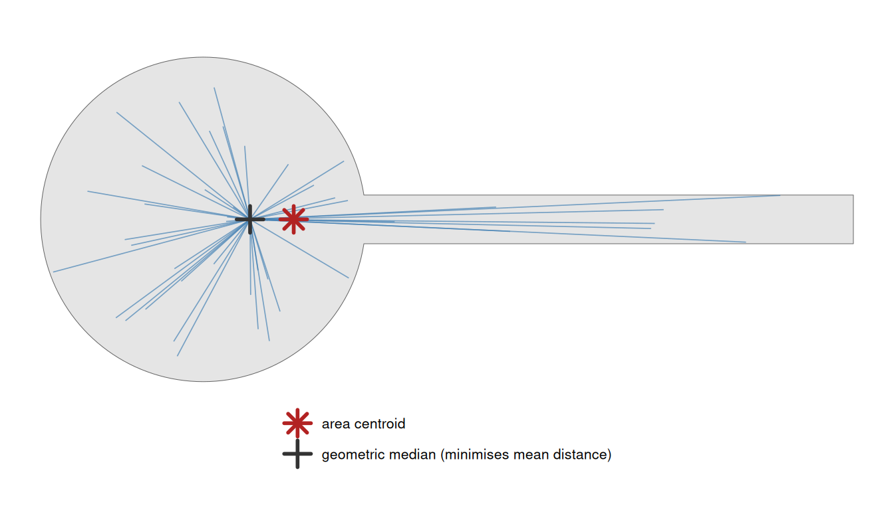
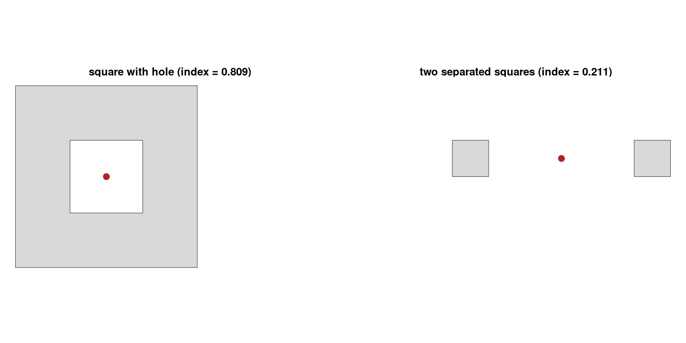
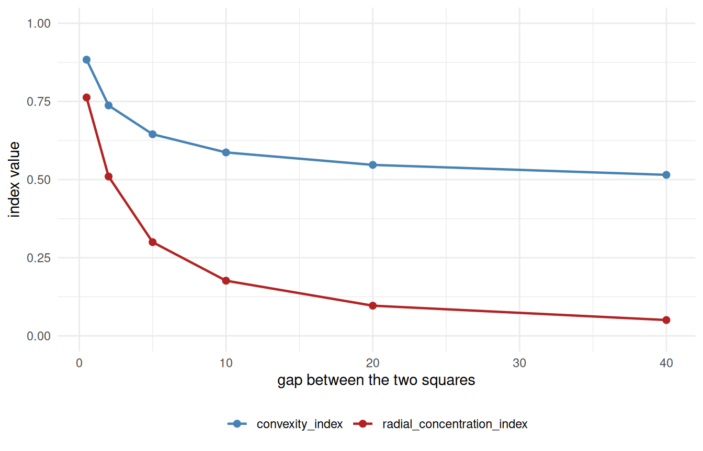

# 5. Understanding Radial Concentration Index

Code

``` r

library(shapeindices)
library(sf)
library(ggplot2)

theme_set(theme_minimal(base_size = 11))
theme_gallery <- theme_void(base_size = 10) +
  theme(strip.text = element_text(size = 9, face = "bold"))
```

Code

``` r

square <- st_polygon(list(rbind(c(0,0), c(10,0), c(10,10), c(0,10), c(0,0))))
make_rect <- function(w, h) st_polygon(list(rbind(c(0,0), c(w,0), c(w,h), c(0,h), c(0,0))))
aspect_seq <- c(1, 2, 4, 10, 20)
rectangles <- lapply(aspect_seq, function(a) make_rect(sqrt(100 * a), sqrt(100 / a)))
names(rectangles) <- sprintf("aspect %gx", aspect_seq)

make_star <- function(n_points, r_outer = 1, r_inner = 0.5, center = c(0, 0)) {
  n <- n_points * 2
  angles <- seq(pi/2, pi/2 + 2*pi, length.out = n + 1)[1:n]
  radii  <- rep(c(r_outer, r_inner), n_points)
  x <- center[1] + radii * cos(angles); y <- center[2] + radii * sin(angles)
  st_polygon(list(rbind(cbind(x, y), c(x[1], y[1]))))
}
ratio_seq <- c(0.9, 0.7, 0.5, 0.3, 0.15)
stars_r <- lapply(ratio_seq, function(r) make_star(6, 5, 5 * r))
names(stars_r) <- sprintf("notch ratio %.2f", ratio_seq)

disk <- st_buffer(st_sfc(st_point(c(0, 0))), dist = 5.64, nQuadSegs = 60)[[1]]

# a ring of n_arms radial wedges spanning [r_in, r_out], with a FIXED total
# angular width split evenly among them, so n_arms only changes how finely
# that fixed width is cut up - same construction used in
# vignette("c-understanding-moment-of-inertia-index") to demonstrate the
# same underlying effect there
make_spokes <- function(r_in, r_out, n_arms, total_angle_frac = 0.5) {
  angles <- seq(0, 2 * pi, length.out = n_arms + 1)[1:n_arms]
  half_w <- total_angle_frac * pi / n_arms
  polys <- lapply(angles, function(a0) {
    th <- seq(a0 - half_w, a0 + half_w, length.out = max(6, 40 %/% n_arms))
    outer_pts <- cbind(r_out * cos(th), r_out * sin(th))
    inner_pts <- cbind(r_in * cos(rev(th)), r_in * sin(rev(th)))
    st_polygon(list(rbind(outer_pts, inner_pts, outer_pts[1, ])))
  })
  Reduce(function(p, q) st_union(st_sfc(p), st_sfc(q))[[1]], polys)
}
arm_counts <- c(2, 4, 8, 16)
spoke_shapes <- lapply(arm_counts, function(n) make_spokes(3, 5, n))
names(spoke_shapes) <- sprintf("%d arms", arm_counts)
```

## 1 Introduction

[`radial_concentration_index()`](https://nkaza.github.io/shapeindices/reference/radial_concentration_index.md)
measures how tightly a polygon’s own mass is concentrated around its own
best possible centre, relative to how concentrated an equal-area
circle’s mass is around *its* centre. For a mass distribution with
density $`\rho`$ and total mass $`W`$, and a candidate centre $`c`$,

``` math
D_1(\rho, c) = \frac{1}{W}\int_P \rho(s)\,\lvert s - c\rvert\,ds, \qquad D_1(\rho) = \min_{c} D_1(\rho, c)
```

As in
[`span_index()`](https://nkaza.github.io/shapeindices/reference/span_index.md),
$`\rho`$ is a density over the polygon and $`s \in P`$ is a whole point,
not a scalar coordinate. But here the density appears *once*, not twice
as in span’s $`\rho(s)\,\rho(t)`$ double integral, because only one end
of the distance is a random point: $`s`$ is drawn from $`\rho/W`$, while
$`c`$ is a single fixed candidate centre, not a second draw. That
doesn’t mean $`\rho`$ acts only once - the minimiser $`c`$ is itself the
$`\rho`$-weighted geometric median, so reweighting the mass also moves
the centre - it just enters through the $`\min_{c}`$ rather than as a
second integration variable.

[`radial_concentration_index()`](https://nkaza.github.io/shapeindices/reference/radial_concentration_index.md)
is $`D_{1,\text{ref}}/D_1(\rho) \in (0, 1]`$, where $`D_{1,\text{ref}}`$
is the same quantity for a circle (unweighted) or a concentric annulus
(weighted) of the same area. It’s a sibling to
[`moment_of_inertia_index()`](https://nkaza.github.io/shapeindices/reference/moment_of_inertia_index.md)
(squared distance to the centroid) and
[`span_index()`](https://nkaza.github.io/shapeindices/reference/span_index.md)
(plain distance, but between two random points, no reference point at
all) - this one is plain distance *to* a reference point, the remaining
combination of the two design choices.

No single prior paper matches this exact construction - median-anchored,
plain-distance dispersal - the way
[`moment_of_inertia_index()`](https://nkaza.github.io/shapeindices/reference/moment_of_inertia_index.md)
matches both Kaza’s IMI and Angel et al.’s Cohesion
([`vignette("c-understanding-moment-of-inertia-index")`](https://nkaza.github.io/shapeindices/articles/c-understanding-moment-of-inertia-index.md)).
It belongs generically to the “dispersion” family of circle-compactness
properties surveyed in Angel, Parent & Civco (2010)[^1] - shapes whose
mass sits close to a well-chosen centre read as compact, wherever
exactly that centre is anchored - without being a direct implementation
of any one property in that survey.

## 2 Deriving the index

### 2.1 Why the geometric median, not the centroid

$`D_1(\rho, c)`$ is convex in $`c`$, so it has a unique minimiser - but
it’s the **geometric median** (Fermat-Weber point), not the centroid.
The centroid minimises *squared* distance
($`\mathbb E\lvert s - c\rvert^2`$, which is why
[`moment_of_inertia_index()`](https://nkaza.github.io/shapeindices/reference/moment_of_inertia_index.md)
uses it); plain distance is minimised by a different point entirely,
with no closed form of its own. The two coincide only when the shape is
symmetric enough (a disk, or anything centrally symmetric); on a
lopsided shape they separate, with the median pulled toward the bulk of
the mass and the centroid sitting at the plain average of position.

The figure below shows both on a “tadpole” - a round head with a thin
tail, deliberately lopsided - together with the spokes whose lengths
$`D_1`$ averages, drawn from the median (the point that makes that
average as small as possible).



The tail drags the area centroid off toward it, while the geometric
median stays back in the head where most of the mass actually is - the
robustness that makes the median, not the centroid, the right centre for
a mean-distance measure. The index is the mean spoke length from that
median: the smallest such average any single centre can achieve. On a
symmetric shape the two markers coincide and the distinction vanishes.

### 2.2 The disk and annulus are provably optimal

For a *fixed* centre $`c`$, the disk of area $`A`$ centred at $`c`$
minimises $`\int_\Omega|s-c|\,ds`$ among every measurable set $`\Omega`$
of that area - a direct bathtub-principle argument ($`|s-c|`$ is
radially increasing about $`c`$, so the minimising set of fixed measure
is a ball around it). Evaluating this at $`\Omega`$’s own geometric
median shows the disk beats *every* shape of that area, holes and
multiple parts included - the proof never assumes connectivity or
convexity. The weighted case gives concentric rings, sorted
densest-to-centre, by the same argument applied level-set by level-set.

### 2.3 Closed forms

Distance-to-a-fixed-point depends only on radius, not angle, so - unlike
[`span_index()`](https://nkaza.github.io/shapeindices/reference/span_index.md) -
neither reference needs elliptic integrals:

``` math
D_{1,\text{circle}}(A) = \frac{2}{3}\sqrt{\frac{A}{\pi}}, \qquad \bar r(a, b) = \frac{2(a^2+ab+b^2)}{3(a+b)} \text{ for a ring of inner/outer radius } a, b
```

### 2.4 Finding the centre

The geometric median has no closed form, so it’s found via **Weiszfeld’s
algorithm**: starting from the centroid, repeatedly re-weight each point
by the inverse of its current distance to the estimate and re-average,
until the *objective value* (not the position) stops moving. Convergence
on position isn’t guaranteed for a symmetric multi-part shape - two
identical, separated blobs have a whole segment of equally-good centres,
not one point - so the stopping rule has to watch the value, not the
point.

``` r

sq1 <- st_polygon(list(rbind(c(0,0), c(2,0), c(2,2), c(0,2), c(0,0))))
sq2 <- st_polygon(list(rbind(c(10,0), c(12,0), c(12,2), c(10,2), c(10,0))))
dumbbell <- st_union(st_sfc(sq1, sq2))
res <- radial_concentration_index(dumbbell)
st_coordinates(res$center)   # lands exactly on the connecting midpoint, (6, 1)
```

         X Y
    [1,] 6 1

Each triangle also needs finer internal resolution than a fixed 3-point
quadrature rule gives - collapsing a large triangle to a handful of
fixed points systematically misestimates $`\int_T|s-c|\,ds`$, by single
digits of percent at realistic mesh sizes, not a rounding-level nicety.
[`radial_concentration_index()`](https://nkaza.github.io/shapeindices/reference/radial_concentration_index.md)’s
default (`deterministic = TRUE`) instead recursively subdivides each
triangle - the same medial-subdivision idea
[`span_index()`](https://nkaza.github.io/shapeindices/reference/span_index.md)
uses for its own self-term, though built by its own vectorised routine
that subdivides every triangle in the mesh in one pass rather than
recursing triangle-by-triangle - into up to 256 sub-triangles and uses
their centroids as the point cloud. The depth is area-adaptive, not
fixed: the bias above is worst for *large* triangles specifically (it
scales with a triangle’s own spatial extent), so only the mesh’s own
largest triangle pays the full 256 points - smaller triangles need
proportionally less subdivision to reach that same final sub-triangle
resolution, down to a single centroid for the smallest ones. A
real-world CDT mesh - many small triangles packed along complex boundary
detail alongside a handful of large ones in the open interior - can have
area ratios of many orders of magnitude between its largest and smallest
triangle, so this typically cuts the total point count by 60x or more
relative to giving every triangle the same fixed depth, while changing
the index by under 0.05% - invisible at the precision indices are
typically read to. `deterministic = FALSE` remains the escape valve for
meshes too large even after that: it samples `n_lines` points directly
from the weighted density and runs Weiszfeld on that sample instead, the
same Monte Carlo idea
[`convexity_index()`](https://nkaza.github.io/shapeindices/reference/convexity_index.md)/[`span_index()`](https://nkaza.github.io/shapeindices/reference/span_index.md)
already use for the same reason.

``` r

deep_star <- stars_r[["notch ratio 0.15"]]
radial_concentration_index(deep_star)$index
```

    [1] 0.6660687

``` r

radial_concentration_index(deep_star, deterministic = FALSE, n_lines = 3000, seed = 1)$index
```

    [1] 0.6619143

## 3 Illustrations

### 3.1 Basic shapes

| shape | name | radial_concentration_index | D1 | D1_ref |
|:---|:---|---:|---:|---:|
|  | square | 0.984 | 3.822 | 3.761 |
|  | disk | 1.001 | 3.756 | 3.760 |
|  | aspect 1x | 0.984 | 3.822 | 3.761 |
|  | aspect 2x | 0.897 | 4.191 | 3.761 |
|  | aspect 4x | 0.710 | 5.300 | 3.761 |
|  | aspect 10x | 0.470 | 8.002 | 3.761 |
|  | aspect 20x | 0.335 | 11.218 | 3.761 |
|  | notch ratio 0.90 | 0.999 | 3.093 | 3.090 |
|  | notch ratio 0.70 | 0.984 | 2.770 | 2.725 |
|  | notch ratio 0.50 | 0.941 | 2.448 | 2.303 |
|  | notch ratio 0.30 | 0.838 | 2.129 | 1.784 |
|  | notch ratio 0.15 | 0.666 | 1.894 | 1.262 |

The disk scores just above 1 rather than exactly 1 - the expected
residual from finite subdivision depth, not a modelling error.
Elongation and deeper notches both pull the index down, same direction
as
[`moment_of_inertia_index()`](https://nkaza.github.io/shapeindices/reference/moment_of_inertia_index.md)
and
[`span_index()`](https://nkaza.github.io/shapeindices/reference/span_index.md),
but not identically - it’s measuring a different thing (mean distance
*to a point*, not squared distance to the centroid or pairwise distance
with no reference point at all).

### 3.2 Holes and multi-part shapes



Both centres (red points) are found correctly even though neither sits
on solid material - one lands in the middle of the hole, the other on
the empty gap between the two squares. This is expected: the geometric
median, like the ordinary centroid, doesn’t have to be a point of the
shape itself, and the bathtub-principle proof never assumed it would be.

### 3.3 Things to watch out for

#### 3.3.1 Same radial spread, same index

[`radial_concentration_index()`](https://nkaza.github.io/shapeindices/reference/radial_concentration_index.md)
shares
[`moment_of_inertia_index()`](https://nkaza.github.io/shapeindices/reference/moment_of_inertia_index.md)’s
exact insensitivity to angular rearrangement, for the same underlying
reason (see
[`vignette("c-understanding-moment-of-inertia-index")`](https://nkaza.github.io/shapeindices/articles/c-understanding-moment-of-inertia-index.md)
for the full derivation): $`D_1 = \int_P \rho(s)\,|s-c|\,ds`$ depends on
each point only through its distance from the reference centre $`c`$,
never its bearing. For a shape with two-fold or higher rotational
symmetry, $`c`$ - here the geometric median, not the centroid - sits at
the shape’s own centre of symmetry regardless of how finely the mass is
carved up angularly, so the index can’t tell a couple of broad wedges
from many thin ones covering the same total angle.

``` r

spoke_results <- lapply(spoke_shapes, function(g) radial_concentration_index(st_sfc(g)))
tbl_spokes <- do.call(rbind, Map(function(nm, res) {
  data.frame(shape = shape_thumb(spoke_shapes[[nm]]), name = nm,
             radial_concentration = res$index,
             convexity = suppressWarnings(convexity_index(st_sfc(spoke_shapes[[nm]]), deterministic = FALSE,
                                                            n_lines = 5000, seed = 1)$index))
}, names(spoke_shapes), spoke_results))
knitr::kable(format = "html", tbl_spokes, digits = 4, row.names = FALSE, escape = FALSE)
```

| shape | name | radial_concentration | convexity |
|:---|:---|---:|---:|
|  | 2 arms | 0.4618 | 0.6269 |
|  | 4 arms | 0.4618 | 0.5168 |
|  | 8 arms | 0.4618 | 0.4278 |
|  | 16 arms | 0.4618 | 0.3797 |

``` r

# how far each row's own median landed from the origin - checking that the
# rotational symmetry really is pinning it there, not just approximately
center_drift <- vapply(spoke_results, function(res) {
  as.numeric(sqrt(sum(st_coordinates(res$center)[1, 1:2]^2)))
}, numeric(1))
```

`radial_concentration` doesn’t move as the same fixed angular width is
cut from 2 arms into 16 - only
[`convexity_index()`](https://nkaza.github.io/shapeindices/reference/convexity_index.md)
responds to the widening gaps. Worth checking independently here, since
the reference centre is a median rather than a centroid: the largest
distance from the origin to any row’s own `center` above is 3.12e-06,
confirming the median stays pinned by the same rotational symmetry the
centroid relies on in
[`moment_of_inertia_index()`](https://nkaza.github.io/shapeindices/reference/moment_of_inertia_index.md)’s
own version of this effect.

#### 3.3.2 Weight moves the reference, not just the value

| weighting | name | index |
|:---|:---|---:|
|  | uniform | 0.902 |
|  | concentrated at centre | 0.870 |
|  | concentrated at edge | 0.724 |

Concentrating weight at the edge scores lowest, as expected. But
concentrating it at the centre scores *lower than the uniform baseline*,
not higher - surprising at first sight, until you remember that the
reference itself adapts to the given weight’s own histogram rather than
staying fixed. Both `D1` (actual) and `D1_ref` shrink when weight moves
toward the centre, but here `D1_ref` shrinks proportionally faster:
pushing weight toward the middle via a smooth radial function creates a
skewed histogram whose *own* ideal sorted-ring arrangement is a much
tighter target than a uniform disk’s, and the star’s actual notches keep
the real arrangement from fully reaching that tighter target. The one
comparison guaranteed to hold either way - centre-weighted beats
edge-weighted - does; the comparison to the unweighted baseline doesn’t
have a similarly simple guarantee.

## 4 Where this fits

[`radial_concentration_index()`](https://nkaza.github.io/shapeindices/reference/radial_concentration_index.md)
is the plain-distance-to-a-reference-point member of a family of three.
Its siblings measure the same “how spread out is the mass” question
through different lenses:
[`moment_of_inertia_index()`](https://nkaza.github.io/shapeindices/reference/moment_of_inertia_index.md)
uses *squared* distance to the centroid
([`vignette("c-understanding-moment-of-inertia-index")`](https://nkaza.github.io/shapeindices/articles/c-understanding-moment-of-inertia-index.md)),
and
[`span_index()`](https://nkaza.github.io/shapeindices/reference/span_index.md)
uses plain distance between two random points, with no fixed reference
point at all
([`vignette("d-understanding-span-index")`](https://nkaza.github.io/shapeindices/articles/d-understanding-span-index.md)).
Unlike either sibling, its reference centre is a geometric median rather
than a centroid - the point that makes plain (not squared) distance
minimal - which is also why it, alone among the three, needs an
iterative algorithm (Weiszfeld’s) just to locate its own centre.

“Things to watch out for” above already showed one divergence from
[`convexity_index()`](https://nkaza.github.io/shapeindices/reference/convexity_index.md):
widening the *angular* gaps between spokes at a fixed radius moves
[`convexity_index()`](https://nkaza.github.io/shapeindices/reference/convexity_index.md)
but leaves
[`radial_concentration_index()`](https://nkaza.github.io/shapeindices/reference/radial_concentration_index.md)
untouched. Pulling two solid pieces apart in *space* - rather than
carving a fixed footprint more finely - shows the opposite pattern, and
a genuinely surprising one:
[`radial_concentration_index()`](https://nkaza.github.io/shapeindices/reference/radial_concentration_index.md)
turns out to be the more sensitive of the two, not the less.



Both indices fall as the two squares separate, but only one of them
keeps falling.
[`convexity_index()`](https://nkaza.github.io/shapeindices/reference/convexity_index.md)
levels off near 0.52 no matter how far apart the pieces get - it’s a
bounded probability (the fraction of random point-pairs whose connecting
line stays inside), and once the two lobes are far enough apart that
essentially every cross-lobe pair is already cut, further separation
can’t push the fraction down any more.
[`radial_concentration_index()`](https://nkaza.github.io/shapeindices/reference/radial_concentration_index.md)
has no such floor: it’s an absolute mean-distance ratio, and mean
distance from the (unboundedly distant) median to either lobe grows
without limit as the gap widens, so the index keeps falling toward 0.
The lesson generalises beyond this one shape:
[`convexity_index()`](https://nkaza.github.io/shapeindices/reference/convexity_index.md)
asks a yes/no question per pair of points and averages the answers,
which saturates once the answer stops changing; the “distance from a
centre” family
([`radial_concentration_index()`](https://nkaza.github.io/shapeindices/reference/radial_concentration_index.md),
[`moment_of_inertia_index()`](https://nkaza.github.io/shapeindices/reference/moment_of_inertia_index.md),
[`span_index()`](https://nkaza.github.io/shapeindices/reference/span_index.md))
has no equivalent ceiling on how badly a shape can score.

## 5 Key takeaways

- [`radial_concentration_index()`](https://nkaza.github.io/shapeindices/reference/radial_concentration_index.md)
  compares $`D_1`$ (mean plain distance from every point to the shape’s
  own geometric median) to the same quantity for an equal-area disk,
  or - weighted - a concentric annulus, both provably optimal via the
  bathtub principle. 1 exactly when the shape matches its reference.
- It anchors on the geometric median, not the centroid: the point that
  minimises plain distance, found only iteratively (Weiszfeld’s
  algorithm), and one that can diverge sharply from the centroid on a
  lopsided shape (see the tadpole figure above).
- It depends only on distance from that centre, never bearing: shapes
  with two-fold or higher rotational symmetry and the same
  radius-vs-mass profile score *identically*, however finely that mass
  is carved into separate wedges - the same effect
  [`moment_of_inertia_index()`](https://nkaza.github.io/shapeindices/reference/moment_of_inertia_index.md)
  has, and for the same reason (see “Things to watch out for” above).
  [`convexity_index()`](https://nkaza.github.io/shapeindices/reference/convexity_index.md)
  is the one that actually sees the gaps between the wedges.
- Weighting doesn’t just change the value, it can change *which shape
  wins*: concentrating weight toward the centre can score *lower* than
  uniform weighting, because the reference itself tightens faster than
  the actual value does (see “Things to watch out for” above) - the one
  guarantee that survives is that centre-weighting always beats
  edge-weighting on the same shape.
- Holes and multi-part gaps are handled correctly by construction: the
  median can (and does) land on empty territory, exactly like the
  centroid, since the bathtub-principle proof never assumed the
  reference point had to sit on solid material.
- `deterministic = TRUE` (the default) uses area-adaptive triangle
  subdivision rather than a fixed quadrature rule, since a small, fixed
  point count systematically misestimates $`\int_T|s-c|\,ds`$ on real
  meshes; `deterministic = FALSE` remains available as a Monte Carlo
  escape valve on meshes too large even for that.

[^1]: Angel, S., Parent, J., & Civco, D. L. (2010). Ten compactness
    properties of circles: measuring shape in geography. *Canadian
    Geographer*, 54(4), 441-461.
