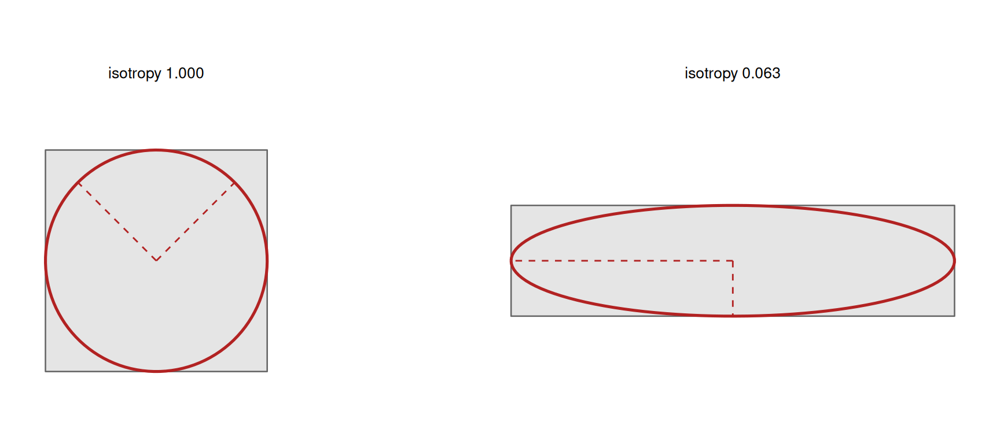

# 6. Understanding Moment Isotropy Index

Code

``` r

library(shapeindices)
library(sf)
library(ggplot2)

theme_set(theme_minimal(base_size = 11))
theme_gallery <- theme_void(base_size = 10) +
  theme(strip.text = element_text(size = 9, face = "bold"))
```

Code

``` r

square <- st_polygon(list(rbind(c(0,0), c(10,0), c(10,10), c(0,10), c(0,0))))
make_rect <- function(w, h) st_polygon(list(rbind(c(0,0), c(w,0), c(w,h), c(0,h), c(0,0))))
aspect_seq <- c(1, 2, 4, 10, 20)
rectangles <- lapply(aspect_seq, function(a) make_rect(sqrt(100 * a), sqrt(100 / a)))
names(rectangles) <- sprintf("aspect %gx", aspect_seq)

make_star <- function(n_points, r_outer = 1, r_inner = 0.5, center = c(0, 0)) {
  n <- n_points * 2
  angles <- seq(pi/2, pi/2 + 2*pi, length.out = n + 1)[1:n]
  radii  <- rep(c(r_outer, r_inner), n_points)
  x <- center[1] + radii * cos(angles); y <- center[2] + radii * sin(angles)
  st_polygon(list(rbind(cbind(x, y), c(x[1], y[1]))))
}
ratio_seq <- c(0.9, 0.7, 0.5, 0.3, 0.15)
stars_r <- lapply(ratio_seq, function(r) make_star(6, 5, 5 * r))
names(stars_r) <- sprintf("notch ratio %.2f", ratio_seq)

make_regular_ngon <- function(n, r = 1, center = c(0, 0)) {
  ang <- seq(0, 2*pi, length.out = n + 1)[1:n]
  st_polygon(list(rbind(cbind(center[1] + r*cos(ang), center[2] + r*sin(ang)), center + c(r, 0))))
}
hexagon <- make_regular_ngon(6, 5)

disk <- st_buffer(st_sfc(st_point(c(0, 0))), dist = 5.64, nQuadSegs = 60)[[1]]

# thin rectangular arms radiating from a small hub, with real empty space
# between them - unlike stars_r above (a single concave outline, no gaps
# of zero mass anywhere), a pinwheel has genuine angular voids, which is
# what makes the effect below visually undeniable rather than a curiosity
# about squares and hexagons
make_pinwheel <- function(n_arms, arm_len = 10, arm_width = 1, hub_r = 0.5) {
  angles <- seq(0, 2 * pi, length.out = n_arms + 1)[1:n_arms]
  hub <- st_buffer(st_sfc(st_point(c(0, 0))), hub_r, nQuadSegs = 30)[[1]]
  arms <- lapply(angles, function(a) {
    tip  <- c(arm_len * cos(a), arm_len * sin(a))
    perp <- c(-sin(a), cos(a)) * arm_width / 2
    st_polygon(list(rbind(perp, tip + perp, tip - perp, -perp, perp)))
  })
  Reduce(function(p, q) st_union(st_sfc(p), st_sfc(q))[[1]], c(list(hub), arms))
}
pinwheels <- lapply(2:6, make_pinwheel)
names(pinwheels) <- sprintf("%d arms", 2:6)
```

## 1 Introduction

[`moment_isotropy_index()`](https://nkaza.github.io/shapeindices/reference/moment_isotropy_index.md)
measures how anisotropic - how much it prefers one direction over
others - a (multi)polygon’s mass distribution is: the ratio of the
smaller to the larger principal moment of its mass inertia tensor, in
$`(0, 1]`$. It reuses
[`moment_of_inertia_index()`](https://nkaza.github.io/shapeindices/reference/moment_of_inertia_index.md)’s
own machinery exactly - same triangulation, same mass centroid, same
$`I_{xx}`$/$`I_{yy}`$ - plus one new quantity, the product of inertia
$`I_{xy}`$, needed to find the tensor’s eigenvalues.

**How this relates to classical eccentricity.** If you know ellipses,
the natural first guess is that this index *is* eccentricity - it isn’t,
in two ways worth having clear before reading further. For an ellipse
with semi-axes $`a \ge b`$, this index works out to
$`b^2/a^2 = 1 - e^2`$, where $`e = \sqrt{1-(b/a)^2}`$ is the classical
eccentricity: related, but not the same formula. And the two run in
opposite directions - eccentricity *increases* from 0 (circle) to 1
(degenerate) as a shape elongates, while this index *decreases* from 1
toward 0, matching the 1-is-ideal convention every index in this package
follows. “Isotropy” states the property directly: a high value means the
mass distribution treats every direction alike.

It’s also built differently from the package’s reference-shape indices,
and worth being explicit about that up front.
[`convexity_index()`](https://nkaza.github.io/shapeindices/reference/convexity_index.md),
[`moment_of_inertia_index()`](https://nkaza.github.io/shapeindices/reference/moment_of_inertia_index.md),
[`span_index()`](https://nkaza.github.io/shapeindices/reference/span_index.md),
and
[`radial_concentration_index()`](https://nkaza.github.io/shapeindices/reference/radial_concentration_index.md)
are all “actual value vs. a provably optimal reference shape”
comparisons - a rearrangement inequality or bathtub-principle argument
shows a disk (or, weighted, concentric rings) is the unique
best-possible arrangement, and the index is how close the real shape
gets to that ceiling.
[`moment_isotropy_index()`](https://nkaza.github.io/shapeindices/reference/moment_isotropy_index.md)
has no reference shape at all: it compares the shape’s own two principal
moments to *each other*, an elementary fact about positive semi-definite
matrices, not a rearrangement inequality. One consequence worth flagging
immediately: an index of 1 does **not** mean “this is a disk” the way it
does for
[`moment_of_inertia_index()`](https://nkaza.github.io/shapeindices/reference/moment_of_inertia_index.md)/[`span_index()`](https://nkaza.github.io/shapeindices/reference/span_index.md)/[`radial_concentration_index()`](https://nkaza.github.io/shapeindices/reference/radial_concentration_index.md) -
it means the mass distribution is rotationally isotropic about its own
centroid, which a disk achieves, but so does a square, a regular
hexagon, or anything with three-fold or higher rotational symmetry.

The ratio of an inertia tensor’s smaller to larger eigenvalue, exactly
this index’s construction, is an established anisotropy measure - it
comes from a different field than the geography-derived compactness
literature the rest of this package’s indices draw from (see
[`vignette("d-understanding-span-index")`](https://nkaza.github.io/shapeindices/articles/d-understanding-span-index.md)’s
Introduction). Materials science and image analysis use it under names
like “isotropy index” or “elongation factor,” most notably in the
Minkowski-tensor anisotropy framework of Schröder-Turk et
al. (2013).[^1] That framework’s own isotropy index,
$`\beta = \lambda_{\min}/\lambda_{\max}`$, is the same eigenvalue ratio
computed here, just applied to a mass inertia tensor rather than a
Minkowski tensor.

## 2 Deriving the index

### 2.1 The mass inertia tensor

For density $`\rho`$ (piecewise-constant across the CDT mesh,
area-weighted if $`\rho \equiv 1`$), and a point $`s = (x, y) \in P`$
with coordinates $`x, y`$ and density $`\rho(s)`$ there, define the
second moments about the mass centroid $`G = (G_x, G_y)`$:

``` math
I_{xx} = \int_P \rho(s)\,(y - G_y)^2\,ds, \qquad I_{yy} = \int_P \rho(s)\,(x - G_x)^2\,ds, \qquad I_{xy} = \int_P \rho(s)\,(x - G_x)(y - G_y)\,ds
```

[`moment_of_inertia_index()`](https://nkaza.github.io/shapeindices/reference/moment_of_inertia_index.md)
already computes $`I_{xx}`$/$`I_{yy}`$ (their sum is $`J`$, its own
polar moment) and, as of this index, $`I_{xy}`$ too - via the standard
closed-form polygon product-of-inertia formula, the same
triangle-by-triangle shoelace approach $`I_{xx}`$/$`I_{yy}`$ already
use. The $`2\times2`$ symmetric matrix

``` math
M = \begin{pmatrix} I_{xx} & I_{xy} \\ I_{xy} & I_{yy} \end{pmatrix}
```

is the shape’s own mass inertia tensor. Its eigenvalues
$`\lambda_{\min} \le \lambda_{\max}`$ are the two **principal
moments** - the second moments the shape would have about its own two
natural (perpendicular) axes, whatever those happen to be, found without
ever needing to know the axes’ actual orientation.
[`moment_isotropy_index()`](https://nkaza.github.io/shapeindices/reference/moment_isotropy_index.md)
is $`\lambda_{\min}/\lambda_{\max}`$.

### 2.2 Picturing the tensor: the equivalent ellipse

$`M`$ has an exact geometric picture - the **equivalent ellipse**, the
unique ellipse with the same second moments as the shape. Its axes point
along the tensor’s eigenvectors and its semi-axis lengths are
proportional to $`\sqrt{\lambda}`$, so it stretches the same way the
shape’s mass does: nearly circular for an isotropic shape, long and thin
for an elongated one. The index is exactly the *squared* ratio of its
minor to major axis.



The square’s equivalent ellipse is a circle (both principal moments
equal, isotropy 1); the rectangle’s is stretched to the same 4:1 ratio
as the shape, so its minor-to-major axis ratio squared -
$`(1/4)^2 = 0.0625`$ - is the index. Nothing about this needs the shape
to *be* an ellipse; the equivalent ellipse only has to share its two
second moments.

### 2.3 Why this is always in (0, 1\] - no rearrangement inequality needed

$`M`$ is provably positive semi-definite for *any* mass distribution, by
construction rather than by any shape-specific argument: it’s an
integral of rank-1 PSD outer products,
$`M = \int_P \rho(s) \begin{pmatrix} y - G_y \\ x - G_x\end{pmatrix}\begin{pmatrix} y - G_y & x - G_x\end{pmatrix} ds`$,
where $`s = (x, y)`$. A sum (or integral) of PSD matrices is PSD, so
$`\lambda_{\min} \ge 0`$ always, and $`\lambda_{\max} > 0`$ for any
polygon with positive area - $`\lambda_{\min} = 0`$ only in the
degenerate limit where every point of positive mass lies on a single
line, never a genuine 2D polygon. That’s the entire proof: no bathtub
principle, no rearrangement inequality, no reference shape to derive -
just a fact about the algebraic form of $`M`$ itself.

``` r

rect10 <- make_rect(sqrt(2000), sqrt(20))  # a 10x-aspect rectangle
res_unrotated <- moment_isotropy_index(st_sfc(rect10))

theta <- 0.37
rot <- matrix(c(cos(theta), sin(theta), -sin(theta), cos(theta)), 2, 2)
rect10_rotated <- st_polygon(list(st_coordinates(rect10)[, 1:2] %*% t(rot)))
res_rotated <- moment_isotropy_index(st_sfc(rect10_rotated))

data.frame(
  quantity  = c("Ixx", "Iyy", "Ixy", "index"),
  unrotated = c(res_unrotated$Ixx, res_unrotated$Iyy, res_unrotated$Ixy, res_unrotated$index),
  rotated   = c(res_rotated$Ixx, res_rotated$Iyy, res_rotated$Ixy, res_rotated$index)
) |> knitr::kable(format = "html", digits = c(0, 4, 4, 4), row.names = FALSE, escape = FALSE,
                   col.names = c("quantity",
                                 paste0(shape_thumb(rect10), "<br>unrotated"),
                                 paste0(shape_thumb(rect10_rotated), "<br>rotated 0.37 rad")))
```

[TABLE]

$`I_{xx}`$, $`I_{yy}`$, and $`I_{xy}`$ all change under rotation - none
of the three is rotation-invariant on its own. But $`M`$’s
*eigenvalues*, and so the index built from them, don’t - the difference
between the two `index` values above is 1.73e-18, floating-point noise
rather than any real movement. That’s expected:
$`\lambda_{\min}`$/$`\lambda_{\max}`$ are properties of the tensor
itself, not of whatever coordinate axes happened to be used to write it
down.

### 2.4 Not “= 1 iff a disk”

``` r

data.frame(
  shape = c(shape_thumb(disk), shape_thumb(square), shape_thumb(hexagon)),
  name = c("disk", "square", "regular hexagon"),
  isotropy = c(moment_isotropy_index(st_sfc(disk))$index,
               moment_isotropy_index(st_sfc(square))$index,
               moment_isotropy_index(st_sfc(hexagon))$index)
) |> knitr::kable(format = "html", digits = 8, row.names = FALSE, escape = FALSE)
```

| shape | name | isotropy |
|:---|:---|---:|
|  | disk | 1 |
|  | square | 1 |
|  | regular hexagon | 1 |

All three score (numerically) exactly 1, not just approximately - a
square and a hexagon have no preferred axis for their own mass to spread
along, so their principal moments are exactly equal, same as a disk’s.
Contrast
[`moment_of_inertia_index()`](https://nkaza.github.io/shapeindices/reference/moment_of_inertia_index.md),
where only the disk reaches the ceiling and a square scores 0.955: that
index measures dispersal relative to a disk specifically, while isotropy
measures anisotropy relative to *the shape’s own two axes*, whatever
they are. A shape can be maximally isotropy-1 while still being far from
round - a hexagon isn’t a disk, it just doesn’t prefer a direction. The
next two sections push on exactly how far that separation goes.

## 3 Algorithmic choices

There isn’t a `deterministic` argument, a quadrature parameter, or a
Monte Carlo mode to discuss here, and it’s worth being explicit about
why rather than leaving the absence unexplained. $`I_{xx}`$, $`I_{yy}`$,
and $`I_{xy}`$ are exact closed-form polygon integrals, summed triangle
by triangle via the shoelace formula - there’s no approximation layer
for a `deterministic`-style argument to switch between. More than that,
the sum is provably the same regardless of *which* valid triangulation
produced the triangles: moments are additive over any partition of the
polygon into non-overlapping pieces, so any two triangulations of the
same region must sum to the same total, as long as each triangle’s own
contribution is computed with consistent (CCW) winding - which
`.moment_of_inertia_core()`’s own winding check guarantees regardless of
what a particular triangulator happens to produce.

``` r

# a fan triangulation from every vertex of a convex, irregular heptagon -
# seven genuinely different triangulations of the exact same region
ang <- c(10, 50, 100, 160, 210, 270, 320) * pi / 180
r   <- c(5, 4.2, 5.5, 4.8, 5.1, 4.5, 5.3)
v   <- cbind(r * cos(ang), r * sin(ang))
heptagon <- st_polygon(list(rbind(v, v[1, ])))
n <- nrow(v)

fan_from <- function(apex) {
  ord  <- ((apex + 0:(n - 2)) %% n) + 1   # the other n-1 vertices, in cyclic order
  tris <- lapply(seq_len(n - 2), function(k) {
    st_polygon(list(rbind(v[apex, ], v[ord[k], ], v[ord[k + 1], ], v[apex, ])))
  })
  st_sf(area = vapply(tris, function(t) as.numeric(st_area(st_sfc(t))), numeric(1)),
        geometry = st_sfc(tris))
}

idx_cdt <- moment_isotropy_index(st_sfc(heptagon),
                                  prep = list(poly = heptagon, tri = cdt_triangles(st_sfc(heptagon))))$index
idx_fan <- vapply(1:n, function(apex) {
  moment_isotropy_index(st_sfc(heptagon), prep = list(poly = heptagon, tri = fan_from(apex)))$index
}, numeric(1))

data.frame(triangulation = c("CDT", paste("fan from vertex", 1:n)),
           index = c(idx_cdt, idx_fan)) |> knitr::kable(format = "html", digits = 10, row.names = FALSE)
```

| triangulation     |     index |
|:------------------|----------:|
| CDT               | 0.8382805 |
| fan from vertex 1 | 0.8382805 |
| fan from vertex 2 | 0.8382805 |
| fan from vertex 3 | 0.8382805 |
| fan from vertex 4 | 0.8382805 |
| fan from vertex 5 | 0.8382805 |
| fan from vertex 6 | 0.8382805 |
| fan from vertex 7 | 0.8382805 |

All eight triangulations - the package’s own CDT plus a fan from every
one of the heptagon’s seven vertices - agree to floating-point noise
(max difference 2.2e-16). The same holds on non-convex polygons via a
diagonal flip of an existing CDT mesh (not shown here); it isn’t
specific to convex shapes. This is a genuinely different situation from
[`convexity_index()`](https://nkaza.github.io/shapeindices/reference/convexity_index.md)/[`span_index()`](https://nkaza.github.io/shapeindices/reference/span_index.md),
both of which *do* depend on mesh resolution (finer quadrature or
subdivision moves their value, even if only slightly) because they
estimate an integral with no closed form. Moment isotropy has nothing to
estimate.

## 4 Illustrations

### 4.1 Basic shapes: isotropy vs. the two properties it isn’t

| shape | name | isotropy | moment_of_inertia | convexity |
|:---|:---|---:|---:|---:|
|  | square | 1.000 | 0.955 | 1.000 |
|  | hexagon | 1.000 | 0.992 | 1.000 |
|  | disk | 1.000 | 1.000 | 1.000 |
|  | aspect 1x | 1.000 | 0.955 | 1.000 |
|  | aspect 2x | 0.250 | 0.764 | 1.000 |
|  | aspect 4x | 0.063 | 0.449 | 1.000 |
|  | aspect 10x | 0.010 | 0.189 | 1.000 |
|  | aspect 20x | 0.003 | 0.095 | 1.000 |
|  | notch ratio 0.90 | 1.000 | 0.996 | 1.000 |
|  | notch ratio 0.70 | 1.000 | 0.957 | 0.998 |
|  | notch ratio 0.50 | 1.000 | 0.851 | 0.975 |
|  | notch ratio 0.30 | 1.000 | 0.637 | 0.892 |
|  | notch ratio 0.15 | 1.000 | 0.373 | 0.724 |

Elongating a rectangle (constant area, growing aspect ratio) collapses
isotropy toward 0 fast - by the closed form for a $`W \times H`$
rectangle,
$`\lambda_{\min}/\lambda_{\max} = \min(H^2, W^2)/\max(H^2, W^2)`$, so a
20x aspect ratio gives an index of exactly $`1/400 = 0.0025`$, matching
the table above. `moment_of_inertia` falls too, but more gently - it’s
penalising dispersal from the centroid generally, not elongation
specifically, so a stretched-but-not-dispersed shape doesn’t hit its
floor as hard.

The star sequence tells the opposite story: deepening notches drag
`convexity` down sharply (that’s what it’s built to detect) while
`isotropy` barely moves - a 6-pointed star with deep notches is still,
on average, pulling mass roughly equally in six directions, so its
principal moments stay close to equal even as it becomes badly
non-convex. **Elongation and concavity are independent properties**, and
this table is the same point the classic-metrics vignette makes with
[`moment_of_inertia_index()`](https://nkaza.github.io/shapeindices/reference/moment_of_inertia_index.md)
vs
[`convexity_index()`](https://nkaza.github.io/shapeindices/reference/convexity_index.md),
made again here with a third, independent axis.

### 4.2 Weighting: isotropy is “free” with no separate reference to derive

Weighting is exactly as cheap here as for
[`moment_of_inertia_index()`](https://nkaza.github.io/shapeindices/reference/moment_of_inertia_index.md),
and for the same reason: $`I_{xx}`$/$`I_{yy}`$/$`I_{xy}`$ are already
$`\rho`$-weighted sums over triangles, so a weighted isotropy is just
the same eigenvalue ratio computed from the weighted tensor - there’s no
concentric-rings derivation to redo, because there’s no reference shape
in the first place.

``` r

prep <- prepare_polygon(st_sfc(disk))
tri <- prep$tri
ang <- atan2(st_coordinates(st_centroid(st_geometry(tri)))[, 2],
             st_coordinates(st_centroid(st_geometry(tri)))[, 1])
w_ew <- 1 + 3 * cos(ang)^2   # weight concentrated along the east-west axis

plain <- moment_isotropy_index(st_sfc(disk), prep = prep)
weighted <- moment_isotropy_index(st_sfc(disk), prep = prep, weight = w_ew)

# the shape itself never changes here, so the thumbnail shows the WEIGHT
# distribution (shaded by density) rather than a fixed outline - what
# varies row to row is where the mass sits, not the boundary
data.frame(
  weighting = c(weight_thumb(tri, rep(1, nrow(tri))), weight_thumb(tri, w_ew)),
  name = c("uniform (area)", "concentrated east-west"),
  isotropy = c(plain$index, weighted$index)
) |> knitr::kable(format = "html", digits = 3, row.names = FALSE, escape = FALSE)
```

| weighting | name | isotropy |
|:---|:---|---:|
|  | uniform (area) | 1.000 |
|  | concentrated east-west | 0.538 |

The disk’s own boundary never changes - only how its mass is distributed
within it - yet concentrating weight along one axis drops isotropy well
below 1. A perfectly round *shape* is no guarantee of a round *mass
distribution* once weighting enters the picture, the same lesson
[`vignette("e-understanding-radial-concentration-index")`](https://nkaza.github.io/shapeindices/articles/e-understanding-radial-concentration-index.md)’s
“weight moves the reference” section makes for that index’s own
reference.

### 4.3 Things to watch out for: isotropic tensor, not isotropic coverage

| shape | name | moment_isotropy | directional_balance | convexity |
|:---|:---|---:|---:|---:|
|  | 2 arms | 0.0025 | 0.9998 | 1.0000 |
|  | 3 arms | 1.0000 | 0.9997 | 0.5554 |
|  | 4 arms | 1.0000 | 0.9999 | 0.6470 |
|  | 5 arms | 1.0000 | 1.0000 | 0.5435 |
|  | 6 arms | 1.0000 | 1.0000 | 0.5908 |
|  | disk (reference) | 1.0000 | 0.9997 | 1.0000 |

From 3 arms up, `moment_isotropy` reads *exactly* 1 - identical, to the
precision shown, to a genuine solid disk - despite wide empty sectors
between the arms where there’s no mass at all. This isn’t a numerical
coincidence: any rank-2 tensor built from vectors arranged with
three-fold or higher rotational symmetry is forced to be isotropic, a
fact from representation theory rather than anything specific to
polygons or mass distributions.
[`directional_balance_index()`](https://nkaza.github.io/shapeindices/reference/directional_balance_index.md)
is fooled the same way, for a related but distinct reason - see
[`vignette("g-understanding-directional-balance-index")`](https://nkaza.github.io/shapeindices/articles/g-understanding-directional-balance-index.md)’s
own “things to watch out for” section, where a 2-armed (dumbbell) shape
cancels out because that index only needs *two-fold* symmetry to zero
its first moment. Here, the second moment needs three-fold or higher -
which is exactly why the 2-armed case above is the one row where
`moment_isotropy` correctly reads low. Only
[`convexity_index()`](https://nkaza.github.io/shapeindices/reference/convexity_index.md)
catches any of these pinwheels for what they visually are.

The distinction worth carrying forward:
[`moment_isotropy_index()`](https://nkaza.github.io/shapeindices/reference/moment_isotropy_index.md)
measures whether a shape’s mass is spread *equally* across directions -
the two principal moments come out equal - not whether mass is *present*
in every direction. A shape built entirely from a handful of narrow,
evenly-spaced spokes satisfies the first condition perfectly while
failing the second about as badly as a shape can. Reach for
[`convexity_index()`](https://nkaza.github.io/shapeindices/reference/convexity_index.md),
not this index, when the question is really “does this shape have gaps.”

## 5 Where this fits

[`moment_isotropy_index()`](https://nkaza.github.io/shapeindices/reference/moment_isotropy_index.md)
is a genuinely different question from this package’s other eleven
indices, not a fifth entry in a family: “is this shape convex”
([`convexity_index()`](https://nkaza.github.io/shapeindices/reference/convexity_index.md),
[`hull_ratio_index()`](https://nkaza.github.io/shapeindices/reference/hull_ratio_index.md)),
“how far is mass dispersed from the centre”
([`moment_of_inertia_index()`](https://nkaza.github.io/shapeindices/reference/moment_of_inertia_index.md),
[`span_index()`](https://nkaza.github.io/shapeindices/reference/span_index.md),
[`radial_concentration_index()`](https://nkaza.github.io/shapeindices/reference/radial_concentration_index.md)),
“how round is the boundary/bounding shape”
([`polsby_popper_index()`](https://nkaza.github.io/shapeindices/reference/polsby_popper_index.md),
[`reock_index()`](https://nkaza.github.io/shapeindices/reference/reock_index.md),
[`width_length_ratio_index()`](https://nkaza.github.io/shapeindices/reference/width_length_ratio_index.md)),
“does the mass distribution prefer an axis”
([`moment_isotropy_index()`](https://nkaza.github.io/shapeindices/reference/moment_isotropy_index.md)),
and “does the mass distribution prefer a bearing”
([`directional_balance_index()`](https://nkaza.github.io/shapeindices/reference/directional_balance_index.md),
see
[`vignette("g-understanding-directional-balance-index")`](https://nkaza.github.io/shapeindices/articles/g-understanding-directional-balance-index.md))
are five separate properties that happen to correlate on many real
shapes without being redundant with each other. Two direct side-by-side
comparisons already sit above rather than being repeated here: the
basic-shapes table in “Illustrations” (isotropy
vs. `moment_of_inertia_index`/`convexity_index` on the same shapes) and
the pinwheel table in “Things to watch out for” (isotropy
vs. `directional_balance_index`/`convexity_index` on shapes designed to
expose each index’s own blind spot).

## 6 Key takeaways

- [`moment_isotropy_index()`](https://nkaza.github.io/shapeindices/reference/moment_isotropy_index.md)
  measures whether a shape’s mass is spread *equally* across directions
  (its two principal moments come out equal), not whether mass is
  *present* in every direction - a handful of narrow, evenly-spaced
  spokes with wide empty gaps between them can satisfy the first
  condition perfectly while failing the second badly.
- It is exact and closed-form throughout: no `deterministic` argument,
  no quadrature, no Monte Carlo mode, and provably
  triangulation-invariant (confirmed above across eight different valid
  triangulations of the same polygon, agreeing to floating-point
  noise) - unlike
  [`convexity_index()`](https://nkaza.github.io/shapeindices/reference/convexity_index.md)/[`span_index()`](https://nkaza.github.io/shapeindices/reference/span_index.md),
  there is no approximation layer for a mesh choice to move.
- It’s bounded in $`(0, 1]`$ by an elementary matrix fact (the mass
  inertia tensor is always positive semi-definite), not a rearrangement
  inequality or bathtub-principle argument - the only index in this
  package’s family with that kind of proof.
- An index of 1 does not mean “this is a disk”: any shape with
  three-fold or higher rotational symmetry - a square, a hexagon, or the
  pinwheels above - reaches exactly 1, whatever its actual boundary
  looks like. Reach for
  [`convexity_index()`](https://nkaza.github.io/shapeindices/reference/convexity_index.md),
  not this index, when the real question is “does this shape have gaps.”
- Weighting is free: since there’s no reference shape to re-derive
  (unlike
  [`moment_of_inertia_index()`](https://nkaza.github.io/shapeindices/reference/moment_of_inertia_index.md)’s
  concentric rings or
  [`span_index()`](https://nkaza.github.io/shapeindices/reference/span_index.md)’s
  annulus), a weighted isotropy is just the same eigenvalue ratio
  computed from the reweighted tensor.
- It rides loosely with the “dispersal from a centre” family
  ([`moment_of_inertia_index()`](https://nkaza.github.io/shapeindices/reference/moment_of_inertia_index.md),
  [`span_index()`](https://nkaza.github.io/shapeindices/reference/span_index.md),
  [`radial_concentration_index()`](https://nkaza.github.io/shapeindices/reference/radial_concentration_index.md))
  on real shapes, but is structurally the odd one out - the only member
  immune to *where* the mass’s centre sits, only to the *shape* of the
  spread around it.

[^1]: Schröder-Turk, G. E., Mickel, W., Kapfer, S. C., Schaller, F. M.,
    Breidenbach, B., Hug, D., & Mecke, K. (2013). Minkowski tensors of
    anisotropic spatial structure. *New Journal of Physics*, 15, 083028.
