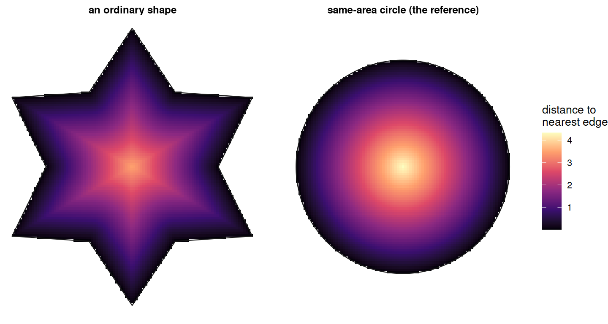

# 8. Understanding Depth Index

Code

``` r

library(shapeindices)
library(sf)
library(ggplot2)

theme_set(theme_minimal(base_size = 11))
theme_gallery <- theme_void(base_size = 10) +
  theme(strip.text = element_text(size = 9, face = "bold"))
```

Code

``` r

make_square <- function(half = 5) st_polygon(list(rbind(
  c(-half, -half), c(half, -half), c(half, half), c(-half, half), c(-half, -half))))
make_rectangle <- function(w, h) st_polygon(list(rbind(
  c(0, 0), c(w, 0), c(w, h), c(0, h), c(0, 0))))
make_disk <- function(r = 5, n = 60) st_buffer(st_sfc(st_point(c(0, 0))), dist = r, nQuadSegs = n)[[1]]
make_star <- function(n_points, r_outer, r_inner) {
  n <- n_points * 2
  angles <- seq(pi / 2, pi / 2 + 2 * pi, length.out = n + 1)[1:n]
  radii  <- rep(c(r_outer, r_inner), n_points)
  x <- radii * cos(angles); y <- radii * sin(angles)
  st_polygon(list(rbind(cbind(x, y), c(x[1], y[1]))))
}
make_square_with_hole <- function(outer_half = 5, hole_frac = 0.3) {
  outer <- rbind(c(-outer_half, -outer_half), c(outer_half, -outer_half),
                 c(outer_half, outer_half), c(-outer_half, outer_half), c(-outer_half, -outer_half))
  hh <- outer_half * sqrt(hole_frac)
  hole <- rbind(c(-hh, -hh), c(-hh, hh), c(hh, hh), c(hh, -hh), c(-hh, -hh))
  st_polygon(list(outer, hole))
}
make_dumbbell_gap <- function(gap) {
  sq1 <- st_polygon(list(rbind(c(0, 0), c(2, 0), c(2, 2), c(0, 2), c(0, 0))))
  sq2 <- st_polygon(list(rbind(c(2 + gap, 0), c(4 + gap, 0), c(4 + gap, 2), c(2 + gap, 2), c(2 + gap, 0))))
  st_union(st_sfc(sq1, sq2))
}
# n equal-area squares of total area `total_area`, spaced `gap_mult` times
# each square's own side apart - for separating "how many pieces" from
# "how far apart are they" below
make_n_squares <- function(n, total_area = 16, gap_mult = 3) {
  side <- sqrt(total_area / n)
  centers <- lapply(seq_len(n), function(i) c((i - 1) * side * (1 + gap_mult), 0))
  sqs <- lapply(centers, function(c0) st_polygon(list(rbind(
    c(c0[1] - side/2, c0[2] - side/2), c(c0[1] + side/2, c0[2] - side/2),
    c(c0[1] + side/2, c0[2] + side/2), c(c0[1] - side/2, c0[2] + side/2),
    c(c0[1] - side/2, c0[2] - side/2)))))
  st_union(st_sfc(sqs))
}
# rasterize a target polygon at a given cell size: keep every grid cell
# whose centre falls inside it, then union the cells - a stand-in for
# vectorizing a raster/classification mask, without needing a raster
# package at all (same construction as vignette("i-understanding-classical-indices"))
rasterize_polygon <- function(target, cell) {
  target_sfc <- st_sfc(target)
  bb <- st_bbox(target_sfc)
  xs <- seq(bb["xmin"] + cell / 2, bb["xmax"], by = cell)
  ys <- seq(bb["ymin"] + cell / 2, bb["ymax"], by = cell)
  g <- expand.grid(x = xs, y = ys)
  pts <- st_as_sf(g, coords = c("x", "y"))
  keep <- lengths(st_intersects(pts, target_sfc)) > 0
  g <- g[keep, , drop = FALSE]
  half <- cell / 2
  make_cell <- function(cx, cy) st_polygon(list(rbind(
    c(cx - half, cy - half), c(cx + half, cy - half),
    c(cx + half, cy + half), c(cx - half, cy + half), c(cx - half, cy - half))))
  st_union(st_sfc(mapply(make_cell, g$x, g$y, SIMPLIFY = FALSE)))[[1]]
}
```

## 1 Introduction

[`depth_index()`](https://nkaza.github.io/shapeindices/reference/depth_index.md)
measures how deep a polygon’s own interior is: how far, on average, its
points sit from the nearest edge of the shape. The figure below shows
that field directly - brightest at the centre, darkest along the
boundary - for an ordinary shape, and for the equal-area circle beside
it:



The circle is brighter almost everywhere - more of its interior sits far
from any edge - which is exactly the property
[`depth_index()`](https://nkaza.github.io/shapeindices/reference/depth_index.md)
measures: the mean of this field, compared to the same mean on the
equal-area circle.

This is not a new idea. Angel, Parent & Civco (2010)[^1] already define
exactly this property, under exactly this name - motivated, in their own
account, by how exposed a country’s territory is across its own borders,
or how much of a forest’s interior sits safely away from its edge. Their
Depth Proposition states it plainly: among shapes of a given area, the
circle has the longest average distance from its interior points to its
own boundary, and the Depth Index compares a shape’s own average
interior-to-boundary distance against that same quantity for its
equal-area circle.

They trace the underlying measure to Rohrbach (1890),[^2] known today
only through Frolov’s (1975)[^3] historical review - the original is not
independently available to check. Angel et al. offer no proof of the
Depth Proposition - it’s stated as an observation, not derived. The next
section gives one.

## 2 Mathematical derivation

### 2.1 Setting up the quantity

For a mass distribution with density $`\rho`$ over polygon $`P`$ and
total mass $`W`$, define the depth field
$`d(s) = \min_{b \in \partial P}|s-b|`$ for $`s \in P`$, and

``` math
\bar{d}(\rho) = \frac{1}{W}\int_P \rho(s)\,d(s)\,ds
```

[`depth_index()`](https://nkaza.github.io/shapeindices/reference/depth_index.md)
is $`\bar{d}_{\text{ref}}/\bar{d}(\rho) \in (0, 1]`$, where
$`\bar d_{\text{ref}}`$ is the same quantity for the *most
depth-maximising* arrangement of that area/mass - a disk when
unweighted; concentric rings (densest at the centre) when weighted,
exactly as derived in the Weighted reference section below.

### 2.2 The Depth Proposition, proved

**Claim:** among all measurable shapes $`P`$ of a given area $`A`$, the
disk maximises the unweighted mean depth
$`\bar d(P) = \frac{1}{A}\int_P d(s)\,ds`$.

**Step 1 - reduce to erosion areas.** For a non-negative function,
$`\int_P d(s)\,ds = \int_0^\infty |\{s \in P : d(s) > t\}|\,dt`$ (the
standard layer-cake identity). The set $`\{s \in P : d(s) > t\}`$ is the
**erosion** $`P_{-t}`$ - the points at least $`t`$ from the boundary. So

``` math
\bar d(P) \cdot A = \int_0^\infty |P_{-t}|\,dt
```

and maximising mean depth is the same as maximising erosion area *at
every depth simultaneously*.

**Step 2 - bound erosion area via Brunn-Minkowski.** By definition of
erosion, if $`x \in P_{-t}`$ then the whole radius-$`t`$ ball around
$`x`$ stays inside $`P`$ - so $`P_{-t} \oplus B_t \subseteq P`$, where
$`\oplus`$ is the Minkowski sum and $`B_t`$ a disk of radius $`t`$. The
2D Brunn-Minkowski inequality - fully general, no convexity or
connectedness assumption on either set - states
$`\sqrt{|X \oplus Y|} \ge \sqrt{|X|} + \sqrt{|Y|}`$. Applying it:

``` math
\sqrt{A} = \sqrt{|P|} \ge \sqrt{|P_{-t}\oplus B_t|} \ge \sqrt{|P_{-t}|} + \sqrt{\pi t^2} = \sqrt{|P_{-t}|} + t\sqrt\pi
```

so
$`|P_{-t}| \le \left(\sqrt A - t\sqrt\pi\right)^2 = A - 2t\sqrt{\pi A} + \pi t^2`$.

**Step 3 - the disk achieves this exactly.** A disk’s own erosion by
$`t`$ is a smaller concentric disk of radius $`R-t`$ (where
$`R = \sqrt{A/\pi}`$), giving
$`|P_{-t}| = \pi(R-t)^2 = A - 2t\sqrt{\pi A} + \pi t^2`$ - identical to
the bound just derived.

**Step 4 - integrate.** $`|P_{-t}| \le |P_{-t}|_{\text{disk}}`$ at every
$`t \ge 0`$ integrates directly to
$`\bar d(P) \le \bar d(\text{disk})`$. $`\blacksquare`$

No convexity or connectedness assumption was needed anywhere in this
argument - Brunn-Minkowski holds for arbitrary measurable sets. That
means, unlike some of this package’s other indices, Depth’s boundedness
for multi-part shapes and shapes with holes falls out of the *same*
proof, with no separate argument required.

### 2.3 A closed form for the disk

For a disk of radius $`R`$, a point at distance $`r`$ from the centre
has $`d(s) = R - r`$ (the nearest boundary point is always radially
outward), so the reference reduces to finding $`\mathbb E[r]`$ over a
uniform disk. The ring at radius $`r`$ has circumference $`2\pi r`$, so
$`2\pi r\,dr`$ is how much area sits at each radius - the natural weight
for the average:

``` math
\mathbb E[r] = \frac{\int_0^R r \cdot 2\pi r\,dr}{\int_0^R 2\pi r\,dr} = \frac{2\pi R^3/3}{\pi R^2} = \frac{2R}{3}
```

so

``` math
\bar d(\text{disk}) = R - \mathbb E[r] = R - \frac{2R}{3} = \frac{R}{3}
```

So the reference side of the ratio needs no sampling at all, even though
the actual shape’s own $`\bar d(\rho)`$ does (see “Algorithmic choices”
below).

### 2.4 Weighted reference

Unlike
[`moment_of_inertia_index()`](https://nkaza.github.io/shapeindices/reference/moment_of_inertia_index.md)/[`span_index()`](https://nkaza.github.io/shapeindices/reference/span_index.md)/[`radial_concentration_index()`](https://nkaza.github.io/shapeindices/reference/radial_concentration_index.md),
the depth field $`d(s)`$ is a purely *geometric* quantity - it depends
only on the polygon’s boundary, not on where mass sits. Weighting
changes how $`d(s)`$ gets averaged, not the field itself. For a disk,
$`d(s) = R - r`$ is *decreasing* in $`r`$, so by the rearrangement
inequality, the arrangement of a fixed multiset of weight values that
*maximises* $`\int \rho(s) d(s)\,ds`$ places the heaviest weights where
$`d(s)`$ is largest - i.e. **concentric rings, densest at the centre** -
exactly the same reference construction already implemented for the
other three “dispersal from a centre” indices (see “Weighting” under
Illustrations below for what this looks like in practice).

Because $`d(s)`$ still only depends on radius (never on which ring a
point of mass falls in - the boundary is the same disk regardless of
internal density), the weighted reference reduces to a single 1D radial
integral
$`\int_0^R \rho(r)(R-r)\cdot 2\pi r\,dr \big/ \int_0^R \rho(r)\cdot 2\pi r\,dr`$ -
no elliptic integral needed (that complexity in
[`span_index()`](https://nkaza.github.io/shapeindices/reference/span_index.md)’s
own annulus reference came specifically from *pairwise* distances; this
is single-point, so it should be as tractable as
[`moment_of_inertia_index()`](https://nkaza.github.io/shapeindices/reference/moment_of_inertia_index.md)’s
own weighted reference).

## 3 Algorithmic choices

[`depth_index()`](https://nkaza.github.io/shapeindices/reference/depth_index.md)
needs two things a plain CDT mesh doesn’t already give it “for free”: a
representative sample of interior points, and each one’s own distance to
the shape’s actual boundary. Both reuse machinery this package already
has, but neither is a trivial reuse.

### 3.1 The point cloud

`deterministic = TRUE` (the default) samples interior points the same
way
[`radial_concentration_index()`](https://nkaza.github.io/shapeindices/reference/radial_concentration_index.md)
does
([`vignette("e-understanding-radial-concentration-index")`](https://nkaza.github.io/shapeindices/articles/e-understanding-radial-concentration-index.md)):
every CDT triangle is recursively split by medial subdivision,
area-adaptively (the mesh’s own largest triangle gets the full 4
levels/256 points; smaller ones need proportionally fewer to reach the
same final resolution), and each sub-triangle’s centroid stands in for
its own small share of area.

A single point per triangle would be enough if $`d(s)`$ were linear
across it - and away from the shape’s own *medial axis* (where two
different boundary edges are equally close), it is: $`d(s)`$ is exactly
linear in the direction perpendicular to whichever single edge is
nearest, so that triangle’s own centroid already gives its exact average
depth. Only triangles straddling the medial axis need subdivision -
there, $`d(s)`$ behaves like $`\min(\text{linear}_1, \text{linear}_2)`$,
a concave “tent” rather than a straight slope, and a bare centroid
overestimates the triangle’s true contribution. (This is the opposite
direction from
[`radial_concentration_index()`](https://nkaza.github.io/shapeindices/reference/radial_concentration_index.md)’s
own reason for subdividing: its field, distance to a single fixed point,
is convex everywhere, so a bare centroid *under*estimates there
instead.) The table below shows the size of the effect on a deeply
notched star, where the medial axis has a lot of surface area to matter
on:

``` r

notchy <- st_sfc(make_star(6, 5.64, 0.6), crs = 3857)
prep   <- prepare_polygon(notchy)

# naive: one point (the bare centroid) per triangle, no subdivision at all
bnd <- st_boundary(prep$poly)
tc  <- st_coordinates(st_centroid(st_geometry(prep$tri)))[, 1:2]
d_naive <- as.numeric(st_distance(st_cast(st_sfc(st_multipoint(tc), crs = st_crs(prep$poly)), "POINT"), bnd))
mean_naive <- sum(prep$tri$area * d_naive) / sum(prep$tri$area)

res_adaptive <- depth_index(notchy, prep = prep)
res_hires    <- depth_index(notchy, prep = prep, deterministic = FALSE, n_lines = 200000, seed = 1)

data.frame(
  method = c("naive (bare centroid per triangle)", "adaptive subdivision (the package default)",
             "Monte Carlo, n = 200,000 (ground truth)"),
  mean_depth = c(mean_naive, res_adaptive$mean_depth, res_hires$mean_depth)
) |> knitr::kable(format = "html", digits = 4)
```

| method                                     | mean_depth |
|:-------------------------------------------|-----------:|
| naive (bare centroid per triangle)         |     0.2120 |
| adaptive subdivision (the package default) |     0.1164 |
| Monte Carlo, n = 200,000 (ground truth)    |     0.1161 |

The naive, unsubdivided estimate overshoots the true mean depth by
roughly 83%, on a shape whose deep notches give its medial axis a lot of
surface area to matter on. The package default lands within a fraction
of a percent of the 200,000-point Monte Carlo ground truth.
`deterministic = FALSE` remains available as an escape valve for meshes
too large even for the adaptive subdivision cloud - it draws `n_lines`
points directly from the weighted density (`.sample_weighted_points()`,
the same routine
[`convexity_index()`](https://nkaza.github.io/shapeindices/reference/convexity_index.md)/[`span_index()`](https://nkaza.github.io/shapeindices/reference/span_index.md)/[`radial_concentration_index()`](https://nkaza.github.io/shapeindices/reference/radial_concentration_index.md)
already use) and skips subdivision entirely.

``` r

star8 <- st_sfc(make_star(8, 1, 0.4), crs = 3857)
depth_index(star8)$index
```

    [1] 0.4479874

``` r

depth_index(star8, deterministic = FALSE, n_lines = 8000, seed = 1)$index
```

    [1] 0.4504543

### 3.2 The boundary distance

Nothing else this package’s other six mesh indices compute needs the
polygon’s *actual* boundary - they only ever need triangle centroids,
areas, and (for
[`convexity_index()`](https://nkaza.github.io/shapeindices/reference/convexity_index.md)/[`span_index()`](https://nkaza.github.io/shapeindices/reference/span_index.md)’s
deterministic mode) real triangle geometry. Depth is the exception:
[`st_distance()`](https://r-spatial.github.io/sf/reference/geos_measures.html)
from every point in the cloud to `st_boundary(poly_u)`. On a large,
complex real-world polygon this could plausibly be as slow as
[`convexity_index()`](https://nkaza.github.io/shapeindices/reference/convexity_index.md)’s
own pairwise cross-product matrix, which is genuinely quadratic and
needs its own memory safeguards - so it’s worth knowing how this one
actually scales.

Measured against a real 50,424-feature Urban Area boundary (a unioned
polygon with 50,611 boundary vertices):

| sample points | time (s) |
|--------------:|---------:|
|          1000 |     0.04 |
|          5000 |     0.13 |
|         20000 |     0.48 |

Sub-second even at 20,000 points against a 50,000-vertex boundary -
confirming
[`st_distance()`](https://r-spatial.github.io/sf/reference/geos_measures.html)’s
own point-to-line-string implementation scales far better than a naive
all-pairs comparison would, and that no chunking or memory-safety
ceiling (the kind
[`convexity_index()`](https://nkaza.github.io/shapeindices/reference/convexity_index.md)
needs for its genuinely quadratic cross-product) is needed here.

### 3.3 Bound handling

A shape whose true index is exactly 1 (a disk) can still read slightly
*above* 1, from ordinary finite-sample/finite-subdivision noise - the
same residual every Monte Carlo or point-cloud estimate in this package
carries, and handled the same way: left alone, not clamped.

``` r

disk <- st_sfc(make_disk(5, n = 60), crs = 3857)
depth_index(disk)$index                                          # deterministic
```

    [1] 1.001851

``` r

depth_index(disk, deterministic = FALSE, n_lines = 5000, seed = 1)$index  # Monte Carlo
```

    [1] 1.007527

## 4 Illustrations

### 4.1 Basic shapes

| shape | name | depth_index | mean_depth | ref_depth |
|:---|:---|---:|---:|---:|
|  | square | 0.890 | 1.673 | 1.881 |
|  | disk | 1.002 | 1.883 | 1.880 |
|  | rect 2:1 | 0.786 | 1.478 | 1.880 |
|  | rect 10:1 | 0.411 | 0.772 | 1.879 |
|  | hexagon | 0.954 | 1.591 | 1.667 |
|  | star (mild) | 0.745 | 1.078 | 1.447 |
|  | star (sharp) | 0.194 | 0.116 | 0.599 |

The disk reads just above 1, the expected finite-sampling residual
described above, not a modelling error. Elongating the rectangle pulls
the index down steadily - a 10:1 rectangle has nowhere in its interior
that’s far from *some* edge, however large its area - and the two stars,
same six points with only the inner radius shrinking, separate sharply:
[`depth_index()`](https://nkaza.github.io/shapeindices/reference/depth_index.md)
reacts to spike depth here, unlike
[`width_length_ratio_index()`](https://nkaza.github.io/shapeindices/reference/width_length_ratio_index.md)
([`vignette("i-understanding-classical-indices")`](https://nkaza.github.io/shapeindices/articles/i-understanding-classical-indices.md)),
whose bounding box never notices six needle-thin arms replacing six
broad ones.

### 4.2 Holes and multi-part shapes

| shape | hole % | depth_index |
|:---|:---|---:|
|  | 1% | 0.622 |
|  | 5% | 0.544 |
|  | 10% | 0.489 |
|  | 20% | 0.417 |
|  | 30% | 0.363 |
|  | 50% | 0.277 |
|  | 70% | 0.199 |

A hole costs
[`depth_index()`](https://nkaza.github.io/shapeindices/reference/depth_index.md)
far more than its area share: a 10% centred hole already cuts the index
nearly in half. That’s not a discretisation artefact - a small centred
hole excises exactly the interior points that had the *largest* $`d(s)`$
to begin with (the ones furthest from the outer edge, right where the
hole starts), and gives everything left over near the new hole boundary
a much shorter distance to its nearest edge besides. See “Key
pathological properties” below for the multi-part comparison, which
turns out to work by a different mechanism entirely.

### 4.3 Weighting

| weighting | name | index |
|:---|:---|---:|
|  | uniform | 0.448 |
|  | concentrated at centre | 0.403 |
|  | concentrated at edge | 0.284 |

Edge-weighting scores lowest, as expected - it puts the most mass
exactly where $`d(s)`$ is smallest. But centre-weighting scores *below*
the uniform baseline, the same effect
[`radial_concentration_index()`](https://nkaza.github.io/shapeindices/reference/radial_concentration_index.md)’s
own weighting demo documents
([`vignette("e-understanding-radial-concentration-index")`](https://nkaza.github.io/shapeindices/articles/e-understanding-radial-concentration-index.md))
for the identical reason: the reference isn’t fixed, it’s the *best
possible* rearrangement of that same weight histogram into perfect
concentric rings. A smooth exponential reweighting concentrates real
mass toward the centre, but the star’s actual notches keep the real
arrangement from reaching the much tighter target its own reference
assumes - so both the actual and the reference mean depth rise, but the
reference rises faster. The one comparison guaranteed to hold
regardless - centre-weighted beats edge-weighted - does.

## 5 Key pathological properties

### 5.1 Annulus vs. thin rectangle

$`d(s)`$ is defined purely by an interior point’s distance to the
*nearest* boundary, with no reference to the shape’s own global layout -
a ring and a straightened-out strip of the same width give every
interior point the same menu of nearby edges to be close to, however
differently the two are connected up. A thin annulus and a thin
rectangle of the same width and the same total area make this concrete:

| shape | name | area | depth_index |
|:---|:---|---:|---:|
|  | annulus, width 1 | 28.2729 | 0.25 |
|  | rectangle, width 1 | 28.2729 | 0.25 |

The two differ in the fourth decimal place - both scoring around 0.250
despite one being a closed ring and the other a straight, open-ended
strip. Every other CDT-based index in this package would tell these two
apart immediately: closing a strip into a ring changes
[`convexity_index()`](https://nkaza.github.io/shapeindices/reference/convexity_index.md)
(a ring is far less convex than a strip),
[`moment_of_inertia_index()`](https://nkaza.github.io/shapeindices/reference/moment_of_inertia_index.md)/[`radial_concentration_index()`](https://nkaza.github.io/shapeindices/reference/radial_concentration_index.md)/[`span_index()`](https://nkaza.github.io/shapeindices/reference/span_index.md)
(the ring’s own mass sits at a very different distance from any single
centre than the strip’s does), and
[`directional_balance_index()`](https://nkaza.github.io/shapeindices/reference/directional_balance_index.md)
(a closed ring has no net bearing at all, a strip clearly does). Depth
alone doesn’t move, because none of those global facts - convexity,
centre-relative dispersal, net bearing - ever enter its own field
$`d(s)`$.

### 5.2 Piece size vs. piece separation

The multi-part gap sweep already familiar from this package’s other
vignettes gives a genuinely different answer here:

| shape | gap | depth_index |
|:---|---:|---:|
|  | 0.5 | 0.6291 |
|  | 2.0 | 0.6291 |
|  | 5.0 | 0.6291 |
|  | 20.0 | 0.6291 |

Every value is identical - not approximately, to floating-point
precision - regardless of how far apart the two squares sit. That’s the
direct payoff of $`d(s)`$ being purely local: each square’s own interior
points have the same nearest-boundary distances whether the other square
is one unit away or a hundred.
[`radial_concentration_index()`](https://nkaza.github.io/shapeindices/reference/radial_concentration_index.md)’s
own “Where this fits” section
([`vignette("e-understanding-radial-concentration-index")`](https://nkaza.github.io/shapeindices/articles/e-understanding-radial-concentration-index.md))
shows the opposite behaviour on the identical shape - it falls without
bound as the gap widens, because mean distance to a shared reference
centre keeps growing.

That is not the same as saying depth is blind to fragmentation
altogether, though. Splitting one solid shape into more, smaller
separate pieces of the same *combined* area does lower the index, even
at a generous, fixed separation:

| shape | n parts | depth_index |
|:---|---:|---:|
|  | 1 | 0.890 |
|  | 2 | 0.629 |
|  | 4 | 0.445 |
|  | 8 | 0.315 |
|  | 16 | 0.222 |

The mechanism is the reference, not the separation: `ref_depth` is fixed
by the *combined* area alone ($`R/3`$ for the equal-area circle of all
the pieces together), while the actual mean depth is dominated by each
piece’s own, individually much smaller, characteristic width once that
combined area is cut into more pieces. Four equal squares of a given
total area are each half the linear size of one big square holding all
of it, and depth scales with linear size - so the actual value falls
even though every piece, and the gap between them, is otherwise exactly
as “healthy” as before. Depth reacts to *how big each connected piece is
relative to the whole*, never to *how far apart the pieces are placed*.

### 5.3 Boundary and fractal noise

[`vignette("i-understanding-classical-indices")`](https://nkaza.github.io/shapeindices/articles/i-understanding-classical-indices.md)
documents
[`polsby_popper_index()`](https://nkaza.github.io/shapeindices/reference/polsby_popper_index.md)
as the one index in this package’s classical-metrics set that never
converges under a rasterized (stairstepped) boundary - perimeter itself
doesn’t converge to the true curve length as the pixel grid gets finer,
a real fact about approximating curves with axis-aligned steps. Depth
doesn’t use perimeter at all, so it’s worth checking directly whether it
inherits the same problem some other way:

``` r

true_circle <- make_disk(8, 30)
cells <- c(4, 1, 0.25)
tbl_px <- do.call(rbind, c(
  list(data.frame(resolution = "true (unpixelated)",
                   depth_index = suppressWarnings(depth_index(st_sfc(true_circle))$index))),
  lapply(cells, function(cell) {
    g <- st_sfc(rasterize_polygon(true_circle, cell))
    data.frame(resolution = sprintf("cell = %.2f", cell), depth_index = suppressWarnings(depth_index(g)$index))
  })
))
knitr::kable(format = "html", tbl_px, digits = 3, row.names = FALSE)
```

| resolution         | depth_index |
|:-------------------|------------:|
| true (unpixelated) |       1.001 |
| cell = 4.00        |       0.734 |
| cell = 1.00        |       0.903 |
| cell = 0.25        |       0.962 |

Depth converges cleanly back toward 1 as the pixel grid gets finer, the
same behaviour every classical metric except
[`polsby_popper_index()`](https://nkaza.github.io/shapeindices/reference/polsby_popper_index.md)
shows. That makes sense given the mechanism above: pixelation noise is
confined to a thin strip right along the boundary, and its effect on an
*area-weighted mean* shrinks along with that strip’s own share of total
area - unlike perimeter, which the staircase effect inflates and keeps
inflated regardless of how fine the steps get.

## 6 Where this fits

[`depth_index()`](https://nkaza.github.io/shapeindices/reference/depth_index.md)
looks like it belongs to this package’s “dispersal from a centre”
family -
[`moment_of_inertia_index()`](https://nkaza.github.io/shapeindices/reference/moment_of_inertia_index.md),
[`span_index()`](https://nkaza.github.io/shapeindices/reference/span_index.md),
[`radial_concentration_index()`](https://nkaza.github.io/shapeindices/reference/radial_concentration_index.md)
([`vignette("c-understanding-moment-of-inertia-index")`](https://nkaza.github.io/shapeindices/articles/c-understanding-moment-of-inertia-index.md),
[`vignette("d-understanding-span-index")`](https://nkaza.github.io/shapeindices/articles/d-understanding-span-index.md),
[`vignette("e-understanding-radial-concentration-index")`](https://nkaza.github.io/shapeindices/articles/e-understanding-radial-concentration-index.md)) -
since all four compare a shape to an equal-area (or equal-mass)
reference and read 1 exactly when the shape matches it. But it asks a
structurally different question: those three all measure distance *to or
between interior points themselves* (to the centroid, between two random
points, to the geometric median); depth measures distance from an
interior point *to the boundary*, with no interior reference point
anywhere in its own definition. “Key pathological properties” above
makes the practical consequence concrete: all three siblings react to
how far apart a shape’s separate pieces are pulled, without limit in
[`radial_concentration_index()`](https://nkaza.github.io/shapeindices/reference/radial_concentration_index.md)’s
own case; depth doesn’t react to separation at all, only to each piece’s
own size relative to the whole.

It’s also the closest thing in this package to Girth, one of the ten
compactness properties Angel, Parent & Civco (2010) survey alongside
Depth itself: the *inscribed circle radius*, $`\max_s d(s)`$, the same
distance-transform field’s maximum rather than its mean. A maximum
collapses to whichever single point happens to be deepest - blind to a
hole or a second part anywhere else in the shape, and badly
discontinuous under small perturbations near that one point - which is
why this package implements Depth but not Girth. Reading the same field
through a mean instead of a max is exactly why Depth is bounded via the
same Brunn-Minkowski argument for holes and multiple parts alike, with
no special-case reasoning needed the way a max-based property would
require.

Finally, it’s worth distinguishing from this package’s
boundary/hull-based classical metrics
([`vignette("i-understanding-classical-indices")`](https://nkaza.github.io/shapeindices/articles/i-understanding-classical-indices.md)),
which it superficially resembles - both compare a polygon to a reference
circle.
[`reock_index()`](https://nkaza.github.io/shapeindices/reference/reock_index.md)
compares area to the *minimum bounding circle* (an external, enclosing
comparison that never looks at any interior point);
[`exchange_index()`](https://nkaza.github.io/shapeindices/reference/exchange_index.md)
compares overlap with a circle placed at the centroid (a single global
placement, not a distribution over the interior). Depth is the only one
of the three that’s a genuine interior statistic, averaged pointwise
over the whole shape - which is exactly what makes it converge cleanly
under boundary pixelation where a perimeter-based measure like
[`polsby_popper_index()`](https://nkaza.github.io/shapeindices/reference/polsby_popper_index.md)
does not (see above), and exactly why it needs a CDT mesh to sample from
in the first place, unlike any of the three classical metrics it’s being
compared to here.

A systematic empirical comparison against the other twelve indices, in
the style of
[`vignette("j-nc-counties-comparison")`](https://nkaza.github.io/shapeindices/articles/j-nc-counties-comparison.md),
is a natural follow-up once depth has had time to settle - not attempted
here.

## 7 Key takeaways

- [`depth_index()`](https://nkaza.github.io/shapeindices/reference/depth_index.md)
  compares the mean distance from every interior point to the shape’s
  own nearest boundary point against the same quantity for an equal-area
  circle (unweighted) or a concentric annulus densest at the centre
  (weighted) - both provably the *maximum* achievable mean depth for
  that area/mass, the opposite direction from every other reference
  shape in this package, which is always a *minimum*.
- The Depth Proposition (stated without proof by Angel, Parent &
  Civco 2010) is proved here via the Brunn-Minkowski inequality, with no
  convexity or connectedness assumption anywhere in the argument - holes
  and multiple parts are bounded by the same proof, not a separate case.
- It’s the mean of the same distance-transform field Girth, a related
  property this package doesn’t implement, takes the *maximum* of -
  averaging rather than maximising is what makes it robust to a single
  deep point elsewhere in the shape, at the cost of being less
  interpretable as “the radius of the largest circle that fits.”
- The point cloud reuses
  [`radial_concentration_index()`](https://nkaza.github.io/shapeindices/reference/radial_concentration_index.md)’s
  own area-adaptive medial subdivision, but for a different reason:
  $`d(s)`$ is a minimum of convex functions, so it’s exactly linear
  (zero subdivision bias) away from the medial axis and concave right on
  it - the opposite bias direction from
  [`radial_concentration_index()`](https://nkaza.github.io/shapeindices/reference/radial_concentration_index.md)’s
  own convex field (see “Algorithmic choices” above).
- The one genuinely new computation this index needs -
  [`st_distance()`](https://r-spatial.github.io/sf/reference/geos_measures.html)
  from a point cloud to the polygon’s actual boundary - scales safely on
  real, complex boundaries (confirmed against a 50,000-vertex polygon),
  unlike
  [`convexity_index()`](https://nkaza.github.io/shapeindices/reference/convexity_index.md)’s
  genuinely quadratic cross-product.
- It’s a purely local statistic: an annulus and a thin rectangle of the
  same width are indistinguishable to the fourth decimal place, and
  separating a shape’s pieces further apart doesn’t move the index at
  all - both because $`d(s)`$ only ever looks at the *nearest* boundary
  point, never the shape’s global layout.
- That locality has a limit, though: splitting one shape into more,
  smaller pieces of the same *combined* area does lower the index, since
  the reference scales with the combined area while the actual mean
  depth is set by each individual piece’s own, smaller, characteristic
  width.
- A small, roughly-centred hole costs far more than its area share - it
  excises exactly the deepest interior points first, and shortens the
  remaining ones’ own distances to the nearest edge besides.
- It converges cleanly under boundary pixelation, unlike
  [`polsby_popper_index()`](https://nkaza.github.io/shapeindices/reference/polsby_popper_index.md)
  ([`vignette("i-understanding-classical-indices")`](https://nkaza.github.io/shapeindices/articles/i-understanding-classical-indices.md)) -
  pixelation noise is confined to a thin near-boundary strip, and an
  area-weighted mean shrinks that strip’s influence as the pixel grid
  refines, where a perimeter sum does not.

[^1]: Angel, S., Parent, J., & Civco, D. L. (2010). Ten compactness
    properties of circles: measuring shape in geography. *Canadian
    Geographer*, 54(4), 441-461.

[^2]: Rohrbach, C. (1890). On mean frontier distances. *Petermanns
    Geographische Mitteilungen*, 36. Known only via Frolov’s (1975)
    review; the original has not been independently checked.

[^3]: Frolov, Y. S. (1975). Measuring the shape of geographical
    phenomena: a history of the issue. *Soviet Geography*, 16(10),
    676-687.
