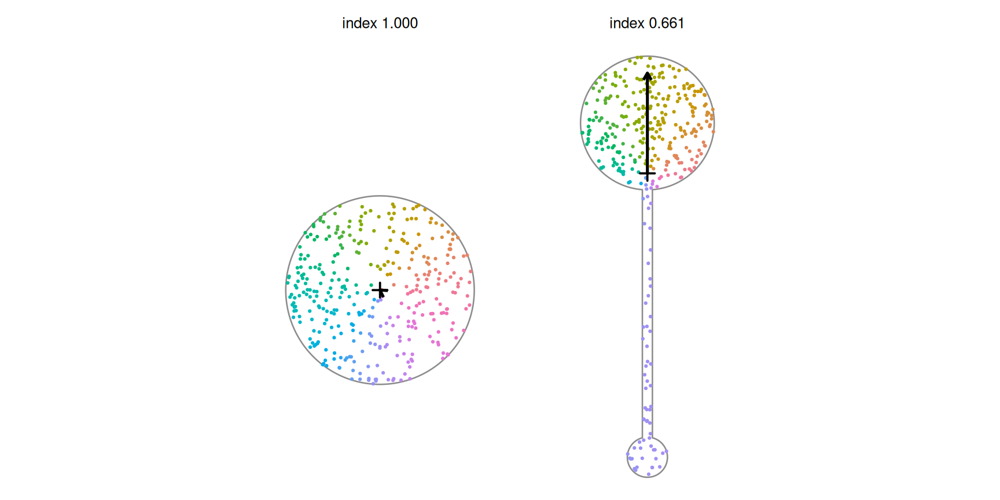

# 8. Understanding Directional Balance Index

Code

``` r

library(shapeindices)
library(sf)
library(ggplot2)

theme_set(theme_minimal(base_size = 11))
theme_gallery <- theme_void(base_size = 10) +
  theme(strip.text = element_text(size = 9, face = "bold"))
```

Code

``` r

square <- st_polygon(list(rbind(c(0,0), c(10,0), c(10,10), c(0,10), c(0,0))))

make_regular_ngon <- function(n, r = 1, center = c(0, 0)) {
  ang <- seq(0, 2*pi, length.out = n + 1)[1:n]
  st_polygon(list(rbind(cbind(center[1] + r*cos(ang), center[2] + r*sin(ang)), center + c(r, 0))))
}
hexagon <- make_regular_ngon(6, 5)
disk <- st_buffer(st_sfc(st_point(c(0, 0))), dist = 5.64, nQuadSegs = 60)[[1]]

make_star <- function(n_points, r_outer = 1, r_inner = 0.5, center = c(0, 0)) {
  n <- n_points * 2
  angles <- seq(pi/2, pi/2 + 2*pi, length.out = n + 1)[1:n]
  radii  <- rep(c(r_outer, r_inner), n_points)
  x <- center[1] + radii * cos(angles); y <- center[2] + radii * sin(angles)
  st_polygon(list(rbind(cbind(x, y), c(x[1], y[1]))))
}
star6 <- make_star(6, 5, 2.5)

make_dumbbell <- function(r_top, r_bottom, cy = 10) {
  top    <- st_buffer(st_sfc(st_point(c(0, cy))), r_top, nQuadSegs = 40)
  bottom <- st_buffer(st_sfc(st_point(c(0, -cy))), r_bottom, nQuadSegs = 40)
  neck   <- st_polygon(list(rbind(c(-0.3,-cy), c(0.3,-cy), c(0.3,cy), c(-0.3,cy), c(-0.3,-cy))))
  st_make_valid(st_union(st_sfc(c(top[[1]], bottom[[1]], neck))))[[1]]
}
dumbbell_sym  <- make_dumbbell(3, 3)     # equal lobes
dumbbell_asym <- make_dumbbell(4, 1.2)   # unequal lobes
```

## 1 Introduction

[`directional_balance_index()`](https://nkaza.github.io/shapeindices/reference/directional_balance_index.md)
measures whether a (multi)polygon’s own mass is spread evenly across
every bearing from its centroid, or leans toward some bearings more than
others. Concretely: $`R`$ is the magnitude of the mean resultant vector
of $`e^{i\theta(x)}`$, where $`\theta(x)`$ is the angle of point $`x`$
as seen from the shape’s own mass centroid $`G`$ - and the index is
$`1 - R`$, in $`[0, 1]`$.

**What this index uses - and what it deliberately ignores.** Unlike
[`moment_of_inertia_index()`](https://nkaza.github.io/shapeindices/reference/moment_of_inertia_index.md)
and
[`moment_isotropy_index()`](https://nkaza.github.io/shapeindices/reference/moment_isotropy_index.md),
which integrate position *squared*, this index uses only the **bearing**
$`\theta(s)`$, never the distance. Distance would carry no information
here anyway: $`G`$ is the mass centroid by definition, so the raw first
moment of position, $`\int_P \rho(s)(s - G)\,ds`$, is identically zero
for *every* shape. $`e^{i\theta(s)}`$ discards distance and keeps only
direction, and that is precisely what makes the quantity informative -
it asks whether the shape’s own area, bearing by bearing, is spread
evenly around the centroid or piled up toward some directions. One
reading to guard against: **balanced does not mean uniform**. $`R = 0`$
says the directional pulls *cancel*, not that mass is spread evenly
across every bearing - “Things to watch out for” in the Illustrations
section below shows exactly a shape where that distinction matters.

## 2 Deriving the index

### 2.1 The resultant vector

For density $`\rho`$ over the polygon, a point $`s = (x, y) \in P`$ with
coordinates $`x, y`$, and mass centroid $`G = (G_x, G_y)`$, define
$`\theta(s) = \operatorname{atan2}(y - G_y,\ x - G_x)`$ - the bearing of
$`s`$ as seen from $`G`$ - and

``` math
R = \left\lvert \frac{1}{W}\int_P \rho(s)\, e^{i\theta(s)}\,ds \right\rvert, \qquad W = \int_P \rho(s)\,ds
```

This is exactly the **mean resultant length** from circular/directional
statistics (Rayleigh 1880’s test for uniformity on a circle is built on
the same quantity[^1]), here applied to a polygon’s own interior angular
mass distribution rather than to literal directional data like wind
bearings. That specific application - bearings of interior area from a
shape’s own mass centroid, rather than literal directional
observations - doesn’t appear to have an established name in the
shape-compactness literature the rest of this package draws from (see
[`vignette("e-understanding-span-index")`](https://nkaza.github.io/shapeindices/articles/e-understanding-span-index.md)’s
Introduction); treat it as a direct application of a classical tool to a
new setting, not a rediscovery of a named index.
[`directional_balance_index()`](https://nkaza.github.io/shapeindices/reference/directional_balance_index.md)
is $`1 - R`$.

Each interior point $`s`$ contributes a *unit* arrow pointing along its
own bearing $`\theta(s)`$ from the centroid - distance discarded,
direction kept. $`R`$ is the length of the average of all those unit
arrows. When the bearings are spread evenly the arrows cancel and
$`R \approx 0`$ (index $`\approx 1`$); when the mass leans one way they
reinforce and $`R`$ grows toward 1 (index toward 0). The figure colours
sample points by their bearing and draws the resulting average arrow
from the centroid:



The disk’s bearings fill every direction evenly, the unit arrows cancel,
and the average arrow collapses to essentially nothing - index
$`\approx 1`$. The lopsided dumbbell’s mass leans toward its bigger
(upper) lobe, so its arrow is long and points that way, dropping the
index. The arrow’s *direction* is `mean_angle`; its *length* (relative
to a fully one-directional shape) is $`R`$.

### 2.2 Why this is always in \[0, 1\]

$`|R| \le 1`$ by the triangle inequality on a complex-valued
expectation:
$`\left|E[e^{i\theta}]\right| \le E\left|e^{i\theta}\right| = E[1] = 1`$.
That is the entire proof - no reference shape, no rearrangement
inequality (the argument behind
[`convexity_index()`](https://nkaza.github.io/shapeindices/reference/convexity_index.md)/[`span_index()`](https://nkaza.github.io/shapeindices/reference/span_index.md)/[`radial_concentration_index()`](https://nkaza.github.io/shapeindices/reference/radial_concentration_index.md)’s
bounds), no matrix fact (the argument behind
[`moment_isotropy_index()`](https://nkaza.github.io/shapeindices/reference/moment_isotropy_index.md)’s).
It also holds for *any* probability measure over bearings - continuous,
or a finite weighted point cloud alike - so the discrete estimates both
computation modes below produce respect the bound exactly, for any mesh
and any sample size, not just approximately or in the limit.

### 2.3 No closed form, unlike the moment family

$`I_{xx}`$/$`I_{yy}`$/$`I_{xy}`$ are polynomial in the vertex
coordinates - dividing by radius to get a pure bearing breaks that
structure, so $`\int e^{i\theta(x)}\,dA`$ over a triangle has no closed
form.
[`directional_balance_index()`](https://nkaza.github.io/shapeindices/reference/directional_balance_index.md)
is genuinely approximate in both modes, the same situation
[`convexity_index()`](https://nkaza.github.io/shapeindices/reference/convexity_index.md)/[`span_index()`](https://nkaza.github.io/shapeindices/reference/span_index.md)/[`radial_concentration_index()`](https://nkaza.github.io/shapeindices/reference/radial_concentration_index.md)
are in (not
[`moment_of_inertia_index()`](https://nkaza.github.io/shapeindices/reference/moment_of_inertia_index.md)/[`moment_isotropy_index()`](https://nkaza.github.io/shapeindices/reference/moment_isotropy_index.md),
which are exact regardless of mode). One practical consequence, visible
directly:

``` r

directional_balance_index(st_sfc(square))$index   # vertex-exact symmetric shape
```

    [1] 1

``` r

directional_balance_index(st_sfc(disk))$index     # curve approximated by 240 segments
```

    [1] 0.9996764

The square scores exactly 1 (its mesh happens to be perfectly
mirror-symmetric), while the segment-approximated disk lands a hair
below. The gap is quadrature resolution, and refining the internal
subdivision drives it to zero:

| subdivision_depth |        R |    index |
|------------------:|---------:|---------:|
|                 0 | 0.185176 | 0.814824 |
|                 2 | 0.019378 | 0.980622 |
|                 4 | 0.000324 | 0.999676 |
|                 6 | 0.000036 | 0.999964 |
|                 8 | 0.000002 | 0.999998 |

A disk approximated by straight boundary segments is, in the continuous
limit, exactly balanced ($`R = 0`$) - but a CDT of a many-sided polygon
isn’t necessarily triangulated with perfect reflection symmetry, so a
small residual survives at shallow subdivision depth. This is ordinary
discretization error, and it shrinks predictably as depth increases.
[`directional_balance_index()`](https://nkaza.github.io/shapeindices/reference/directional_balance_index.md)
uses depth 4 by default (the same area-adaptive depth
[`radial_concentration_index()`](https://nkaza.github.io/shapeindices/reference/radial_concentration_index.md)
uses), so expect a disk to score very close to, but not bit-for-bit
exactly, 1 - anything within about $`10^{-3}`$ of 1 should be read as
“balanced”.

## 3 Illustrations

### 3.1 Basic shapes: directional balance vs. the property it isn’t

| shape | name | directional_balance | moment_isotropy | moment_of_inertia |
|:---|:---|---:|---:|---:|
|  | square | 1.000 | 1.000 | 0.955 |
|  | hexagon | 1.000 | 1.000 | 0.992 |
|  | disk | 1.000 | 1.000 | 1.000 |
|  | star | 0.999 | 1.000 | 0.851 |
|  | symmetric_dumbbell | 1.000 | 0.022 | 0.111 |
|  | asymmetric_dumbbell | 0.661 | 0.074 | 0.218 |

[`moment_isotropy_index()`](https://nkaza.github.io/shapeindices/reference/moment_isotropy_index.md)
is a *second*-moment/axis-preference measure - does the mass prefer an
axis, agnostic to which end of it - while
[`directional_balance_index()`](https://nkaza.github.io/shapeindices/reference/directional_balance_index.md)
is a *first*-harmonic/direction-preference measure - does the mass lean
toward one bearing specifically. The symmetric dumbbell is the cleanest
case where they diverge: low isotropy (it strongly prefers the
north-south axis) but perfect directional balance (it doesn’t prefer
north *over* south, or vice versa). A shape “pointing north” and its
mirror image “pointing south” would score identically on
[`moment_isotropy_index()`](https://nkaza.github.io/shapeindices/reference/moment_isotropy_index.md)
but oppositely on
[`directional_balance_index()`](https://nkaza.github.io/shapeindices/reference/directional_balance_index.md)’s
own `mean_angle` (not on `index` itself, which reports only magnitude).

### 3.2 Weighting: free, for the same reason moment isotropy’s is

No separate reference shape means no separate weighted derivation - the
resultant vector is computed directly from whatever `weight` substitutes
for triangle area, exactly like
[`moment_isotropy_index()`](https://nkaza.github.io/shapeindices/reference/moment_isotropy_index.md).

``` r

prep <- prepare_polygon(st_sfc(dumbbell_sym))
tri  <- prep$tri
cen  <- st_coordinates(st_centroid(st_geometry(tri)))
w_top <- ifelse(cen[, 2] > 0, 3, 1)  # 3x weight on the top lobe, still symmetric-shape but not symmetric-mass

plain    <- directional_balance_index(st_sfc(dumbbell_sym), prep = prep)
weighted <- directional_balance_index(st_sfc(dumbbell_sym), prep = prep, weight = w_top)

data.frame(
  weighting = c(weight_thumb(tri, rep(1, nrow(tri))), weight_thumb(tri, w_top)),
  name = c("uniform (area)", "3x weight on top lobe"),
  index = c(plain$index, weighted$index),
  mean_angle_deg = c(NA, weighted$mean_angle * 180 / pi)
) |> knitr::kable(format = "html", digits = c(NA, NA, 3, 1), escape = FALSE)
```

| weighting | name | index | mean_angle_deg |
|:---|:---|---:|---:|
|  | uniform (area) | 1.000 | NA |
|  | 3x weight on top lobe | 0.549 | 90 |

The shape’s own boundary never changes here - a geometrically symmetric
dumbbell - but concentrating mass in the top lobe alone breaks the
angular cancellation, dropping the index and pointing `mean_angle`
north, toward the heavier lobe.

### 3.3 Things to watch out for

#### 3.3.1 Balanced doesn’t mean uniform

``` r

res_sym  <- directional_balance_index(st_sfc(dumbbell_sym))
res_asym <- directional_balance_index(st_sfc(dumbbell_asym))
data.frame(
  shape = c(shape_thumb(dumbbell_sym), shape_thumb(dumbbell_asym)),
  name = c("symmetric dumbbell (equal lobes)", "asymmetric dumbbell (top lobe bigger)"),
  R = c(res_sym$R, res_asym$R),
  index = c(res_sym$index, res_asym$index),
  mean_angle_deg = c(NA, res_asym$mean_angle * 180 / pi)
) |> knitr::kable(format = "html", digits = c(NA, NA, 6, 4, 1), escape = FALSE)
```

| shape | name | R | index | mean_angle_deg |
|:---|:---|---:|---:|---:|
|  | symmetric dumbbell (equal lobes) | 0.000000 | 1.0000 | NA |
|  | asymmetric dumbbell (top lobe bigger) | 0.339384 | 0.6606 | 90 |

The symmetric dumbbell scores `index = 1` - two equal masses on opposite
bearings from $`G`$ cancel *exactly* in the complex sum, regardless of
how badly dispersed the shape is along its own axis. Compare
[`moment_of_inertia_index()`](https://nkaza.github.io/shapeindices/reference/moment_of_inertia_index.md)
and
[`span_index()`](https://nkaza.github.io/shapeindices/reference/span_index.md),
both of which score this shape poorly (it’s about as far from a disk as
a shape this compact can get):

``` r

data.frame(
  shape = shape_thumb(dumbbell_sym),
  name = "symmetric dumbbell",
  directional_balance = res_sym$index,
  moment_isotropy = moment_isotropy_index(st_sfc(dumbbell_sym))$index,
  moment_of_inertia = moment_of_inertia_index(st_sfc(dumbbell_sym))$index,
  span = span_index(st_sfc(dumbbell_sym))$index
) |> knitr::kable(format = "html", digits = 3, row.names = FALSE, escape = FALSE)
```

| shape | name | directional_balance | moment_isotropy | moment_of_inertia | span |
|:---|:---|---:|---:|---:|---:|
|  | symmetric dumbbell | 1 | 0.022 | 0.111 | 0.374 |

Making the two lobes unequal breaks the cancellation: the bigger lobe
pulls more area to bear in its own direction from the (still centrally
located) centroid, dropping the index to 0.661 with `mean_angle`
pointing toward it (the bigger lobe sits due north; `mean_angle` reads
90.0 degrees, `atan2` convention).

**This is a feature, not purely a limitation.** Paired with
[`moment_of_inertia_index()`](https://nkaza.github.io/shapeindices/reference/moment_of_inertia_index.md)/[`span_index()`](https://nkaza.github.io/shapeindices/reference/span_index.md)/[`moment_isotropy_index()`](https://nkaza.github.io/shapeindices/reference/moment_isotropy_index.md)
(all of which score the symmetric dumbbell badly), the two families
together distinguish “symmetric two-sided reach” - fine here, bad on the
others - from “one-sided reach” - bad on both. That distinction is
plausibly relevant to redistricting analysis: a district extending
outward in one direction only reads differently from one extending
outward symmetrically in two, even though both can look equally
“dispersed” by a single distance-based measure.

#### 3.3.2 Monte Carlo mode’s small, structural bias

`deterministic = FALSE` draws points directly from the weighted density
(the same mechanism
[`radial_concentration_index()`](https://nkaza.github.io/shapeindices/reference/radial_concentration_index.md)
uses) and computes $`\hat{R} = |\text{mean}(e^{i\theta_i})|`$ over the
sample, with $`\theta_i`$ measured relative to the *exact* centroid
$`G`$ (found in closed form regardless of mode). Because $`\hat{R}`$ is
the magnitude of a sample-mean vector - a nonlinear transform - Jensen’s
inequality means $`E[\hat R] \ge |E[\text{sample mean})]| = R`$: for a
truly balanced shape, $`\hat R`$ is essentially never exactly 0 in a
finite sample, so the Monte Carlo index sits systematically slightly
*below* the true value. The gap shrinks as `n_lines` grows:

``` r

gap <- function(n) 1 - directional_balance_index(st_sfc(square), deterministic = FALSE,
                                                   n_lines = n, seed = 1)$index
ns <- c(200, 1000, 5000, 20000)
data.frame(n_lines = ns, gap_from_1 = vapply(ns, gap, numeric(1))) |> knitr::kable(format = "html", digits = 5)
```

| n_lines | gap_from_1 |
|--------:|-----------:|
|     200 |    0.10057 |
|    1000 |    0.03775 |
|    5000 |    0.02571 |
|   20000 |    0.00792 |

The returned index carries this bias uncorrected, because it cannot be
fixed on its own scale: **no unbiased estimator of $`1 - R`$ exists**
for any finite sample. The obstruction is the kink of
$`R = |E[e^{i\theta}]|`$ at exact balance - the same structural reason a
sample standard deviation cannot be unbiased even though a sample
variance can - and it sits at $`R = 0`$, exactly where the bias is
worst, which is also where asymptotic corrections (whose leading term
carries a $`1/R`$) diverge.

What *does* admit an exactly unbiased estimate is the same quantity on a
squared scale, $`1 - R^2`$ - same $`[0, 1]`$ range, same direction, same
shapes scoring exactly 1. Because the sampled bearings are i.i.d.,
$`E[\cos(\theta_j - \theta_k)] = R^2`$ for any two distinct draws, which
makes

``` math
1 - \frac{n\,\hat{R}^2 - 1}{n - 1}
```

exactly unbiased for $`1 - R^2`$, for every weight distribution and
every $`n \ge 2`$ - computable in one line from the returned `R` and
your own `n_lines`. Two things to know if you use it: it can land
slightly *above* 1 for near-balanced shapes - necessarily, since no
estimator confined to $`[0, 1]`$ can be unbiased at the boundary - and
truncating it back to 1 would reintroduce the bias, so leave it be. And
since squaring compresses the top of the scale (real near-balanced
shapes crowd into $`[0.95, 1]`$ on $`1 - R^2`$), treat it as a tool for
unbiased estimation and batch averaging, not as a more readable index.
If you just want a better point estimate of $`1 - R`$ itself, increase
`n_lines` or use `deterministic = TRUE`, which carries no statistical
bias at all.

## 4 Where this fits

[`directional_balance_index()`](https://nkaza.github.io/shapeindices/reference/directional_balance_index.md)
adds a genuinely new question to this package’s family: not “is this
shape convex”
([`convexity_index()`](https://nkaza.github.io/shapeindices/reference/convexity_index.md),
[`hull_ratio_index()`](https://nkaza.github.io/shapeindices/reference/hull_ratio_index.md)),
“how far is mass dispersed from the centre”
([`moment_of_inertia_index()`](https://nkaza.github.io/shapeindices/reference/moment_of_inertia_index.md),
[`span_index()`](https://nkaza.github.io/shapeindices/reference/span_index.md),
[`radial_concentration_index()`](https://nkaza.github.io/shapeindices/reference/radial_concentration_index.md)),
“how round is the boundary/bounding shape”
([`polsby_popper_index()`](https://nkaza.github.io/shapeindices/reference/polsby_popper_index.md),
[`reock_index()`](https://nkaza.github.io/shapeindices/reference/reock_index.md),
[`width_length_ratio_index()`](https://nkaza.github.io/shapeindices/reference/width_length_ratio_index.md)),
or “does the mass distribution prefer an axis”
([`moment_isotropy_index()`](https://nkaza.github.io/shapeindices/reference/moment_isotropy_index.md)) -
but “does the mass distribution prefer a *bearing*”. See
[`vignette("k-nc-counties-comparison")`](https://nkaza.github.io/shapeindices/articles/k-nc-counties-comparison.md)
for how it relates to the other nine on 100 real county boundaries.

## 5 Key takeaways

- [`directional_balance_index()`](https://nkaza.github.io/shapeindices/reference/directional_balance_index.md)
  is $`1 - R`$, where $`R`$ is the magnitude of the mean resultant
  vector of unit bearings $`e^{i\theta(s)}`$ seen from the mass
  centroid - a first-harmonic, direction-preference measure, not a
  dispersal measure: distance from the centroid never enters the
  definition.
- It is bounded in $`[0, 1]`$ by the triangle inequality alone, the same
  elementary-fact style of proof
  [`moment_isotropy_index()`](https://nkaza.github.io/shapeindices/reference/moment_isotropy_index.md)
  uses, but no closed form exists for either computation mode - both
  `deterministic = TRUE` (subdivision-based quadrature) and
  `deterministic = FALSE` (Monte Carlo) are genuinely approximate,
  unlike the exact moment family.
- $`R = 0`$ means the directional pulls *cancel*, not that mass is
  spread evenly across every bearing: a symmetric two-lobed dumbbell
  scores a perfect 1 despite being about as far from a disk as a compact
  shape can get, because its two lobes pull in exactly opposite
  directions (see “Things to watch out for” above). Pair it with
  [`moment_of_inertia_index()`](https://nkaza.github.io/shapeindices/reference/moment_of_inertia_index.md)/[`span_index()`](https://nkaza.github.io/shapeindices/reference/span_index.md)/[`moment_isotropy_index()`](https://nkaza.github.io/shapeindices/reference/moment_isotropy_index.md),
  all of which score that same shape badly, to catch what it misses.
- Weighting is free, for the same reason
  [`moment_isotropy_index()`](https://nkaza.github.io/shapeindices/reference/moment_isotropy_index.md)’s
  is: there’s no reference shape to re-derive, so a weighted index is
  just the resultant vector computed directly from whatever `weight`
  substitutes for triangle area.
- `deterministic = FALSE` carries a small, structural,
  uncorrectable-on-its-own-scale bias toward *higher* apparent
  imbalance, worst exactly at true balance ($`R = 0`$) - a consequence
  of $`R`$ being a magnitude, not an average, so Jensen’s inequality
  bites. `deterministic = TRUE` (the default) carries no such bias; use
  `n_lines` in the tens of thousands if you need `deterministic = FALSE`
  to average out the gap instead.
- It asks a question none of this package’s other nine indices ask: not
  how dispersed the mass is, or whether it prefers an axis, but whether
  it prefers a bearing - complementary to, not redundant with,
  [`moment_isotropy_index()`](https://nkaza.github.io/shapeindices/reference/moment_isotropy_index.md)’s
  axis-preference question.

[^1]: Rayleigh, Lord (1880). On the resultant of a large number of
    vibrations of the same pitch and of arbitrary phase. *Philosophical
    Magazine*, 10(60), 73-78. Mardia, K. V., & Jupp, P. E. (2000).
    *Directional Statistics*. Wiley, is the standard modern reference
    for the mean resultant length and its uses.
