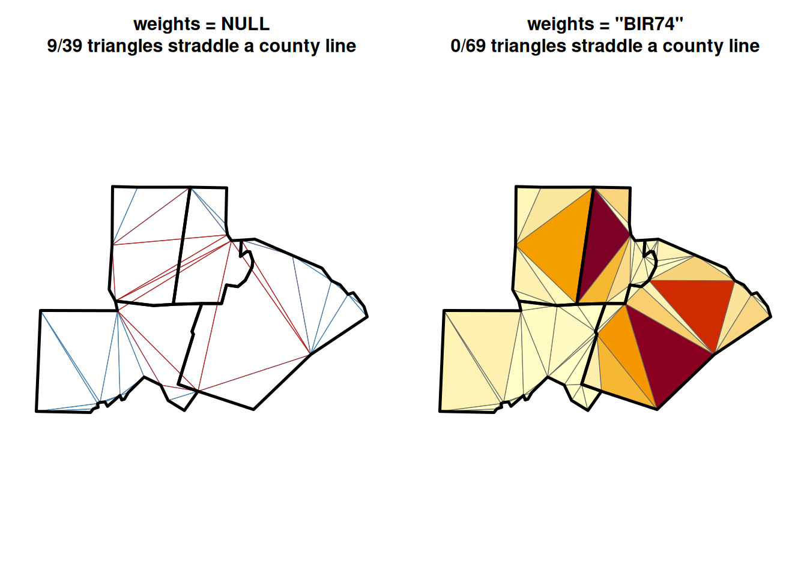

# 10. Comparing Shape Indices: North Carolina Counties

Code

``` r

library(shapeindices)
library(sf)
library(ggplot2)
library(ggalign)
library(dplyr)

theme_set(theme_minimal(base_size = 11))
```

## 1 Introduction

The other vignettes in this package derive each index in isolation, on
synthetic shapes built to isolate one property at a time. This one runs
some of the indices on a real dataset: the North Carolina county
boundaries bundled with `sf`) [^1] The vignette is primarily to show how
the indices perform on a real dataset with varying shapes and weights.

## 2 Indices point to stories about geography and history

County lines are surveyed straight lines and coastlines, not organic
growth boundaries, so the shapes here test something specific: how much
does an index notice a barrier island, a diagonal sliver, or a county
that’s convex but stretched?

[TABLE]

**Caswell** is the baseline: a simple, nearly-rectangular Piedmont
county with no natural features at the boundary. The county is created
from bisecting Orange county and then again to form Caswell adn Pearson.
Convexity, hull ratio, and width-length ratio are all at or near 1. Even
here, Reock only reaches 0.63 (a perfect square’s Reock score is exactly
$`2/\pi \approx 0.637`$). Truly, disk shaped counties are hard to come
by and Reock penalises any deviation from the circle more heavily than
other indices.

**Dare and Currituck** are Outer Banks counties where a compact mainland
piece connects to a long barrier-island strip across an open sound.
Almost index penalises this geographical arrangement: convexity
0.74/0.80, hull ratio 0.26/0.55, Polsby-Popper as low as 0.08 for Dare.

Width-length ratio agrees too, now: 0.40 for Dare and 0.43 for
Currituck, both low like every other elongation-sensitive measure here.
That agreement is itself worth a note: this index used to score
Currituck at 0.96 - nearly a perfect square - because its old
axis-aligned bounding box happened to line up close to the coordinate
axes, an accident of how the county is drawn on the map, not a property
of its actual shape. Switching to the minimum-area bounding rectangle at
any rotation
([`sf::st_minimum_rotated_rectangle()`](https://r-spatial.github.io/sf/reference/geos_unary.html))
fixes this: Currituck’s true elongation, independent of orientation, is
close to Dare’s own, not the 0.96 the old orientation-sensitive version
reported.

**Camden** is the classic split: convexity 0.99, essentially convex, no
real notches for a line to cross. Span/radial concentration agree
(0.61/0.61): Camden is a long, narrow diagonal sliver, and
convexity/span/radial-concentration agree broadly. On the other hand,
moment isotropy as well as moment of inertia isolates that elongation
directly and puts a sharp number on it: 0.04/0.32. Camden’s own
principal moments differ by roughly 27-to-1.

**Lincoln** sharpens that same point with no boundary complexity at all
involved: convexity is a perfect 1.00 and hull ratio 0.99. Yet Reock is
0.34, width-length ratio 0.30, and moment isotropy 0.11; all three
elongation-sensitive measures still penalise it for being stretched,
each via a different route (bounding circle, bounding box, mass tensor).
**Convex and compact are different properties**, and a shape can score
perfectly on one while scoring poorly on the other.

## 3 How do the indices relate to each other?


The above correlation matrix uses unweighted indices and hierarchical
clustering. Across these 100 counties, the indices condense into three
primary behaviors dominated by whether they respond to elongation or
boundary deformities. The core **Elongation Cluster**—comprising moment
of inertia, span, radial concentration, and Reock—behaves almost
interchangeably, as county-level elongation swamps the theoretical
differences between their formulas. Other measures fold into this group
via distinct mechanics: `exchange_index` reads elongation via area
overlap (0.96 with MOI), `detour_index` captures hull-level stretching
(0.94 with span), `depth_index` aligns with boundary complexity (0.93
with Polsby-Popper), and `width_length_ratio_index` - since being
corrected to use the minimum-area bounding rectangle at any rotation
rather than an axis-aligned one - now tracks the same elongation cleanly
(0.80 with moment isotropy, its own strongest tie in the whole matrix).
Moment isotropy belongs to this family but sits slightly apart (0.74
with MOI) because it isolates pure axis elongation, remaining
structurally blind to dispersal or boundary noise.

**Convexity and hull ratio** form a second, distinct cluster (0.84) that
isolates concave boundary departures while ignoring elongation entirely.
The near-zero correlation between moment isotropy and convexity (0.24)
provides clean empirical proof that elongation and concavity are
independent structural properties on real geography rather than
redundant descriptions. Similarly, directional balance tracks
first-harmonic bearing preference rather than axis shape; its weak tie
to moment isotropy (0.46) confirms that bearing preference and
mass-distribution symmetry operate as independent axes despite both
belonging to the elongation-adjacent family.

Connecting these groups, Polsby-Popper acts as a hybrid bridge between
the convexity and elongation clusters (0.90 with hull ratio; 0.84 with
MOI) because perimeter length is inherently inflated by both boundary
roughness and stretched geometries.

`width_length_ratio_index` is no longer the outlier it once was. An
earlier, axis-aligned version of this index correlated weakly with
almost everything in this dataset, because its own orientation noise -
which way a county happens to be drawn relative to the coordinate axes,
not a property of its shape - swamped the real elongation signal
underneath. With that noise removed, its strongest ties sit squarely
inside the elongation cluster: 0.80 with moment isotropy, 0.78 with
exchange, 0.76 with moment of inertia. It still correlates more loosely
with the boundary-complexity side of things (0.31 with convexity, 0.31
with hull ratio) - a bounding rectangle, however it’s computed, still
can’t see concavity the way a convex-hull-based measure can - but it is
a member of a real cluster now, not an island of its own.

## 4 Weighting a collection: the Triangle counties by population

`shape_indices_sf(byrow = FALSE)` treats a whole collection of rows as
sub-polygons of one weighted shape (see
[`vignette("a-basic-usage")`](https://nkaza.github.io/shapeindices/articles/a-basic-usage.md)
for the mechanics). Wake, Durham, Orange, and Chatham counties (the
Research Triangle) are geographically contiguous. Only the six
mesh-based indices have a genuine weighted form worth comparing this
way.

Note that the CDT trianglulation is different in the weighted and
unweigthed case. In the weighted case, the internal borders are
respected so that the weight transfers from the sub polygon to mesh more
cleanly, which increases the mesh count. Also note the assumption of
constant density within the sub polygon, thus large triangle get higher
weight in the same polygon.



|                            | weights = NULL | weights = "BIR74" |
|:---------------------------|---------------:|------------------:|
| convexity_index            |           0.98 |              0.99 |
| moment_of_inertia_index    |           0.82 |              0.70 |
| moment_isotropy_index      |           0.51 |              0.64 |
| directional_balance_index  |           0.98 |              0.96 |
| span_index                 |           0.92 |              0.85 |
| radial_concentration_index |           0.92 |              0.85 |
| total_weight               |  5811314465.44 |          27264.00 |

Weighted by each county’s own area (`weights = NULL`, the default), the
four-county union scores convexity 0.983 and MOI 0.815. Switching the
weight to 1974 births, so that Wake dominates in one part of the union,
moves MOI, span, and radial concentration all *down* together (0.697,
0.849, 0.852). Convexity moves the other way, slightly *up* (0.990). It
does not depend on where the centre of mass is at all and therefore
behaves as expected.

Reweighting the mesh by population reveals that moment isotropy and
directional balance capture fundamentally different spatial mechanisms
when mass shifts toward a dominant county like Wake. **Moment isotropy
moves up** (0.507 to 0.643), shifting opposite to MOI, span, and radial
concentration. This isn’t a contradiction: while center-relative metrics
penalize how far mass drifts from the union’s geometric middle, moment
isotropy evaluates only the *shape* of the distribution around its own
center—concentrating weight into Wake (a relatively round county within
a long four-county strip) makes the core mass footprint more isotropic
even as its center drifts. Conversely, **directional balance moves
down** (0.984 to 0.960), tracking alongside MOI and span because
shifting weight toward Wake creates an asymmetric angular pull from the
new centroid. Moment isotropy acts as the lone outlier here precisely
because it ignores center-relative displacement, proving it operates as
an independent axis rather than a redundant metric. *(Note:
`total_weight` reflects raw area in $`m^2`$ versus total births, so row
totals represent different scales).*

## 5 Conclusion

No single shape index here is redundant: real-world geographies split
metrics into distinct structural behaviors rather than a simple
continuum. While Moment of Inertia (MOI), span, and radial concentration
cluster tightly around overall elongation, measures like convexity and
hull ratio track a fundamentally different property—concavity—explaining
why a shape can be nearly convex (e.g., Lincoln) while scoring poorly on
circle-referenced compactness. Moment isotropy sits loosely in the
elongation group but acts as an independent axis: it is virtually immune
to boundary concavity and can shift in the opposite direction from its
cluster under population reweighting because it ignores centroid offset
entirely, evaluating only the symmetry of the mass footprint itself.

Directional balance is about angular bearing preference (whether mass
leans toward one direction) rather than axis preference (whether mass
aligns along a line), yielding a remarkably weak correlation with moment
isotropy (0.46). Under mesh reweighting, directional balance aligns with
MOI and span because all three respond to centroid-relative mass
drift—making it uniquely sensitive to split geometries like Dare and
Currituck’s mainland-and-barrier-island shapes. Ultimately,
`width_length_ratio_index` - once corrected to use the minimum-area
bounding rectangle at any rotation rather than an axis-aligned one -
joins the elongation cluster rather than sitting apart from it, and
population-weighting doesn’t just tweak scores across the mesh-based
indices—it fundamentally alters which spatial property each one reveals.

[^1]: It is probably useful to think about the history of how the shapes
    came to be and how they changed over time: see Kelly, S. R. 2015.
    “The Boundary Hunters Uncovering North Carolina’s Lost Borders.”
    Technology. The Atlantic, October 6.
    https://www.theatlantic.com/technology/archive/2015/10/north-carolina-lost-county-lines/409090/.
